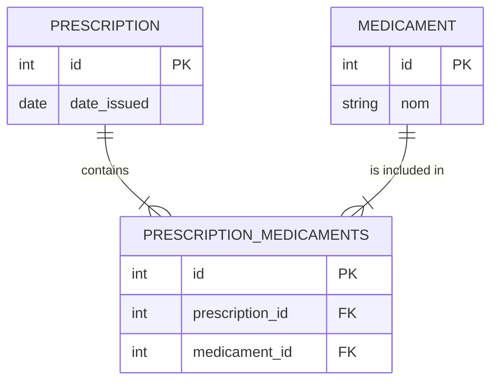

# 3.6. Model Relationships Many-to-Many Relationships

## 1. Many-to-Many Architecture
A **Many-to-Many (M2M)** relationship occurs when multiple records in one table are associated with multiple records in another table. Relational databases do not support direct M2M relations between two tables. Instead, this relationship requires an intermediate table, known as a **Join Table** or **Bridge Table**. This intermediate table stores pairs of foreign keys from both target tables.



In Django, this is represented using the `models.ManyToManyField`. Django handles the creation and management of the join table behind the scenes automatically.

## 2. Python Implementation Examples

### Implicit Join Table (Standard Implementation)
If you only need to link two models together without storing additional metadata about their relationship, define a standard M2M field:
```python
from django.db import models

class Medicament(models.Model):
    nom = models.CharField(max_length=100)
    laboratoire = models.CharField(max_length=50)

    def __str__(self):
        return self.nom

class Prescription(models.Model):
    date = models.DateField()
    # Implicitly creates a join table named 'app_prescription_medicaments'
    medicaments = models.ManyToManyField(Medicament, related_name='prescriptions')
```

### Explicit Join Table (Using the `through` Parameter)
If you need to store metadata about the relationship itself (e.g., the dosage and frequency of a prescribed medication), you must define a custom intermediate model and link it using the `through` parameter.

```python
class Medicament(models.Model):
    nom = models.CharField(max_length=100)
    laboratoire = models.CharField(max_length=50)

class Prescription(models.Model):
    date = models.DateField()
    # Explicitly link via 'PrescriptionItem'
    medicaments = models.ManyToManyField(
        Medicament, 
        through='PrescriptionItem', 
        related_name='prescriptions'
    )

class PrescriptionItem(models.Model):
    # ForeignKey links to both target tables
    prescription = models.ForeignKey(Prescription, on_delete=models.CASCADE)
    medicament = models.ForeignKey(Medicament, on_delete=models.CASCADE)
    # Metadata fields specific to this relationship instance
    dosage_mg = models.IntegerField()
    frequency_per_day = models.IntegerField()
```

## 3. Quering Many-to-Many Relationships

### Querying with an Implicit Join Table
```python
# To add a relationship
prescription = Prescription.objects.get(id=1)
aspirin = Medicament.objects.get(nom="Aspirin")
prescription.medicaments.add(aspirin)

# To retrieve associated items
all_meds = prescription.medicaments.all()
```

### Querying with an Explicit Join Table
When using a custom `through` model, you cannot use `.add()`, `.create()`, or `.set()` directly on the relationship field. Instead, you must instantiate the intermediate model directly:
```python
# Link models by creating an instance of the intermediate model
PrescriptionItem.objects.create(
    prescription=prescription,
    medicament=aspirin,
    dosage_mg=500,
    frequency_per_day=3
)
```