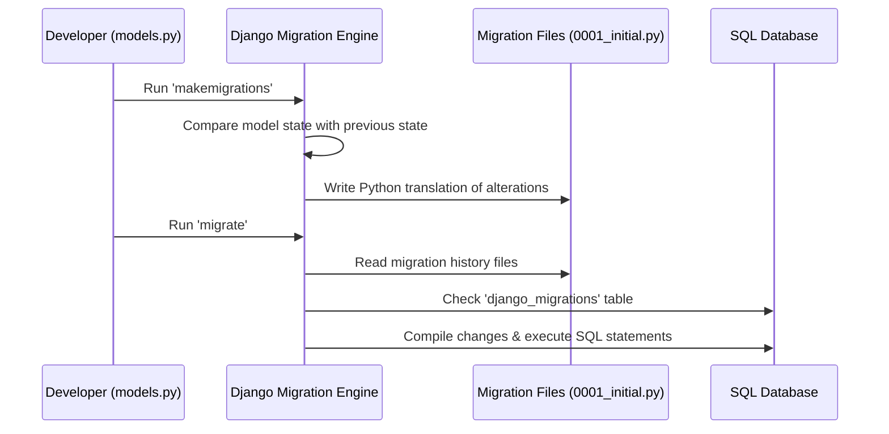

# 3.8. Database Migration Lifecycle Commands

## 1. The Migration Lifecycle Explained
Migrations are Django's way of propagating changes made to your models (adding a field, deleting a model, etc.) into your database schema. They act as a version control system for your database.



## 2. Essential Migration Commands Reference

### `makemigrations`
Scans your model files (`models.py`) and compares them against your existing migration files. If it detects any changes, it generates a new set of python migration files inside the `migrations/` directory.
```bash
python manage.py makemigrations
```
* **Tip**: You can target specific apps to keep migrations modular: `python manage.py makemigrations myapp`.

### `migrate`
Executes pending migrations against your database, updating the schema to match your current codebase.
```bash
python manage.py migrate
```

### `sqlmigrate`
Displays the raw SQL statements that Django will run for a specific migration. This is useful for auditing and inspecting schema changes before applying them to a production database.
```bash
# Usage: python manage.py sqlmigrate <app_name> <migration_number>
python manage.py sqlmigrate myapp 0001
```

### `showmigrations`
Lists all migrations in the project and indicates whether they have been applied (marked with `[X]`) or remain pending (marked with `[ ]`).
```bash
python manage.py showmigrations
```

## 3. How Django Tracks Migration State
Django tracks which migrations have been applied using a dedicated table in your database named **`django_migrations`**.

When you run `python manage.py migrate`:
1. Django queries the `django_migrations` table to get a list of applied migrations.
2. It compares this history against the migration files in your project directory.
3. Django applies only the pending migrations and records their execution in the database table.

## 4. Troubleshooting Common Migration Conflicts
* **Missing Default Values**: When adding a new field that is not nullable to a table that already has records, Django will ask you to provide a default value for the existing records during `makemigrations`. You can either:
  1. Provide a one-off default value in the command prompt.
  2. Exit and define a default value (e.g., `default='Value'`) or allow null values (`null=True`) on the field in `models.py`.
* **Out-of-Sync Migrations**: If multiple developers make database changes on different branches, migration conflicts can occur. Avoid deleting migration files manually. Instead, use:
  ```bash
  python manage.py makemigrations --merge
  ```