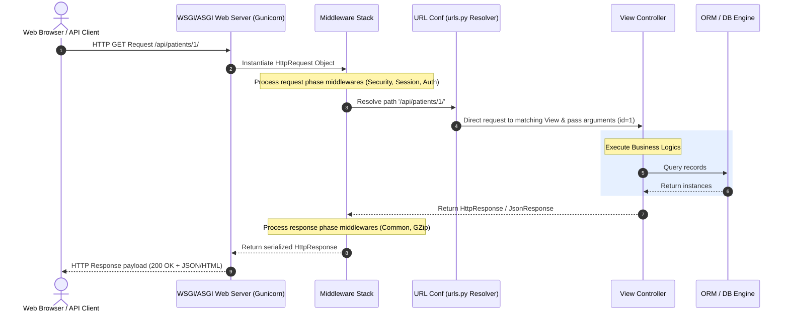

# 4.1. HTTP Request-Response Lifecycle in Django

## 1. Architectural Flow of a Request
Understanding the step-by-step path an HTTP request takes through Django is essential for debugging and designing scalable web APIs.



## 2. Detailed Breakdown of Lifecycle Steps

1. **Client Request**: An API client or web browser sends an HTTP request (e.g., `GET /api/patients/1/`).
2. **WSGI/ASGI Entrypoint**: The web server (e.g., Gunicorn, uWSGI) receives the request and wraps it in a Django `HttpRequest` object.
3. **Middleware Execution (Request Phase)**: The request is passed through the registered middlewares sequentially (defined in `settings.py` under `MIDDLEWARE`). This phase handles core processes like security configurations, session management, and authentication headers.
4. **URL Routing (URLconf)**: Django parses the request URL path and resolves it against your project's URL patterns (`urls.py`). It matches the path and extracts any variables (e.g., `id=1`).
5. **View Controller Execution**: Django forwards the `HttpRequest` along with any extracted URL arguments to the matching View. The view runs your business logic, queries database models as needed, and formats the output.
6. **Middleware Execution (Response Phase)**: The view returns an `HttpResponse` or `JsonResponse` object, which is passed back through the middleware stack in reverse order. This phase handles response compression, header adjustments, and CSRF token processing.
7. **Client Response**: The web server translates the response object back into an HTTP stream and sends it to the client.

## 3. Key Concepts to Remember
* **Middlewares can short-circuit the lifecycle**: If a middleware fails (e.g., an IP is blocked, or authentication fails), it can return an `HttpResponse` immediately. This stops downstream processing and prevents the request from reaching the URL resolver or views.
* **The DB Query is Lazy**: DB queries inside your views do not run until the view evaluates the QuerySet. This evaluation typically occurs during serialization, list comprehensions, or when rendering template contexts.
```