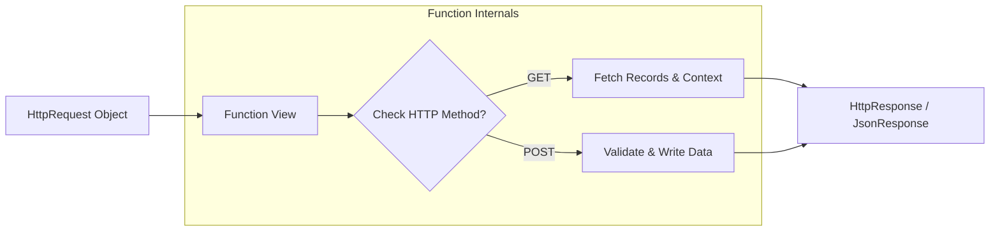

# 4.5. Function-Based Views FBVs

## 1. Anatomy of a Function-Based View
Function-Based Views (FBVs) are python functions that take an `HttpRequest` object as their first parameter and return an `HttpResponse` object. FBVs are simple, direct, and explicit, making them highly readable.



### Python Implementation: Managing Patient Records
Below is a model-backed FBV that handles both `GET` and `POST` requests:
```python
from django.shortcuts import render, redirect, get_object_or_404
from django.http import HttpResponseNotAllowed, JsonResponse
from .models import Patient

def manage_patient_fbv(request, patient_id):
    # Retrieve the patient or return an automatic HTTP 404
    patient = get_object_or_404(Patient, id=patient_id)

    # Route request based on the HTTP method
    if request.method == 'GET':
        # Prepare data context to render a template
        context = {
            'patient': patient,
            'status': 'Active'
        }
        return render(request, 'clinical/patient_detail.html', context)

    elif request.method == 'POST':
        # Update model properties from POST payload data
        new_name = request.POST.get('name')
        if new_name:
            patient.nom = new_name
            patient.save()
            return redirect('clinical:patient-detail', patient_id=patient.id)
        return JsonResponse({'error': 'Name parameter required'}, status=400)

    else:
        # Return an HTTP 405 Method Not Allowed for unsupported methods
        return HttpResponseNotAllowed(['GET', 'POST'])
```

## 2. Common Student Traps
* **Forgetting to Return an HttpResponse**: If your function view executes successfully but fails to return a valid response object, Django will raise a `ValueError` saying *The view didn't return an HttpResponse object. It returned None instead.* Ensure that every execution path in your view returns a response.
* **Failing to Restrict HTTP Methods**: By default, function views will execute for any HTTP request method (`GET`, `POST`, `PUT`, `DELETE`). To prevent security issues and unexpected behavior, always use decorators like `require_http_methods` to restrict acceptable methods:
  ```python
  from django.views.decorators.http import require_http_methods

  @require_http_methods(["GET", "POST"])
  def patient_secure_view(request):
      pass
  ```