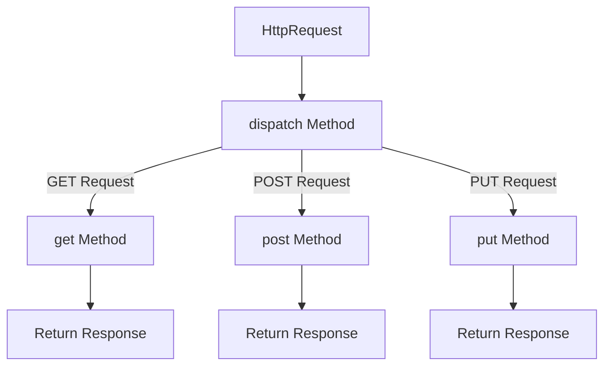

# 4.6. Class-Based Views CBVs

## 1. Object-Oriented View Architectures
As web applications grow, function-based views often become repetitive and difficult to maintain. **Class-Based Views (CBVs)** solve this by using object-oriented principles. Instead of handling different HTTP request methods using conditional statements, CBVs route requests to dedicated class methods named after the HTTP verbs (e.g., `get()`, `post()`, `put()`, `delete()`).



## 2. Basic CBV Structure
Every Class-Based View must inherit from the base `django.views.View` class.

```python
from django.views import View
from django.shortcuts import render, redirect, get_object_or_404
from django.http import JsonResponse
from .models import Patient

class PatientManagerView(View):
    # Optional URL parameters are passed to the method as arguments
    def get(self, request, patient_id):
        patient = get_object_or_404(Patient, id=patient_id)
        context = {'patient': patient}
        return render(request, 'clinical/patient_form.html', context)

    def post(self, request, patient_id):
        patient = get_object_or_404(Patient, id=patient_id)
        new_email = request.POST.get('email')
        
        if new_email:
            patient.email = new_email
            patient.save()
            return redirect('clinical:patient-detail', patient_id=patient.id)
        return JsonResponse({'error': 'Missing email parameter'}, status=400)
```

## 3. Registering CBVs in `urls.py`
Django's routing engine expects a callable function reference as the view argument. Since a CBV is a class, you must call its **`as_view()`** class method to convert it into an executable view function:
```python
from django.urls import path
from .views import PatientManagerView

urlpatterns = [
    # Call as_view() to hook the class into your URL configuration
    path('patient/manage/<int:patient_id>/', PatientManagerView.as_view(), name='manage-patient'),
]
```

## 4. Comparison: FBVs vs. CBVs

| Metric | Function-Based Views (FBVs) | Class-Based Views (CBVs) |
| :--- | :--- | :--- |
| **Simplicity** | High. Code flow is clear and straightforward. | Lower. Requires understanding class inheritance. |
| **HTTP Verb Handling** | Uses conditional branching (`if request.method == 'POST'`). | Implements dedicated methods (`get()`, `post()`). |
| **Reusability** | Low. Decorators must be applied manually to each view function. | High. Extends behavior using mixins and inheritance. |
| **Complexity for CRUD** | Moderate. Requires manual database and validation code. | Minimal. Built-in generic views handle operations automatically. |
```
