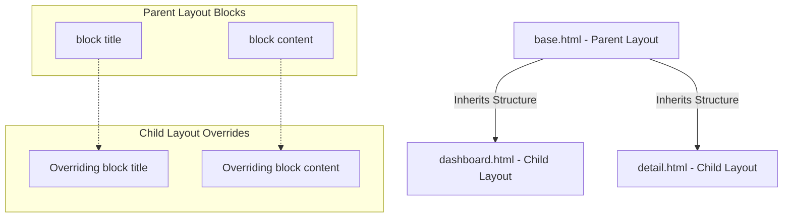

# 5.2. Layout Inheritance and Block Architecture

## 1. The DRY Principle in Django Templates
The **DRY (Don't Repeat Yourself)** principle is a core philosophy of Django development. Standard web layouts often share common elements like headers, footers, meta tags, and navigation bars on every page. 

Rather than copying and pasting this boilerplate HTML into each individual file, Django templates use **Layout Inheritance** to share a single base layout.



## 2. Setting Up Layout Inheritance

### Step 1: Create the Parent Template (`base.html`)
The parent template defines the shared HTML layout structure. It uses `` tags to mark dynamic regions that child templates can override.
```html
<!DOCTYPE html>
<html lang="en">
<head>
    <meta charset="UTF-8">
    <title>Medical Management Portal</title>
</head>
<body>
    <header>
        <nav>
            <a href="/">Dashboard</a> | <a href="/patients/">Patient Lists</a>
        </nav>
    </header>

    <main class="container">
        <!-- Dynamic content region to be populated by child templates -->
        
            <p>Default content placeholder.</p>
        
    </main>

    <footer>
        <p>&copy; 2026 Enterprise Medical Systems Inc.</p>
    </footer>
</body>
</html>
```

### Step 2: Create a Child Template (`dashboard.html`)
The child template uses the `` tag to inherit from the parent layout. It then overrides specific blocks with page-specific content.
```html
<!-- Extends MUST be the first template tag in the file -->


<!-- Override the page title -->
Dashboard Overview - Clinical Portal

<!-- Override the body content -->

    <h1>Welcome to the Clinical Dashboard</h1>
    <p>Operational status: Normal.</p>

```

## 3. Reusable Subcomponents Using `include`
While `extends` is used to inherit complete page structures, the `` tag is used to embed smaller, reusable HTML fragments (like badges, charts, or alert boxes) inside other templates.

### Example: Navigation Card Fragment (`_patient_card.html`)
```html
<div class="patient-card">
    <h3>{{ patient.nom }}</h3>
    <p>Email: {{ patient.email }}</p>
</div>
```

### Including the Fragment in a Dashboard Template
```html
<div class="patients-grid">
    
        <!-- Inject the partial layout template into this section -->
        
    
</div>