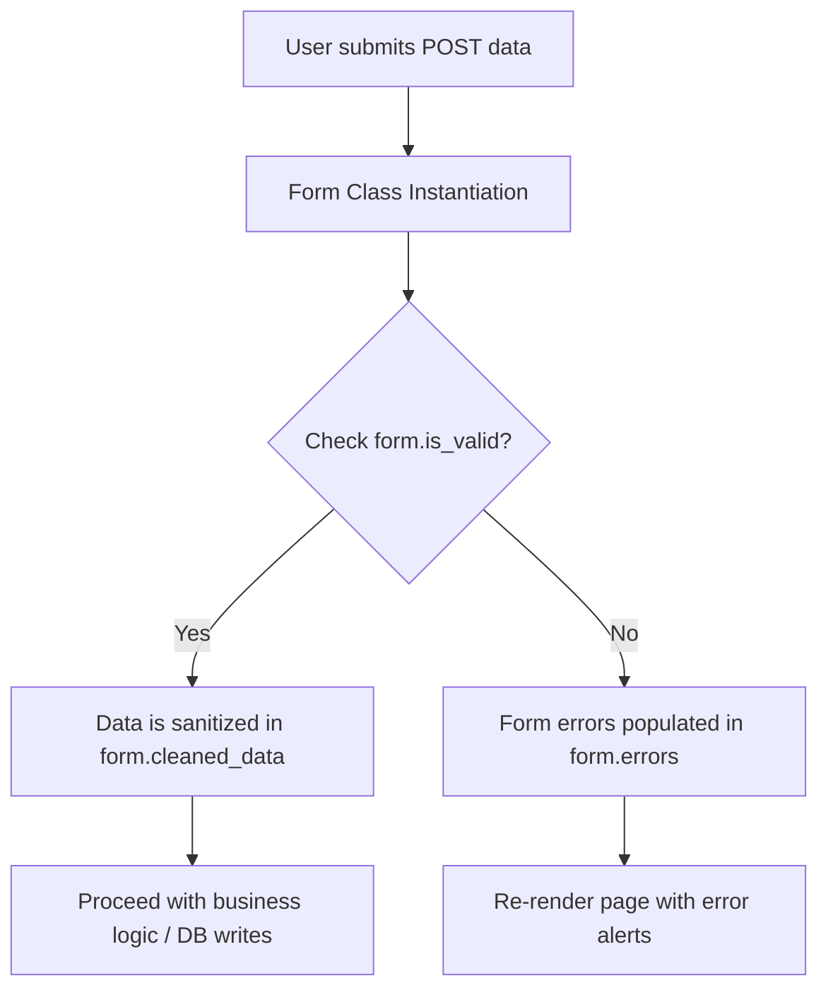

# 5.5. Standard Django Form Class Validation

## 1. What is the Django Form Layer?
Django's Form layer manages user input validation, error handling, and form layout generation. By defining a Form class, you can write validation rules and error messages in Python, and Django will handle validating the submitted data and generating the HTML form fields automatically.

Standard forms inherit from the base **`django.forms.Form`** class.



## 2. Implementing Standard Form Validation
Below is a standard form that enforces validation on incoming contact requests:

```python
from django import forms
from django.core.exceptions import ValidationError

class SecureContactForm(forms.Form):
    name = forms.CharField(max_length=100, label="Your Name")
    email = forms.EmailField(label="Primary Email Address")
    message = forms.CharField(widget=forms.Textarea, label="Message Details")
    security_pin = forms.IntegerField(label="Verification PIN")

    # 1. Field-Level Validation: Clean single fields using 'clean_<fieldname>'
    def clean_email(self):
        email_input = self.cleaned_data.get('email')
        # Enforce corporate domain constraint
        if not email_input.endswith('@hospital.org'):
            raise ValidationError("Registration requires a validated corporate email domain address.")
        return email_input

    # 2. Form-Level Validation: Clean multiple dependent fields using 'clean'
    def clean(self):
        cleaned_data = super().clean()
        name = cleaned_data.get('name')
        message = cleaned_data.get('message')

        # Enforce validation rule spanning multiple fields
        if name and message and name.lower() in message.lower():
            raise ValidationError("For security reasons, your personal profile name should not be included in the message body.")
        return cleaned_data
```

## 3. Form Validation Methods Reference

### Field-Level Validation (`clean_<fieldname>`)
Used to validate a single field. Django runs this method automatically for a field if it is defined on the form. It must return the cleaned value or raise a `ValidationError`.

### Form-Level Validation (`clean`)
Used to validate rules that span across multiple fields. This method is called after all individual field-level validations have passed. It must return the `cleaned_data` dictionary or raise a global form `ValidationError`.

### What is `cleaned_data`?
The `cleaned_data` attribute is a dictionary containing sanitized input data (e.g., converting dynamic string inputs into Python types like integers or dates). 
* **Important**: `cleaned_data` is only available **after** you call the `is_valid()` method on the form. Attempting to access it before calling `is_valid()` will raise an `AttributeError`.