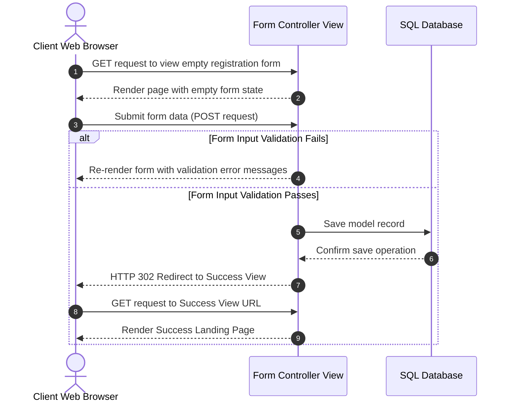

# 5.8. Form Lifecycles inside Controller Views

## 1. The Post-Redirect-Get (PRG) Pattern
When handling form submissions, best-practice software design requires using the **PRG (Post-Redirect-Get)** pattern.

If a POST request (such as a form submission) is successful, the view should always redirect the user to a success page using an HTTP 302 redirect. **Do not** render a successful page directly using `render()`. 

If a page is rendered directly after a POST request, refreshing the page will cause the browser to send duplicate POST requests, which can result in duplicate database records (e.g., submitting a checkout page twice).



## 2. Python Implementation: The Standard View Form Lifecycle
Below is a Class-Based View implementation that demonstrates this lifecycle pattern:

```python
from django.views import View
from django.shortcuts import render, redirect, get_object_or_404
from .forms import PatientRegistrationForm
from .models import Patient

class PatientCreationView(View):
    template_name = 'clinical/patient_register.html'

    def get(self, request):
        # 1. Instantiate an empty form for GET requests
        form = PatientRegistrationForm()
        return render(request, self.template_name, {'form': form})

    def post(self, request):
        # 2. Bind submitted POST payload data to the form class
        form = PatientRegistrationForm(request.POST)
        
        # 3. Trigger validation
        if form.is_valid():
            # 4. Save record to database if validation passes
            patient_record = form.save()
            
            # 5. Redirect using the PRG pattern to prevent duplicate submissions
            return redirect('clinical:registration-success', patient_id=patient_record.id)
        
        # 6. If validation fails, re-render the form with validation error messages
        return render(request, self.template_name, {'form': form})
```

## 3. Common Student Traps
* **Failing to Bind Data**: When processing POST requests, you must pass the submitted data (`request.POST`) into your form class instantiation. Failing to do so (e.g., writing `form = PatientRegistrationForm()`) will instantiate an empty form, and `form.is_valid()` will fail.
* **Double Submission Vulnerability**: Leaving out the `redirect` call on successful POST submissions allows duplicate data entries to be created if the user refreshes their browser. Ensure that all successful write operations end with a redirect.
