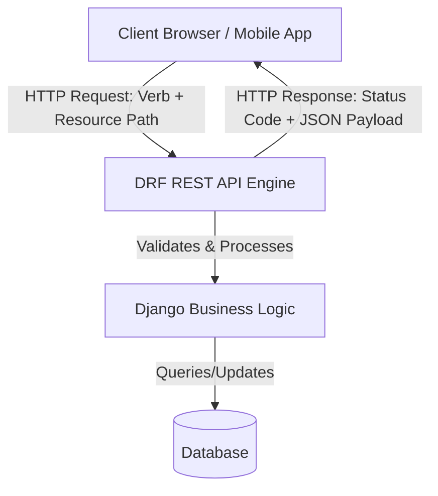

# 6.1. REST Principles in DRF API Design

## 1. Background of REST (Representational State Transfer)
REST is an architectural style designed by Roy Fielding in his 2000 doctoral dissertation. It defines a set of constraints for creating highly scalable web services. 

An API that adheres to these constraints is called **RESTful**.



## 2. Six Core Constraints of RESTful Architectures

1. **Client-Server Decoupling**: The user interface (client) is completely separated from the data storage and business logic (server). This decoupling allows both systems to evolve independently.
2. **Statelessness**: Every HTTP request must contain all the information necessary to understand and process it. The server does not store any client context or session state on its filesystem.
3. **Cacheability**: Server responses must define themselves as cacheable or non-cacheable. This helps prevent clients from repeatedly requesting static or slowly changing data.
4. **Uniform Interface**: Interaction with the server is standardized. This is achieved by:
   * **Resource Identification**: Resources are identified by stable URLs (e.g., `/api/patients/`).
   * **Representation-based Manipulation**: Clients modify resources by passing representation payloads (such as JSON).
   * **Self-descriptive Messages**: Each message includes enough metadata to describe how to process it (e.g., the `Content-Type` header).
5. **Layered System**: A client cannot tell whether it is connected directly to the end server or to an intermediate layer (e.g., a load balancer, CDN, or SSL termination proxy).
6. **Code on Demand (Optional)**: Servers can temporarily extend client functionality by transferring executable code (such as JavaScript).

## 3. Resource Mapping: HTTP Verbs and Endpoints
In a RESTful API, endpoints represent **resources** (nouns) rather than **actions** (verbs). Actions are defined by the HTTP request method used.

| HTTP Method | Target Endpoint | Purpose | SQL Equivalent | DRF ViewSet Method | Successful Status Code |
| :--- | :--- | :--- | :--- | :--- | :--- |
| **`GET`** | `/api/patients/` | Retrieve a list of patients. | `SELECT *` | `list()` | `200 OK` |
| **`GET`** | `/api/patients/1/` | Retrieve a single patient's details. | `SELECT WHERE id=1` | `retrieve()` | `200 OK` |
| **`POST`** | `/api/patients/` | Create a new patient record. | `INSERT INTO` | `create()` | `210 Created` |
| **`PUT`** | `/api/patients/1/` | Replace an entire patient record. | `UPDATE` (Full) | `update()` | `200 OK` |
| **`PATCH`** | `/api/patients/1/` | Update specific fields on a record. | `UPDATE` (Partial) | `partial_update()`| `200 OK` |
| **`DELETE`** | `/api/patients/1/` | Delete a patient record. | `DELETE FROM` | `destroy()` | `204 No Content` |

## 4. Payload Format
REST APIs are format-agnostic, but modern web services standardise on **JSON (JavaScript Object Notation)** over XML due to its lightweight serialization characteristics and native compatibility with JavaScript frontend engines.

The response payload is paired with a matching HTTP response header:
```http
Content-Type: application/json
```