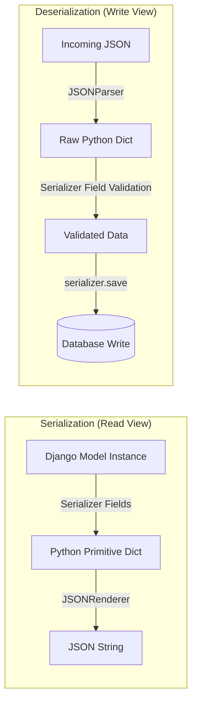

# 6.3. Base Serializers Manual Fields Mapping

## 1. What is a Serializer?
Relational databases deal with tables and rows, while python applications operate on objects. Web clients, however, require serialized strings (like JSON payloads) to transmit data over HTTP. 

DRF **Serializers** handle this translation in both directions:
* **Serialization**: Converts Python model instances and querysets into primitive Python data types, which are then parsed into JSON.
* **Deserialization**: Validates incoming JSON payloads and parses them into Python data structures, ready to be saved to the database.



## 2. Implementing a Manual Base Serializer
While DRF provides shortcuts to generate serializers automatically from models, using the base `serializers.Serializer` class gives you complete, low-level control over how fields are mapped and validated.

Below is an implementation of a manual serializer:

```python
from rest_framework import serializers
from clinical.models import Patient

class ManualPatientSerializer(serializers.Serializer):
    # 1. Define explicit output fields and constraints
    id = serializers.IntegerField(read_only=True)
    full_name = serializers.CharField(max_length=100, source='nom')
    email_address = serializers.EmailField()
    registered_at = serializers.DateTimeField(read_only=True, source='date_creation')

    # 2. Define the explicit creation rule for deserialized data
    def create(self, validated_data):
        # Maps the serializer field names back to your model's database fields
        return Patient.objects.create(
            nom=validated_data.get('nom'),
            email=validated_data.get('email_address'),
        )

    # 3. Define the explicit update rule for deserialized data
    def update(self, instance, validated_data):
        instance.nom = validated_data.get('nom', instance.nom)
        instance.email = validated_data.get('email_address', instance.email)
        instance.save()
        return instance
```

## 3. Standard Django Forms vs. DRF Serializers
While they look similar, Django Forms and DRF Serializers serve different purposes:

| Feature | Django Forms | DRF Serializers |
| :--- | :--- | :--- |
| **Primary Output** | HTML markup widgets (`<input>`). | Primitive Python types (dict), ready for JSON serialization. |
| **Validation Engine** | Validates form data from standard browser POST requests. | Parses, validates, and cleans raw JSON, form data, or multi-part requests. |
| **Relationship Handling**| Basic support. Relies on rendering `<select>` widgets. | Supports nested, relational serialization (e.g., nesting parent and child records in a single payload). |
| **Data Direction** | Bi-directional (browser $\leftrightarrow$ Server). | Bi-directional (API client $\leftrightarrow$ DB). |