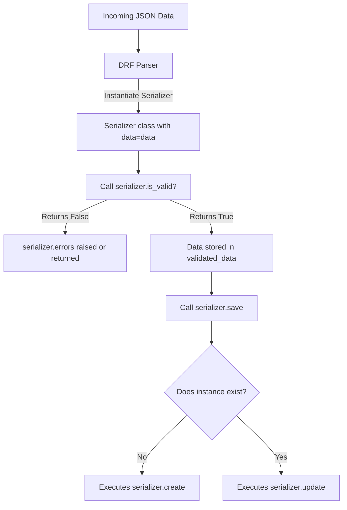

# 6.6. Deserialization Validation and Database Write Operations

## 1. The Deserialization Workflow
Deserialization is the process of accepting an incoming JSON payload, validating its structure and data, and saving it as a database record.



## 2. Multi-Level Deserialization Validation

### Level 1: Field-Level Validation
Field-level validation is used to validate a single field. Define a method on your serializer class named `validate_<field_name>`:
```python
from rest_framework import serializers
from clinical.models import Patient

class PatientWriteSerializer(serializers.ModelSerializer):
    class Meta:
        model = Patient
        fields = ['nom', 'email', 'age']

    def validate_age(self, value):
        # 'value' contains the submitted field value
        if value < 0 or value > 125:
            raise serializers.ValidationError("Please provide a valid age between 0 and 125.")
        return value
```

### Level 2: Object-Level Validation
Object-level validation is used to validate rules that depend on multiple fields. Override the `validate()` method:
```python
    def validate(self, data):
        # 'data' is a dictionary containing all submitted fields
        email = data.get('email')
        nom = data.get('nom')

        if email and nom and nom.lower() in email.lower():
            raise serializers.ValidationError("For security, your name should not be included in your email address.")
        return data
```

## 3. Executing the Save Lifecycle inside a View
Below is a view implementation demonstrating how to handle deserialization, validation, and database writes:

```python
from rest_framework.views import APIView
from rest_framework.response import Response
from rest_framework import status
from .serializers import PatientWriteSerializer

class PatientCreationAPI(APIView):
    def post(self, request):
        # 1. Instantiate the serializer with the request payload data
        serializer = PatientWriteSerializer(data=request.data)
        
        # 2. Run validations. Passing 'raise_exception=True' automatically returns
        # an HTTP 400 Bad Request response containing the validation errors if it fails.
        serializer.is_valid(raise_exception=True)
        
        # 3. Save the record to the database. This executes create() or update()
        # depending on whether an existing instance was passed to the serializer.
        patient_instance = serializer.save()
        
        # 4. Return the serialized data and an HTTP 201 Created status
        return Response(serializer.data, status=status.HTTP_201_CREATED)
```