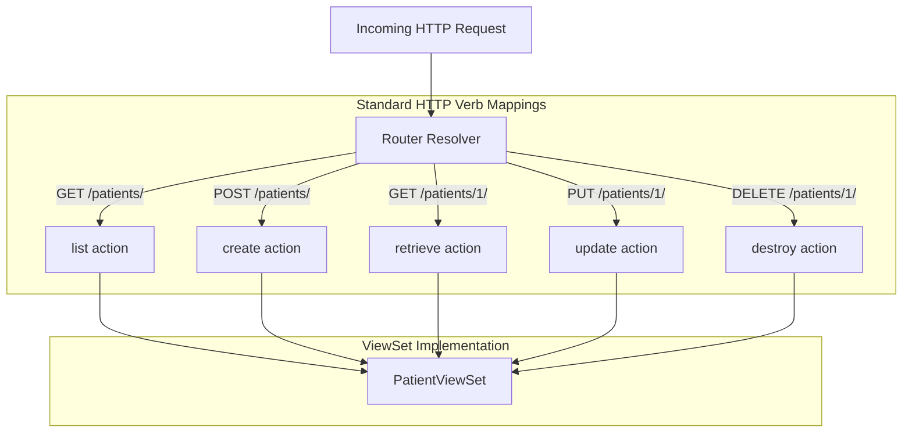

# 7.1. ViewSets Concepts and Action Mappings

## 1. What is a ViewSet?
In standard API design, you often need to define separate views to handle different operations for the same resource (such as one view to handle listing and creating records, and another to handle retrieving, updating, and deleting a single record).

A **ViewSet** simplifies this by combining all of these operations into a single class. Instead of mapping requests to HTTP methods (`get()`, `post()`), a ViewSet maps incoming requests to **actions** (such as `list()`, `create()`, `retrieve()`, `update()`, and `destroy()`).

## 2. Default HTTP Verb to Action Mappings
When a ViewSet is registered with a Router, the HTTP request verbs are automatically mapped to these actions:

| HTTP Method | URL Path | ViewSet Action | Typical Internal Django SQL Query |
| :--- | :--- | :--- | :--- |
| **`GET`** | `/patients/` | **`list`** | `Patient.objects.all()` |
| **`POST`** | `/patients/` | **`create`** | `Patient.objects.create(...)` |
| **`GET`** | `/patients/{id}/` | **`retrieve`** | `Patient.objects.get(pk=id)` |
| **`PUT`** | `/patients/{id}/` | **`update`** | Full column updates |
| **`PATCH`** | `/patients/{id}/` | **`partial_update`** | Selective column updates |
| **`DELETE`** | `/patients/{id}/` | **`destroy`** | `Patient.objects.get(pk=id).delete()` |

## 3. Advantages of Using ViewSets
1. **Less Code Duplication**: By combining related views into a single class, you can share configurations like querysets and serializer classes across all actions.
2. **Simplified Routing**: You no longer need to write URL patterns for every view. Instead, you register your ViewSet with a **Router**, which generates all the standard URL patterns for you automatically.
3. **Consistent API Structure**: ViewSets and Routers ensure that all resource endpoints follow a consistent URL structure and support the same standard actions.
