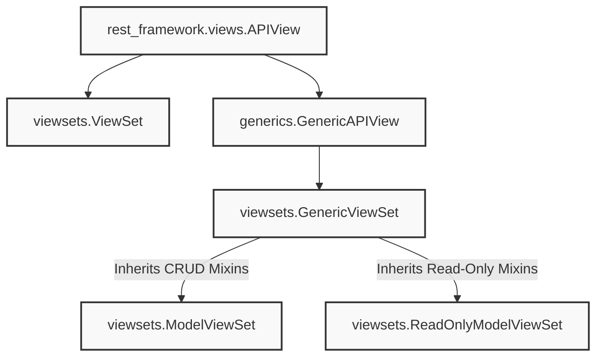

# 7.2. ViewSets Structural Class Hierarchy

## 1. ViewSet Inheritance Diagram
Django REST Framework provides several ViewSet classes with varying levels of abstraction. Understanding this class hierarchy helps you choose the right class for your API's requirements.

## 2. Deep-Dive: ViewSet Classes Reference

### 1. `viewsets.ViewSet`
Inherits from `APIView`. It does not include any default actions, querysets, or serializer mappings. You must write your action methods (like `list()` or `create()`) manually.
* *When to use*: For highly custom APIs that do not map directly to standard database models.

### 2. `viewsets.GenericViewSet`
Inherits from `GenericAPIView`. It provides standard database query helpers (like `get_queryset()` and `get_object()`), but does not include any default action methods. You can implement actions by inheriting DRF's CRUD mixins (such as `ListModelMixin` or `CreateModelMixin`).
* *When to use*: When you want to build a ViewSet that supports only specific actions (e.g., an API that allows users to list and retrieve records, but not create, update, or delete them).

### 3. `viewsets.ModelViewSet`
Inherits from `GenericViewSet` and all five CRUD mixin classes (`ListModelMixin`, `CreateModelMixin`, `RetrieveModelMixin`, `UpdateModelMixin`, and `DestroyModelMixin`).
* *When to use*: For standard database models where you want to support complete CRUD operations.

### 4. `viewsets.ReadOnlyModelViewSet`
Inherits from `GenericViewSet` and only the read-only mixin classes (`ListModelMixin` and `RetrieveModelMixin`).
* *When to use*: For lookup tables or read-only resources where you want to prevent clients from creating, updating, or deleting data.