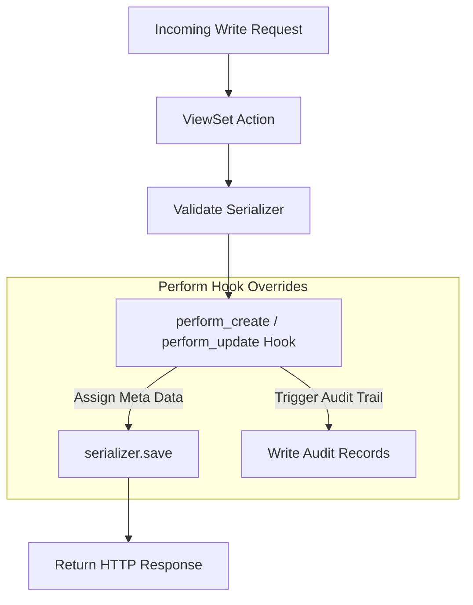

# 7.4. ViewSets Hook Methods and Runtime Overrides

## 1. Customizing ViewSet Behaviors
While the default configurations of `ModelViewSet` are useful for standard operations, you will often need to customize how your views query the database, validate data, or save models. 

You can customize these behaviors by overriding the view's default hook methods.



## 2. Common Hook Methods and Overrides

### 1. Filtering Querysets Dynamically (`get_queryset`)
By default, the view returns all records defined by the `queryset` attribute. You can override **`get_queryset()`** to filter the results dynamically based on the requesting user or query parameters:
```python
from rest_framework import viewsets
from clinical.models import Patient

class SecurePatientViewSet(viewsets.ModelViewSet):
    serializer_class = PatientModelSerializer

    def get_queryset(self):
        # Override to ensure users can only view their own patient records
        user = self.request.user
        if user.is_staff:
            return Patient.objects.all()
        return Patient.objects.filter(assigned_doctor=user)
```

### 2. Using Different Serializers for Different Actions (`get_serializer_class`)
You can use different serializers for different actions (such as using a lightweight serializer for list views to save bandwidth, and a detailed serializer for write views):
```python
    def get_serializer_class(self):
        # Use a lightweight serializer for list views, and the default serializer for everything else
        if self.action == 'list':
            return MinimalPatientSerializer
        return PatientModelSerializer
```

### 3. Modifying Save Behaviors (`perform_create` and `perform_update`)
These hooks run right before a model is saved to the database. They are useful for automatically assigning metadata (such as the creator's user ID) or triggering background tasks:
```python
    def perform_create(self, serializer):
        # Automatically set the creator field to the requesting user during creation
        serializer.save(created_by=self.request.user)
```