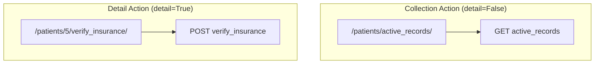

# 7.5. Custom Actions and Routes using action

## 1. What are Custom Actions?
The five standard CRUD actions cover basic database operations. However, real-world APIs often need to support custom business actions on resources (such as activating an account, printing an invoice, or searching for records).

In DRF, you can add custom endpoints to a ViewSet using the **`@action`** decorator.

## 2. Collection Actions vs. Detail Actions
When defining a custom action, you must specify whether it applies to a single record or to the entire collection:
* **Collection Action (`detail=False`)**: Acts on the entire list of resources. Generates a URL path like `/patients/custom_action/`.
* **Detail Action (`detail=True`)**: Acts on a single resource. Generates a URL path containing the resource ID, like `/patients/{id}/custom_action/`.



## 3. Python Implementation Example
```python
from rest_framework import viewsets
from rest_framework.decorators import action
from rest_framework.response import Response
from clinical.models import Patient
from .serializers import PatientModelSerializer

class AdvancedPatientViewSet(viewsets.ModelViewSet):
    queryset = Patient.objects.all()
    serializer_class = PatientModelSerializer

    # 1. Custom Collection Action: GET /api/patients/active_records/
    @action(detail=False, methods=['GET'])
    def active_records(self, request):
        active_patients = Patient.objects.filter(is_active=True)
        serializer = self.get_serializer(active_patients, many=True)
        return Response(serializer.data)

    # 2. Custom Detail Action: POST /api/patients/{id}/verify_insurance/
    @action(detail=True, methods=['POST'])
    def verify_insurance(self, request, pk=None):
        # get_object() automatically retrieves the record using the ID from the URL path
        patient = self.get_object()
        
        # Add your custom business logic here
        insurance_status = verify_provider_api(patient.email)
        
        return Response({
            'patient_id': patient.id,
            'insurance_verified': insurance_status
        })
```

## 4. Important Reminders & Student Traps
* **Failing to Define `methods`**: By default, custom actions only accept `GET` requests. If you want your action to accept `POST`, `PUT`, or `DELETE` requests, you must specify them in the `methods` parameter: `@action(detail=True, methods=['POST'])`.
* **Relying on `pk` for Collection Actions**: A collection action (`detail=False`) does not accept an ID parameter in its URL. Attempting to call `self.get_object()` or reference `pk` inside a collection action will raise an error.