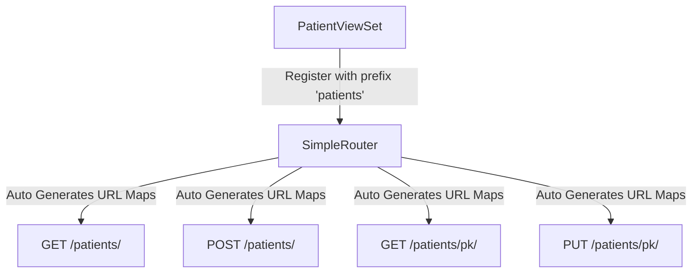

# 7.6. DRF Routing Automations SimpleRouter

## 1. What is a Router?
When building RESTful APIs with Django, writing manual URL configurations for every endpoint can become tedious.

DRF **Routers** solve this by automatically generating all the URL patterns for your ViewSets based on standard conventions. Instead of writing separate URL paths for lists, details, and custom actions, you register your ViewSet with a router, and it generates all the necessary URL mappings for you.



## 2. Python Implementation Example
Here is how to set up routing for your ViewSets using **`SimpleRouter`**:

```python
# Create a new file in your application directory: urls.py
from rest_framework.routers import SimpleRouter
from .views import PatientModelViewSet

# 1. Instantiate the SimpleRouter
router = SimpleRouter()

# 2. Register your ViewSet with a URL prefix
router.register(r'patients', PatientModelViewSet, basename='patient')

# 3. Include the router's generated URL patterns in your urlpatterns list
urlpatterns = router.urls
```

## 3. Generated URL Configuration Mappings
For the registration above, `SimpleRouter` automatically generates these URL patterns:

| Request Verb | URL Path Pattern | Target View Action | Generated Route Name |
| :--- | :--- | :--- | :--- |
| **`GET`** | `/patients/` | `list` | `patient-list` |
| **`POST`** | `/patients/` | `create` | `patient-list` |
| **`GET`** | `/patients/{pk}/` | `retrieve` | `patient-detail` |
| **`PUT`** | `/patients/{pk}/` | `update` | `patient-detail` |
| **`PATCH`** | `/patients/{pk}/` | `partial_update` | `patient-detail` |
| **`DELETE`** | `/patients/{pk}/` | `destroy` | `patient-detail` |

## 4. When to Specify `basename`
The `basename` parameter is used to name the auto-generated URL patterns (e.g., creating `patient-list` from `basename='patient'`). 

* If your ViewSet defines a `queryset` attribute, the router can infer this name automatically from the model name, making `basename` optional.
* If your ViewSet does **not** define a `queryset` attribute (such as when you override `get_queryset()` instead), you **must** specify `basename` manually. If you omit it, Django will raise an error during startup.