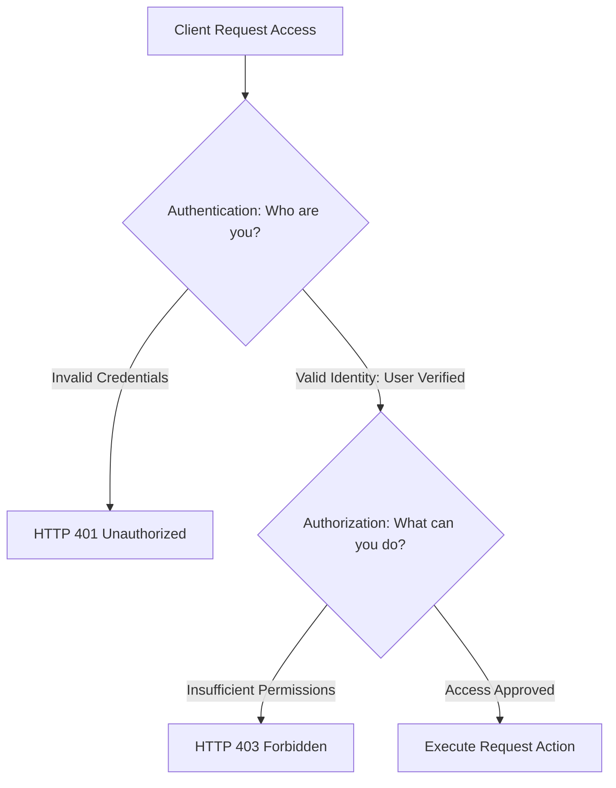

# 8.1. Authentication vs Authorization Core Concepts

## 1. Core Security Definitions
When securing APIs and web applications, you must separate user access control into two distinct stages: **Authentication** and **Authorization**.

## 2. Key Security Differences Comparison

| Feature | Authentication (AuthN) | Authorization (AuthZ) |
| :--- | :--- | :--- |
| **Core Question** | *"Who are you?"* | *"What are you allowed to do?"* |
| **Step Order** | Happens first. You must verify a user's identity before checking their permissions. | Happens second. Runs after the user's identity is verified. |
| **Common Inputs** | Passwords, API Tokens, SSH keys, Fingerprints. | User Roles, User Groups, Access Policies. |
| **DRF Error Code** | **`HTTP 401 Unauthorized`** (Returned if credentials are missing or invalid). | **`HTTP 403 Forbidden`** (Returned if the user is identified but lacks the required permissions). |

## 3. Practical Real-World Example
Consider a corporate secure facility:
* **Authentication**: When you arrive, you present your ID card to the guard to verify your identity. If the card is valid, you have successfully **authenticated**.
* **Authorization**: Next, you attempt to scan your card to enter the server room. If your job role does not grant you server room access, the door remains locked and denies entry. This is an **authorization** failure.