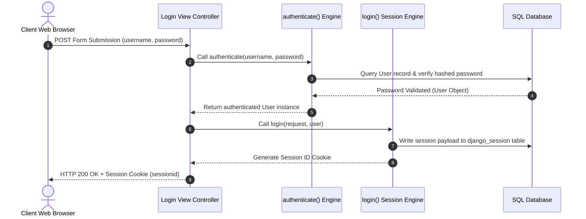

# 8.3. Credentials Verification and Session Integration

## 1. The Session-Based Login Lifecycle
For standard, session-based web applications, logging in a user is a two-step process:
1. **Credentials Verification**: Verify that the submitted username and password match a valid record in your database.
2. **Session Integration**: Generate a session ID on the server, store it in the database, and return a matching session cookie to the client's browser.



## 2. Code Implementation: The Login Process
You can implement this lifecycle pattern in your views using Django's built-in **`authenticate()`** and **`login()`** functions:

```python
from django.contrib.auth import authenticate, login
from django.shortcuts import render, redirect
from django.views import View
from django.http import HttpResponse

class CustomLoginView(View):
    def post(self, request):
        # 1. Retrieve the submitted credentials
        user_input = request.POST.get('username')
        pass_input = request.POST.get('password')

        # 2. Verify credentials
        # 'authenticate' returns a User instance if valid, or None if invalid
        user = authenticate(request, username=user_input, password=pass_input)

        if user is not None:
            # 3. If valid, check if the user account is active
            if user.is_active:
                # 4. Log the user in
                # 'login' generates a session on the server and returns a session cookie to the browser
                login(request, user)
                return redirect('clinical:dashboard')
            else:
                return HttpResponse("Your account has been deactivated.", status=403)
        else:
            return render(request, 'registration/login.html', {
                'error': 'Invalid username or password.'
            })
```