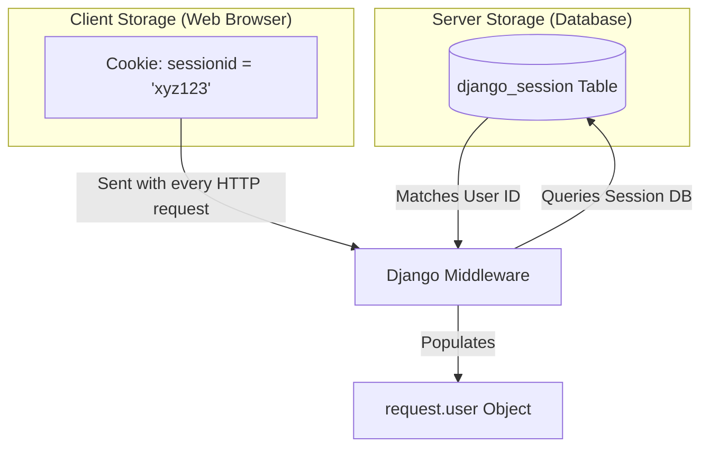

# 8.4. Session Engine Architecture and Cookie Lifetiming

## 1. What is Session Engine Architecture?
Because the HTTP protocol is stateless, web servers treat each request as completely independent. To recognize returning users across requests, web applications use **Sessions**.

When a user logs in:
1. Django creates a session containing user metadata in its backend store (such as database table `django_session`).
2. It returns a cryptographically signed cookie named **`sessionid`** to the client's browser.
3. For subsequent requests, the browser sends this cookie back to the server. Django reads the cookie, retrieves the matching session from its database, and automatically reconstructs the logged-in user object (`request.user`).



## 2. Core Session Settings Configuration
You can configure session lifetimes, engines, and security flags in your project's **`settings.py`**:

```python
# 1. Specify the Session storage backend (default is database-backed sessions)
SESSION_ENGINE = 'django.contrib.sessions.backends.db'

# 2. Define how long sessions remain valid, in seconds (default is 1209600 seconds - 2 weeks)
SESSION_COOKIE_AGE = 1209600

# 3. Determine whether sessions expire when the user closes their browser
SESSION_EXPIRE_AT_BROWSER_CLOSE = False

# 4. Security: Prevent client-side JavaScript from accessing session cookies (XSS Protection)
SESSION_COOKIE_HTTPONLY = True

# 5. Security: Enforce that session cookies are only transmitted over secure HTTPS connections
SESSION_COOKIE_SECURE = True
```

## 3. Clearing Session Footprints on Logout
When a user logs out, you must clear their session data on both the server and the client to prevent security risks. 

You can log a user out and clear their session safely using Django's **`logout()`** and **`request.session.flush()`** methods:

```python
from django.contrib.auth import logout
from django.shortcuts import redirect

def safe_logout_view(request):
    # 1. Destroy and delete all session data from the server's database
    # 2. Delete the session cookie from the user's browser
    logout(request)
    
    # 3. Force-clears the current session dictionary and regenerates a new session key
    request.session.flush()
    
    return redirect('login')
```