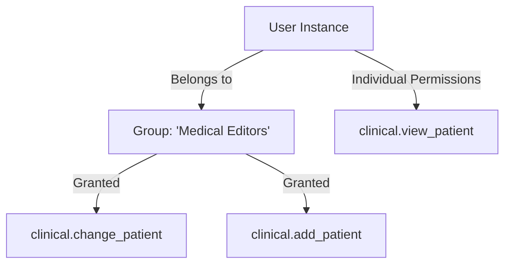

# 8.5. Permissions and Group Management in Django Core

## 1. Role-Based Access Control (RBAC) in Django
Django provides built-in support for **Role-Based Access Control (RBAC)**. This allows you to define permissions and group them together into roles (Groups), and then assign those roles to users.



## 2. Customizing and Verifying Model Permissions
By default, Django automatically creates four standard permissions for every model:
* `add_<model_name>`
* `change_<model_name>`
* `delete_<model_name>`
* `view_<model_name>`

Permissions are represented internally using the string format: `<app_label>.<codename>_<model_name>`.

### Python Implementation: Creating Groups and Permissions
```python
from django.contrib.auth.models import Group, Permission
from django.contrib.contenttypes.models import ContentType
from clinical.models import Patient

# 1. Create a new Group (User Role)
editors_group, created = Group.objects.get_or_create(name='Clinical Editors')

# 2. Retrieve a permission from the database
# First, get the content type for your model
content_type = ContentType.objects.get_for_model(Patient)
# Retrieve the target permission by its codename
change_perm = Permission.objects.get(codename='change_patient', content_type=content_type)

# 3. Assign the permission to the Group
editors_group.permissions.add(change_perm)

# 4. Assign a user to the Group
user.groups.add(editors_group)
```

## 3. Programmatic Permission Checks

### Inside Python View Controllers
```python
def edit_patient_details(request, patient_id):
    # Check if the user has permission to change patient records
    if not request.user.has_perm('clinical.change_patient'):
        from django.core.exceptions import PermissionDenied
        # Raise PermissionDenied to return an automatic HTTP 403 Forbidden response
        raise PermissionDenied("You do not have permission to edit records.")
```

### Inside Django HTML Templates
```html
<!-- Display editing options only to users with the appropriate permissions -->

    <a href="" class="btn-edit">Edit Patient Profile</a>

```