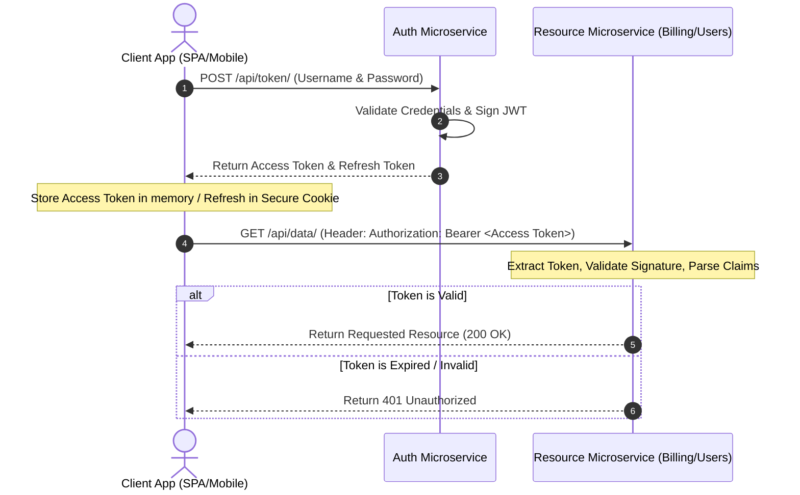

# 9.1. JSON Web Token Architecture and Authentication Flow

## 1. Background and Theory of Stateless Authentication
In a traditional monolithic application, user sessions are stateful. The server stores a session ID in its memory or a database, and the client holds a matching session ID inside a cookie. However, in distributed microservice architectures, stateful session synchronization introduces bottlenecks:
* If Service A handles login, Service B must query Service A’s database or cache (e.g., Redis) to verify the session.
* Under heavy load, this pattern creates a single point of failure and increases network latency.

**JSON Web Tokens (JWT)** solve this by introducing **Stateless Authentication**. Instead of looking up user data on the server, all necessary user information is encoded into a cryptographically signed token sent directly to the client. Any service in the network can verify this token independently using a shared secret or a public key, without making a database lookup.



## 2. Structural Composition of a JWT
A JSON Web Token is a string consisting of three parts separated by dots (`.`): `header.payload.signature`. Each section is individually encoded using **Base64URL**.

```
xxxxx.yyyyy.zzzzz
```

### I. Header
The header contains metadata about the token, typically specifying the token type (`JWT`) and the signing algorithm (e.g., HMAC SHA256 or RSA).
```json
{
  "alg": "HS256",
  "typ": "JWT"
}
```

### II. Payload
The payload contains the **Claims**. Claims are statements about an entity (typically, the authenticated user) and additional metadata. 
There are three types of claims:
* **Registered Claims**: Standard, pre-defined claims (e.g., `iss` for Issuer, `exp` for Expiration time, `sub` for Subject, `aud` for Audience).
* **Public Claims**: Custom claims defined by the application, designed to be collision-free (typically URLs).
* **Private Claims**: Custom claims designed to share information between parties that agree on their usage.
```json
{
  "token_type": "access",
  "exp": 1782048000,
  "jti": "a6713dc777324838b9dfdfba988b4889",
  "user_id": 42,
  "role": "EDITOR"
}
```

### III. Signature
The signature is used to verify that the sender of the JWT is who it claims to be and to ensure that the message has not been altered along the way.
To create the signature, the Base64URL-encoded header, the Base64URL-encoded payload, a secret key, and the algorithm specified in the header are passed to the signing engine:
```javascript
// Conceptual representation of signature generation
HMACSHA256(
  base64UrlEncode(header) + "." +
  base64UrlEncode(payload),
  secret_key
)
```

## 3. Cryptographic Signing Options
* **Symmetric Algorithms (e.g., HS256)**: The same secret key is used both to sign (create) and to verify the token. Every microservice that needs to validate incoming tokens must have access to this shared secret. This approach is simple, but exposes a security risk if any individual microservice is compromised.
* **Asymmetric Algorithms (e.g., RS256)**: Uses a private-public key pair. The authentication service signs the token using its private key, while all other microservices use the corresponding public key to verify it. Since the public key can only read and not write tokens, this approach is highly secure and recommended for distributed microservice architectures.

## 4. Common Misunderstandings & Student Traps
* **Confusing Encrypted vs. Signed Tokens**: Standard JWTs are **signed, not encrypted**. Base64URL encoding is a reversible formatting step, not encryption. Anyone who intercepts the token can decode the payload and read the claims (like user IDs or emails). 
  * **Rule**: Never store sensitive data (like plain-text passwords, credit card numbers, or private medical details) inside a JWT payload.