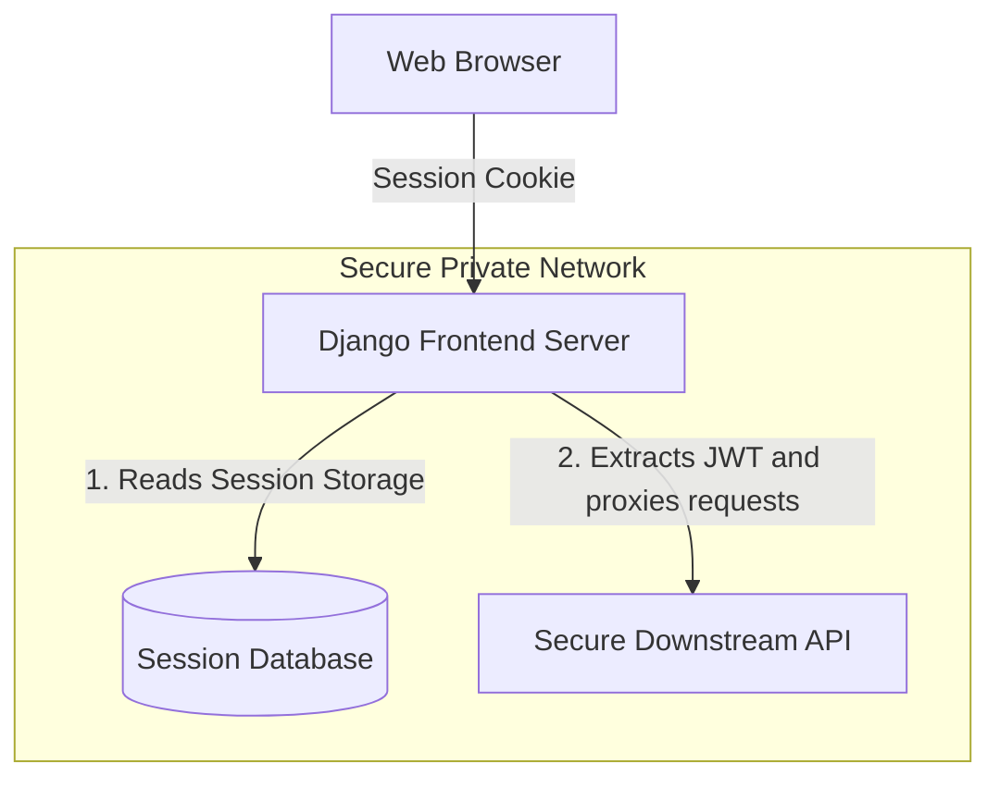

# 9.6. Session-Based Persistent Storage of JWT Tokens

## 1. Proxying Requests: Hybrid Architectures
When using a hybrid architecture (such as a monolithic Django template frontend that connects to separate microservice APIs), you must manage JWTs securely on the server.

Rather than exposing JWT tokens directly to the user's browser, the frontend server can store the tokens inside its secure, database-backed session engine. The frontend server can then automatically attach these tokens to requests it proxies to downstream microservices.



## 2. Python Implementation: Login and Token Storage View
Below is a hybrid login view that authenticates against a remote microservice and stores the returned JWT tokens in the user's session:

```python
from django.shortcuts import render, redirect
from django.views import View
import requests

class RemoteAuthLoginView(View):
    template_name = 'registration/login.html'

    def get(self, request):
        return render(request, self.template_name)

    def post(self, request):
        email = request.POST.get('email')
        password = request.POST.get('password')

        # 1. Authenticate against the remote identity microservice
        identity_service_url = "http://identity-service.internal/api/token/"
        try:
            response = requests.post(
                identity_service_url, 
                json={"email": email, "password": password},
                timeout=5
            )
        except requests.exceptions.RequestException:
            return render(request, self.template_name, {"error": "Authentication service currently offline."})

        if response.status_code == 200:
            tokens = response.json()
            
            # 2. Store the returned JWT tokens in the secure session database
            request.session['access_token'] = tokens['access']
            request.session['refresh_token'] = tokens['refresh']
            
            # Mark the session as active
            request.session['is_logged_in'] = True
            
            return redirect('dashboard')
        else:
            return render(request, self.template_name, {"error": "Invalid email credentials or password."})
```

## 3. Proxying Authorized Requests to Downstream Microservices
```python
# Django view that proxies requests to downstream microservices using tokens from the session:

def get_medical_data_proxy(request):
    # Retrieve the access token from the secure session database
    access_token = request.session.get('access_token')
    
    if not access_token:
        return redirect('login')

    # Attach the token to the request header
    headers = {
        "Authorization": f"Bearer {access_token}"
    }
    
    # Query the secure downstream microservice
    response = requests.get("http://clinical-service.internal/api/patients/", headers=headers)
    
    if response.status_code == 200:
        return render(request, 'dashboard.html', {'data': response.json()})
    else:
        # Handle expired tokens or connection errors
        return render(request, 'error.html', {'message': 'Unable to retrieve data.'})
```