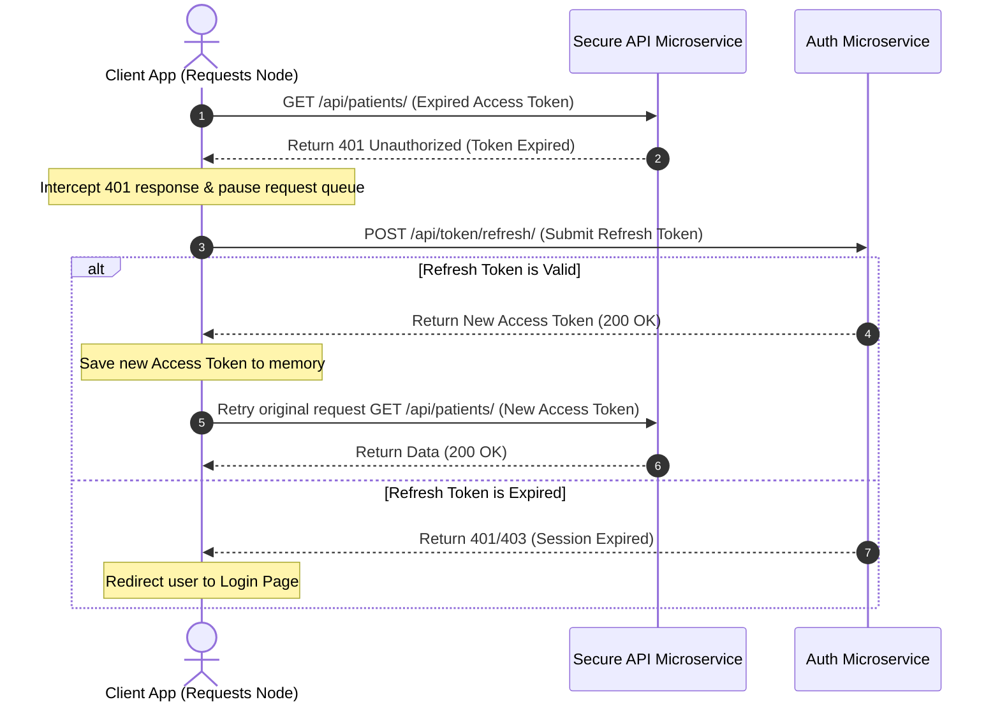

# 9.7. Dynamic Access Token Renewal Pipelines

## 1. Automated Token Renewal Workflow
Because access tokens are short-lived, they will expire while users are actively interacting with your application. To ensure a seamless user experience, your client-side code should automatically detect expired access tokens and use the refresh token to renew them without interrupting the user.



## 2. Python Implementation: Token Renewal Pipeline
Below is a reusable Python client client that handles automatic token renewal and request retries:

```python
import requests

class AuthorizedAPIClient:
    def __init__(self, base_url, auth_username, auth_password):
        self.base_url = base_url
        self.username = auth_username
        self.password = auth_password
        self.access_token = None
        self.refresh_token = None
        
        # Authenticate on initialization
        self.authenticate()

    def authenticate(self):
        """Request a new token pair using credentials."""
        url = f"{self.base_url}/api/token/"
        response = requests.post(url, json={"username": self.username, "password": self.password})
        if response.status_code == 200:
            data = response.json()
            self.access_token = data["access"]
            self.refresh_token = data["refresh"]
        else:
            raise Exception("Authentication failed. Unable to obtain token pair.")

    def renew_access_token(self):
        """Exchange the refresh token for a new access token."""
        url = f"{self.base_url}/api/token/refresh/"
        response = requests.post(url, json={"refresh": self.refresh_token})
        if response.status_code == 200:
            data = response.json()
            self.access_token = data["access"]
            print("[Pipeline] Access token successfully renewed.")
            return True
        else:
            print("[Pipeline] Refresh token expired. User must re-authenticate.")
            self.access_token = None
            self.refresh_token = None
            return False

    def execute_request(self, method, endpoint, payload=None):
        """Execute requests and handle expired tokens automatically."""
        url = f"{self.base_url}{endpoint}"
        headers = {
            "Authorization": f"Bearer {self.access_token}",
            "Content-Type": "application/json"
        }
        
        # 1. Execute the initial request
        if method.upper() == "GET":
            response = requests.get(url, headers=headers)
        elif method.upper() == "POST":
            response = requests.post(url, headers=headers, json=payload)
        else:
            raise ValueError(f"Unsupported HTTP method: {method}")

        # 2. Check for token expiration (HTTP 401 Unauthorized)
        if response.status_code == 401:
            print("[Pipeline] Access token expired. Attempting automatic renewal...")
            
            # 3. Renew the token and retry the request
            if self.renew_access_token():
                headers["Authorization"] = f"Bearer {self.access_token}"
                print("[Pipeline] Retrying original request with new token...")
                if method.upper() == "GET":
                    return requests.get(url, headers=headers)
                elif method.upper() == "POST":
                    return requests.post(url, headers=headers, json=payload)
            else:
                # Force logout if the refresh token has also expired
                raise Exception("Session expired. Please log in again.")
                
        return response
```