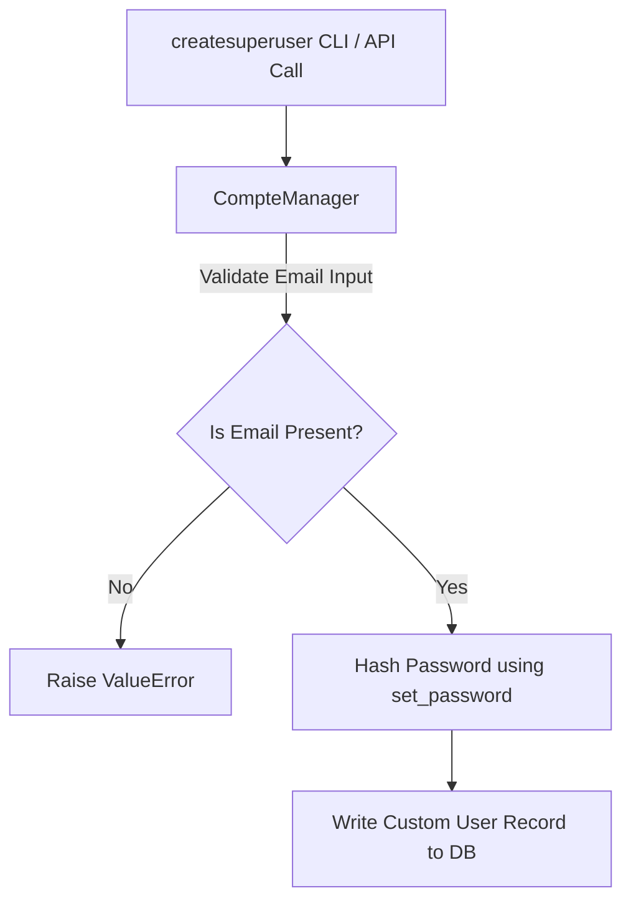

# 10.3. BaseUserManager Custom Implementation

## 1. Why Do We Need a Custom Manager?
When you define a custom user model with an email-based login flow, Django's default user manager cannot create users because it expects a `username` field. 

To support email-based users, you must define a custom manager by inheriting from **`BaseUserManager`**. This custom manager handles creating normal users and superusers using your updated field schema.



## 2. Python Implementation Example
Below is an implementation of a custom manager designed to support email-based users:

```python
from django.contrib.auth.models import BaseUserManager

class CompteManager(BaseUserManager):
    def create_user(self, email, password=None, **extra_fields):
        """Create and save a standard user with the given email and password."""
        if not email:
            raise ValueError("The Email field must be specified.")
            
        # Normalize the email domain name to prevent duplicate email registrations
        email = self.normalize_email(email)
        
        # Instantiate the custom user model with the extra fields
        user = self.model(email=email, **extra_fields)
        
        # Hash the plain-text password securely before saving
        user.set_password(password)
        
        # Save the user to the database
        user.save(using=self._db)
        return user

    def create_superuser(self, email, password=None, **extra_fields):
        """Create and save a superuser with the given email and password."""
        # Set superuser defaults
        extra_fields.setdefault('is_staff', True)
        extra_fields.setdefault('is_superuser', True)
        extra_fields.setdefault('is_active', True)
        extra_fields.setdefault('role', 'ADMIN')

        # Validate superuser flags
        if extra_fields.get('is_staff') is not True:
            raise ValueError("Superuser must be assigned to staff status (is_staff=True).")
        if extra_fields.get('is_superuser') is not True:
            raise ValueError("Superuser must be assigned to superuser status (is_superuser=True).")

        return self.create_user(email, password, **extra_fields)
```

## 3. Under the Hood: Key Manager Methods
* **`normalize_email`**: Normalizes the domain portion of email addresses (making it lowercase). For example, `doctor@HOSPITAL.org` becomes `doctor@hospital.org`. This helps prevent duplicate registrations caused by case sensitivity issues.
* **`set_password`**: Hashes plain-text passwords securely using standard hashing algorithms (e.g., PBKDF2) before writing them to the database.
```