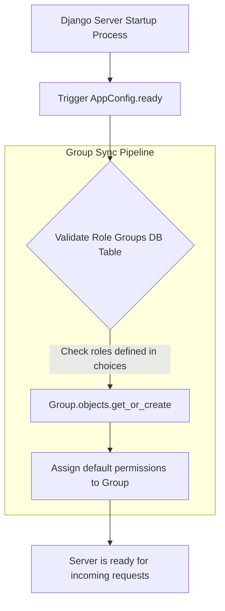

# 10.5. Automated Application Group Syncing

## 1. The Startup Synchronization Pattern
In Role-Based Access Control (RBAC) architectures, we represent roles using Django's standard **`Group`** models. However, when deploying your application to a new environment, manually creating these groups and assigning permissions in the admin panel is error-prone.

To automate this, you can configure your application to check and synchronize your groups and permissions automatically whenever the server starts up.



## 2. Python Implementation Example
We can implement this automated synchronization pipeline inside our app's **`apps.py`** configuration file:

```python
# clinical/apps.py
from django.apps import AppConfig
from django.db.models.signals import post_migrate

def synchronize_system_roles(sender, **kwargs):
    """Callback function to create groups and assign default permissions after migrations run."""
    from django.contrib.auth.models import Group, Permission
    from django.contrib.contenttypes.models import ContentType
    
    # Import models dynamically to avoid import collisions during startup
    from clinical.models import Patient

    # Define roles and their default permission configurations
    role_permissions = {
        'ADMIN': ['add_patient', 'change_patient', 'delete_patient', 'view_patient'],
        'EDITOR': ['add_patient', 'change_patient', 'view_patient'],
        'VIEWER': ['view_patient'],
    }

    # Retrieve patient content type
    patient_content_type = ContentType.objects.get_for_model(Patient)

    for role, permissions in role_permissions.items():
        # 1. Create the Group if it does not exist
        group, created = Group.objects.get_or_create(name=role)
        if created:
            print(f"[RBAC Sync] Created Role Group: {role}")

        # 2. Assign default permissions to the Group
        for perm_codename in permissions:
            try:
                # Retrieve permission record
                permission = Permission.objects.get(
                    codename=perm_codename, 
                    content_type=patient_content_type
                )
                # Assign the permission to the group
                group.permissions.add(permission)
            except Permission.DoesNotExist:
                print(f"[Warning Error] Permission codename '{perm_codename}' not found.")

class ClinicalAppConfig(AppConfig):
    default_auto_field = 'django.db.models.BigAutoField'
    name = 'clinical'

    def ready(self):
        # Connect the synchronization function to Django's post_migrate signal
        # This ensures the sync runs automatically every time you run 'python manage.py migrate'
        post_migrate.connect(synchronize_system_roles, sender=self)
```