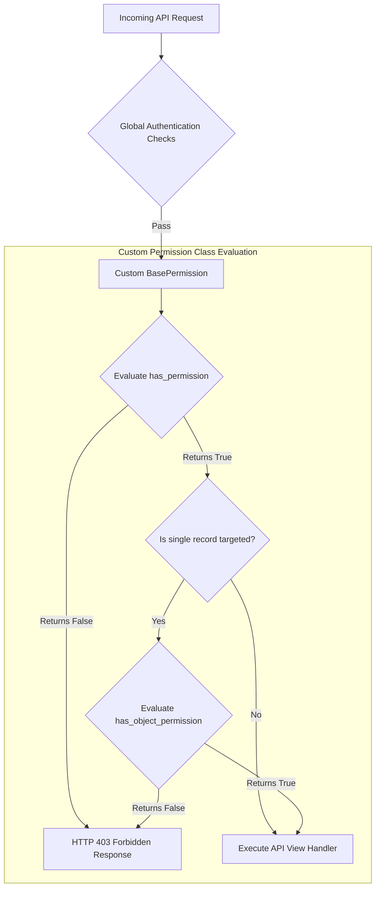

# 10.7. DRF Custom BasePermission Implementation

## 1. Custom API Permissions
While Django REST Framework includes built-in permission classes (such as `IsAuthenticated` or `IsAdminUser`), web APIs often have custom business rules that these classes do not support (for example, allowing access based on user roles, or allowing write access only to the user who created the record).

To implement custom permissions in DRF, inherit from **`rest_framework.permissions.BasePermission`** and override one or both of these methods:
* **`has_permission(self, request, view)`**: Enforces permissions at the request level (runs before the view is executed).
* **`has_object_permission(self, request, view, obj)`**: Enforces permissions at the object level (runs before returning or modifying a specific database record).



## 2. Python Implementation: Role-Based API Permissions
Below is a custom permission class that restricts access based on our custom user model's `role` field:

```python
from rest_framework import permissions

class IsEditorOrAdminOnly(permissions.BasePermission):
    """Custom permission class that restricts write access to Editors and Admins only."""

    def has_permission(self, request, view):
        # 1. Allow read-only HTTP methods (GET, HEAD, OPTIONS) for any authenticated user
        if request.method in permissions.SAFE_METHODS:
            return request.user and request.user.is_authenticated

        # 2. Restrict write methods (POST, PUT, PATCH, DELETE) to Editors and Admins
        return request.user and request.user.is_authenticated and request.user.role in ['ADMIN', 'EDITOR']

class IsPatientOwnerOrStaff(permissions.BasePermission):
    """Custom permission class that restricts editing a patient's record to their assigned doctor or admins."""

    def has_object_permission(self, request, view, obj):
        # obj represents the target model instance (such as a Patient record)
        user = request.user
        
        # 1. Allow staff and admins access automatically
        if user.is_staff or user.role == 'ADMIN':
            return True
            
        # 2. Allow access if the patient's assigned doctor matches the requesting user
        return obj.assigned_doctor == user
```

## 3. Registering Custom Permissions in ViewSets
Add your custom permissions to a ViewSet using the `permission_classes` list:

```python
from rest_framework import viewsets
from clinical.models import Patient
from .serializers import PatientModelSerializer
from .permissions import IsEditorOrAdminOnly, IsPatientOwnerOrStaff

class PatientSecureViewSet(viewsets.ModelViewSet):
    queryset = Patient.objects.all()
    serializer_class = PatientModelSerializer
    
    # DRF evaluates permission classes in the order they are listed. 
    # The request is blocked immediately if any permission class returns False.
    permission_classes = [IsEditorOrAdminOnly, IsPatientOwnerOrStaff]
```