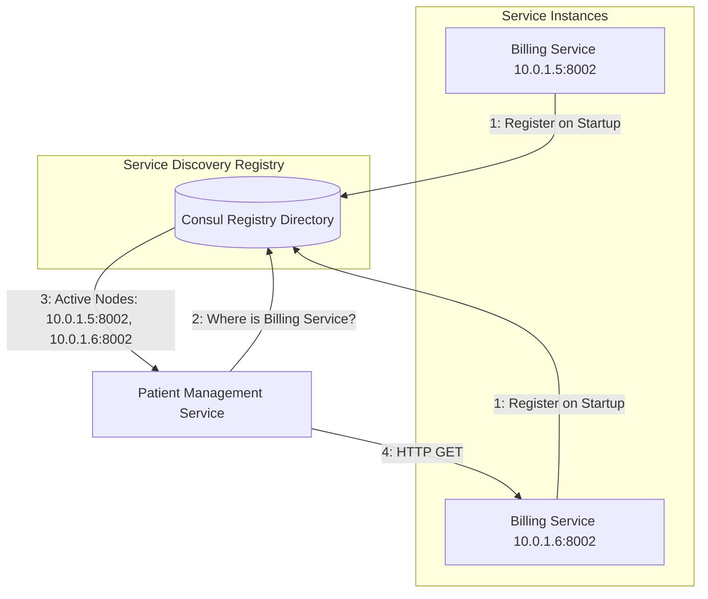

# 11.1. Dynamic Service Discovery Patterns

## 1. Why Do Microservices Need Service Discovery?
In monolithic applications, components call each other directly through in-memory function calls. In a microservices architecture, however, services must communicate with each other over the network using protocols like HTTP or gRPC.

Using hardcoded configuration files to store network addresses (such as `http://10.0.0.5:8000`) has several limitations in cloud and containerized environments:
* **IP Churn**: Containers and cloud servers are ephemeral. They are created, destroyed, and reassigned new IP addresses constantly.
* **Elastic Scaling**: Under heavy load, our application may scale from 2 instances to 15. Managing these addresses manually is impossible.
* **Failure Tolerance**: If a service instance fails, traffic should be routed away from it automatically.

To solve this, we use the **Service Registry / Service Discovery Pattern**.



## 2. Service Discovery Architectures Comparison

### I. Client-Side Service Discovery
The client querying the service (the caller) is responsible for looking up available service instances in the service registry, performing load balancing, and making the request directly.
* *Pros*: Simple, has direct access to instance health details, and does not require extra network hops.
* *Cons*: Couples client-side code to the service registry's API and requires custom implementation for each programming language used in your codebase.

### II. Server-Side Service Discovery
The client makes requests to a central load balancer. The load balancer queries the service registry and routes the request to an available service instance.
* *Pros*: Decouples service discovery logic from client-side code.
* *Cons*: Adds an extra network hop (Client $\rightarrow$ Load Balancer $\rightarrow$ Service) and requires setting up and managing a high-availability load balancer.
```