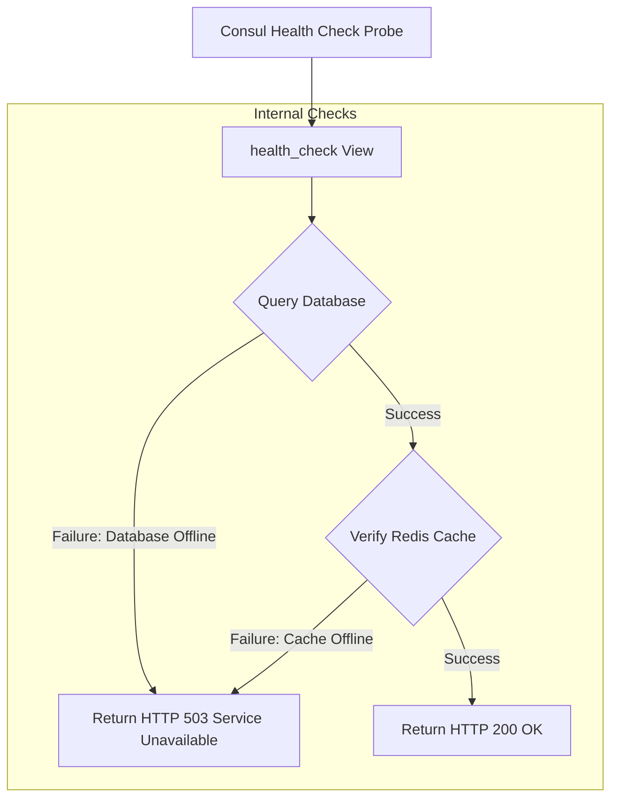

## 1. Designing a Health Check Endpoint
Consul monitors service health using periodic HTTP probes. If your service fails to respond or returns an HTTP error code (such as 500 or 503), Consul will flag the instance as unhealthy and stop routing traffic to it.

A good health check should verify not only that your web server is running, but also that its essential dependencies (such as its database and cache) are online and accessible.



## 2. Python Implementation Example
Below is an implementation of a comprehensive health check endpoint:

```python
# File: clinical/views.py
from django.http import JsonResponse
from django.db import connection
from django.core.cache import cache

def health_check_endpoint(request):
    """Verifies that the application and its dependencies are online."""
    health_status = {
        "status": "Healthy",
        "dependencies": {
            "database": "Online",
            "cache": "Online"
        }
    }
    status_code = 200

    # 1. Verify Database Connectivity
    try:
        # Run a lightweight query to check connection status
        with connection.cursor() as cursor:
            cursor.execute("SELECT 1;")
    except Exception as e:
        health_status["status"] = "Degraded"
        health_status["dependencies"]["database"] = f"Offline: {str(e)}"
        status_code = 503

    # 2. Verify Redis Cache Connectivity
    try:
        # Test write and read permissions in cache
        cache.set("health_check_key", "active", timeout=5)
        if cache.get("health_check_key") != "active":
            raise Exception("Cache value mismatch.")
    except Exception as e:
        health_status["status"] = "Degraded"
        health_status["dependencies"]["cache"] = f"Offline: {str(e)}"
        # Degraded cache status can also return a 503 status code depending on its critical level
        status_code = 503

    return JsonResponse(health_status, status=status_code)
```

## 3. Routing Configuration
Add the health check route to your application's **`urls.py`**:
```python
# clinical/urls.py
from django.urls import path
from .views import health_check_endpoint

urlpatterns = [
    # Match the endpoint path registered in your Consul configuration
    path('health/', health_check_endpoint, name='api-health'),
]
```