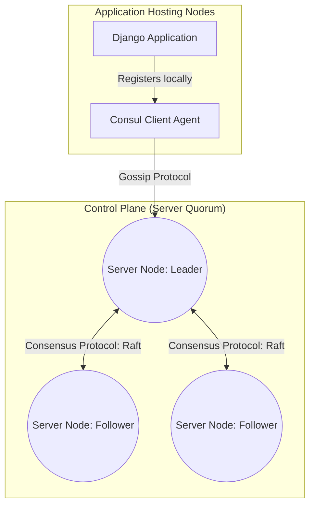

# 11.2. HashiCorp Consul Architecture Overview

## 1. What is HashiCorp Consul?
**Consul** is a distributed, highly available service networking solution developed by HashiCorp. It provides three primary features for microservice architectures:
* **Service Registry**: An active directory where services can register their network locations and metadata.
* **Health Checking**: Proactively monitors registered service instances to ensure they are healthy before routing traffic to them.
* **Key-Value Store**: A distributed, transactional datastore used for configuration management and feature flagging.

## 2. Consul Plane Divisions

* **Control Plane**: Handles registering services, monitoring health, and propagating routing rules across the cluster.
* **Data Plane**: Handles proxying and encrypting network traffic between active services (Service Mesh).

## 3. Consul Agent Execution Modes
The Consul agent is a lightweight process that runs on every node in the cluster. It can be run in two modes:

### I. Consul Server Nodes
Consul Server nodes manage the state of the cluster. They maintain the service registry, handle write requests, and run health checks. 
* To prevent data loss and ensure consensus, production clusters require multiple server nodes (typically 3 or 5).

### II. Consul Client Nodes
Consul Client nodes are lightweight agents that run on application servers. They forward registration requests and health status updates to the Server nodes.
* Client nodes do not store cluster state and are highly scalable.

