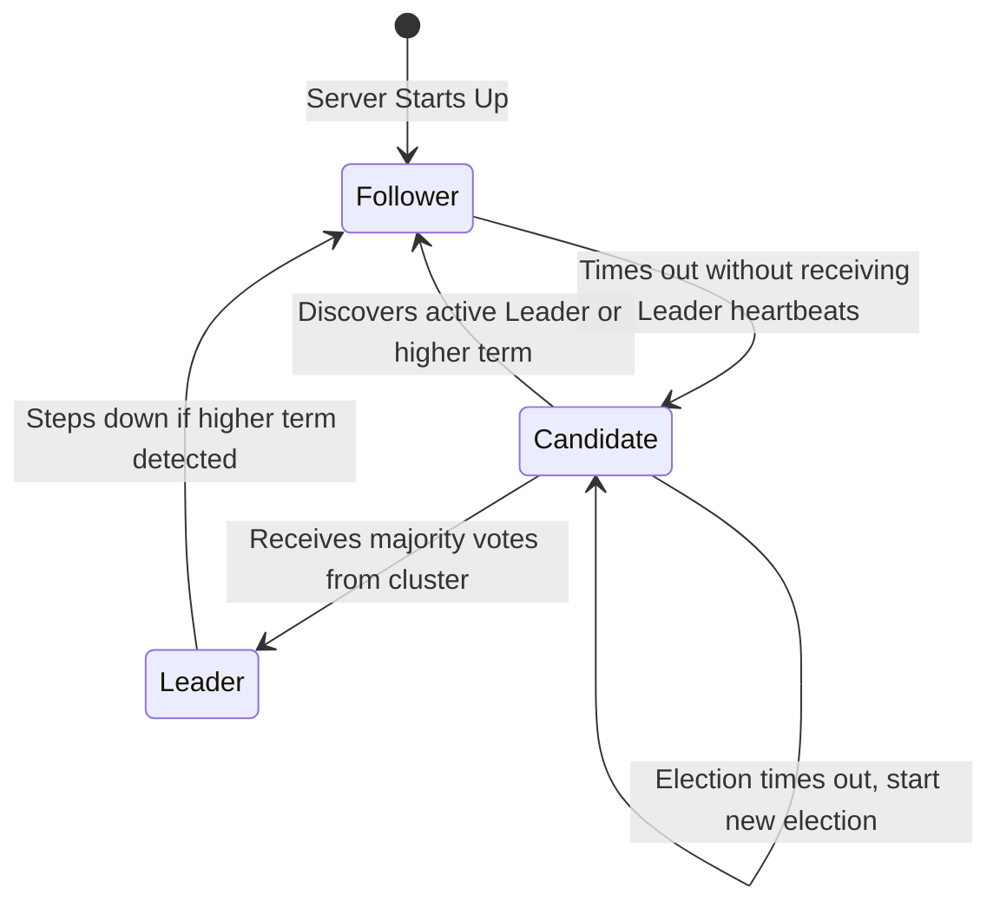

# 11.3. Consensus Protocol Raft and Server Quorums

## 1. Decentralized Consensus and Raft
Distributed systems must agree on data state (such as which services are currently healthy and registered) even if some network connections fail. Consul manages cluster state consistency using the **Raft Consensus Protocol**.

In Raft, server nodes can be in one of three states:
* **Leader**: Coordinates all database writes, replication logs, and heartbeats. There is only one active Leader in a cluster.
* **Follower**: Replicates write logs from the Leader. If the Leader fails, Followers transition to Candidates to elect a new Leader.
* **Candidate**: Used during elections to select a new Leader node.

## 2. Calculating the Server Quorum Formula
To prevent inconsistencies (such as split-brain scenarios where the network splits in two and both sides elect a leader), Raft requires a **Quorum** (a strict majority of active server nodes) to execute database writes and elect leaders.

$$\text{Quorum} = \left\lfloor \frac{N}{2} \right\rfloor + 1$$

Where $N$ is the total number of server nodes in the cluster.

| Total Servers ($N$) | Permissible Server Failures | Quorum Requirements |
| :---: | :---: | :---: |
| **1** | 0 | 1 |
| **3** | 1 | 2 |
| **5** | 2 | 3 |
| **7** | 3 | 4 |

## 3. Important Reminders & Student Traps
* **Why Even-Numbered Clusters are an Anti-Pattern**: If you set up a cluster with 4 server nodes, the quorum requirement is 3. If 2 servers fail, the remaining 2 servers cannot reach a quorum, and the cluster will stop accepting writes. This means a 4-server cluster can only tolerate **1 failure**, which provides the exact same fault tolerance as a 3-server cluster while requiring more resources.