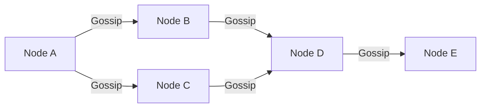

# 11.4. Gossip Protocol Serf and Local WAN Network Topology

## 1. Cluster Communication and Serf
Consul Server nodes use Raft to synchronize state, which requires high bandwidth and low latency. For lightweight communication across the rest of the cluster (such as discovering client nodes and checking member health), Consul uses **Serf**, a decentralized membership protocol based on **Gossip Protocols**.

Rather than querying a central registry, nodes communicate by passing lightweight metadata messages to a small group of neighboring nodes. These neighbors then pass the message to their neighbors, allowing information to propagate across the entire cluster.

## 2. LAN vs. WAN Gossip Pools
Consul separates Gossip traffic into two distinct pools:

### I. LAN Gossip Pool
Used for communication between nodes in the same local network or datacenter.
* **Purpose**: Handles node discovery, membership updates, and health checking.
* **Performance**: Designed for high-speed, low-latency local networks.

### II. WAN Gossip Pool
Used to bridge clusters across different datacenters over the public internet or WAN.
* **Purpose**: Allows datacenters to discover each other, route cross-datacenter requests, and coordinate global state.
* **Performance**: Optimized for higher latency and lower bandwidth networks.