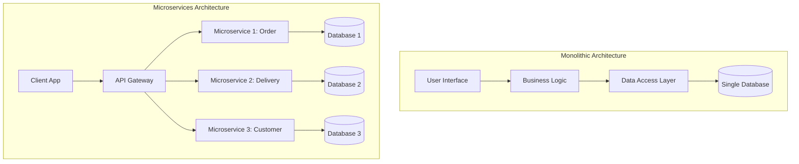
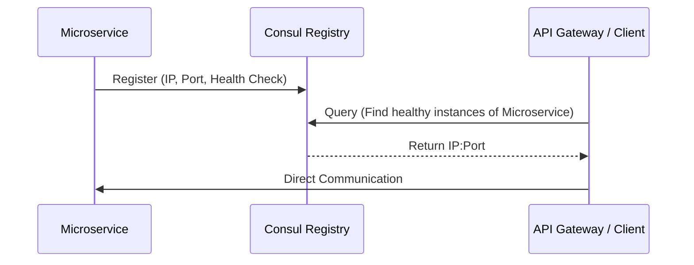
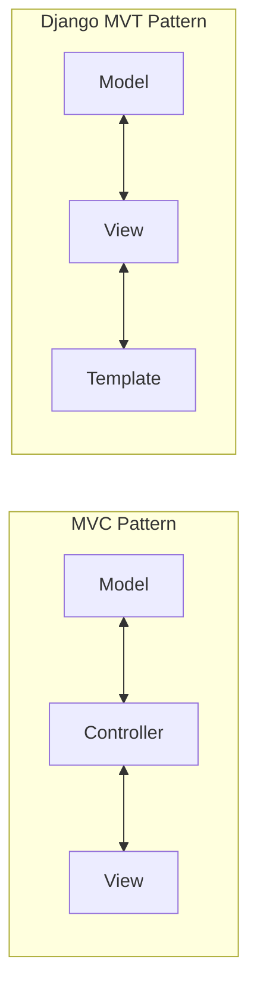
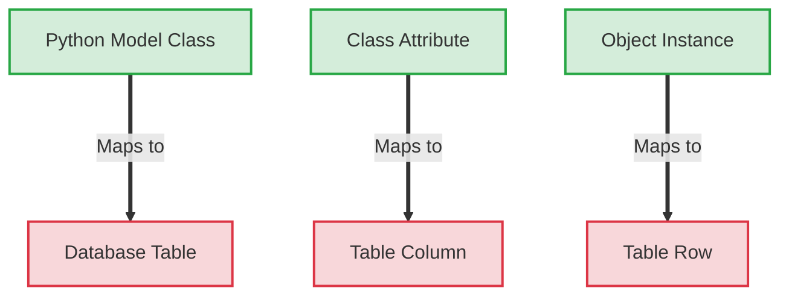
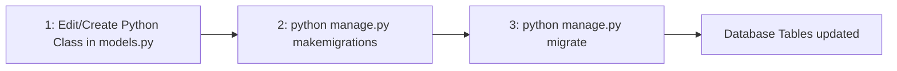

# Part 1: Pure Theory & Factual Knowledge

---

## 1. System Architectures: Monolith vs. Microservices

### Context & Problematic
Modern Information Systems (IS) must serve multiple client platforms (Web, Mobile, Desktop) while ensuring:
* Data coherence
* System scalability
* Independent feature deployments
* Technology evolutionary changes
* High availability and resilience

### Architectural Comparison



### Key Differences

| Dimension | Monolithic Architecture | Microservices Architecture |
| :--- | :--- | :--- |
| **Definition** | Single, unified software unit. | Collection of autonomous, specialized services. |
| **Coupling** | High (Tight coupling). | Low (Independent, loosely coupled). |
| **Scalability** | All-or-nothing (Must scale entire system). | Granular (Scale individual services as needed). |
| **Deployment** | Slow, risky redeployments of entire app. | Independent, rapid service deployments. |
| **Resilience** | Low (A single crash can bring down the system). | High (Fault isolation: failures are localized). |
| **Tech Stack** | Single database, language, and framework. | Polyglot (Choose tech stack per service). |
| **Drawbacks** | Slow deployment, hard to scale. | Operational complexity, harder distributed testing. |

---

## 2. Microservice Components

### Standard Microservice System Topology
A complete microservice architecture contains:
1. **Service (Stateless/Stateful)**: Executes specific domain logic.
2. **API Gateway**: Single entry point for clients. Handles routing, authentication, throttling, and aggregation. (*Examples: Kong, Traefik, Nginx, AWS API Gateway*).
3. **Message Broker / Event Bus**: Manages [[asynchronous]] inter-service communication.
4. **Service Discovery / Registry**: Dynamic inventory tracking of service instance locations.
5. **Database per Service**: Ensures strict service independence and decoupling.
6. **Observability Suite**: Unified logging, metrics, and tracing platforms (*e.g., Prometheus, Grafana, Jaeger*).

### Service Discovery & Registry: Consul
Consul acts as a centralized directory. Instead of hardcoding IP addresses, services register with Consul and query it to locate other healthy endpoints.



* **Register**: Adds a service instance details and its associated health check status to the directory.
* **Query**: Resolves healthy, active target instances using DNS queries or HTTP APIs.
* **Secure**: Restricts and protects communications using mutual [[TLS (mTLS)]] encryption and access control lists [[(ACLs).]]

---

## 3. Design Patterns: [[MVC vs. MVT]] (Django)

Django uses the **MVT (Model-View-Template)** pattern, which is a variation of the traditional **MVC (Model-View-Controller)** pattern.



### Element Mappings

| MVC Component | Django MVT Component | Responsibility in Django |
| :--- | :--- | :--- |
| **Model** | **Model** (`models.py`) | Handles data structures, validation rules, and business logic. |
| **Controller** | **View** (`views.py`) | Handles incoming requests, queries the model, and passes data to templates. |
| **View** | **Template** (`.html`) | Represents the presentation layer (HTML/CSS/JS with context bindings). |

---

## 4. The ORM (Object-Relational Mapping) Pattern

### Concept
The ORM translates programming objects to database structures without requiring direct SQL.



### Advantages and Limitations

* **Advantages**:
  * Complete SQL syntax abstraction for higher developer productivity.
  * SGBD Portability (change SQL backends with minimal changes).
  * Maintained consistency between logic layers and database schemas.
  * Automatic management of relationship tables.
* **Limitations**:
  * Performance overhead when running complex or deeply nested queries.
  * Less control over database-level engine execution optimizations.
  * Learning curve for managing custom database migrations.

---

## 5. Django Project Structure & Artifacts

### Directory Architecture Details

```text
monprojet/
│
├── manage.py                # CLI entrypoint for administration tasks.
│
├── monprojet/               # Inner project settings directory.
│   ├── __init__.py          # Identifies directory as a Python package.
│   ├── settings.py          # Centralized global configurations & environment parameters.
│   ├── urls.py              # Main URL path routing tree registry.
│   └── wsgi.py              # Web Server Gateway Interface entry point for production.
│
└── monapp/                  # Django Application package directory.
    ├── __init__.py          # App package identifier.
    ├── admin.py             # Configuration file to expose models to Django Admin Panel.
    ├── apps.py              # App metadata configurations.
    ├── migrations/          # Auto-generated database structural changes history.
    ├── models.py            # Object-Relational Database schema declarations.
    ├── tests.py             # Code Unit testing scripts repository.
    └── views.py             # View controllers handling incoming network request objects.
```

---

# Part 2: Applied Methodology & Execution

---

## 1. Virtual Environments (venv)

Isolated virtual environments prevent dependency version conflicts between different Python projects.

### Terminal Commands: Setup & Lifecycle
* **Creation**: Create the environment directory (named `venv` here):
  ```bash
  python3 -m venv venv
  ```
* **Activation (Linux/macOS)**:
  ```bash
  source venv/bin/activate
  ```
* **Activation (Windows PowerShell)**:
  ```powershell
  venv\Scripts\Activate.ps1
  ```
* **Dependency Installation**: Install dependencies listed in a requirements file:
  ```bash
  pip install -r requirements.txt
  ```
* **Dependency Exportation**: Save current environment packages to file:
  ```bash
  pip freeze > requirements.txt
  ```
* **Deactivation**: Exit the active virtual environment:
  ```bash
  deactivate
  ```

---

## 2. Django Setup & Initialization

### Terminal Commands: Initial Setup
* **Framework Installation**:
  ```bash
  pip install django
  ```
* **Project Creation**: Create a project folder structure:
  ```bash
  django-admin startproject mysite
  ```
* **Start Development Server**: Run local server on port 8000:
  ```bash
  cd mysite
  python manage.py runserver
  ```

---

## 3. SGBD Database Configuration (`settings.py`)

Locate the `DATABASES` dictionary inside your settings file to update configuration details. Below is an example configuration for PostgreSQL:

```python
DATABASES = {
    'default': {
        'ENGINE': 'django.db.backends.postgresql', # Options: sqlite3, postgresql, mysql...
        'NAME': 'ma_base',                        # Database schema name
        'USER': 'mon_user',                        # Login credential username
        'PASSWORD': 'mon_password',                # User credential password
        'HOST': 'localhost',                       # Engine address server (IP or domain name)
        'PORT': '5432',                            # Default SGBD system port
    }
}
```

---

## 4. Model Design & Declarations (`models.py`)

### Django Field Attributes Reference

| SGBD Constraints | Django Field Argument | Description / Usage |
| :--- | :--- | :--- |
| `NULL` | `null=True` | Allows saving empty database cells as `NULL`. |
| Forms Validation | `blank=True` | Allows fields to be left blank in input forms. |
| DB Unique constraint | `unique=True` | Restricts data to unique values across the column. |
| Table Default values | `default=value` | Autopopulates fields with a default value when omitted. |
| Character Limit | `max_length=n` | Required parameter on `CharField` to restrict length. |
| Choice validation | `choices=LISTE` | Restricts field values to an explicit options list. |
| Created Datestamp | `auto_now_add=True` | Autopopulates the field with the current timestamp when created. |

### Field Types & Model Example

```python
from django.db import models

class Patient(models.Model):
    # Text types
    nom = models.CharField(max_length=100, null=False, blank=False) # Short text
    biographie = models.TextField(blank=True)                       # Long text
    
    # Numeric types
    age = models.IntegerField()                                     # Integer
    poids = models.FloatField(null=True)                            # Decimal
    
    # Dates
    date_naissance = models.DateField()                             # Date
    date_inscription = models.DateTimeField(auto_now_add=True)       # Date + Time
    
    # Specific fields
    email = models.EmailField(unique=True)                          # Email formatting
    site_web = models.URLField(blank=True)                          # URL formatting
    est_actif = models.BooleanField(default=True)                   # Boolean status
```

---

## 5. Model Relationship Modeling

### 1-to-N (One-to-Many): `ForeignKey`
A doctor can have many consultation sessions, but each consultation is linked to a single doctor.

```python
class Medecin(models.Model):
    nom = models.CharField(max_length=100)
    specialite = models.CharField(max_length=50)

class Consultation(models.Model):
    # Many consultations map to 1 Doctor. 
    medecin = models.ForeignKey(Medecin, on_delete=models.CASCADE)
    date = models.DateTimeField()
```

#### On-Delete Cascading Behaviors

| Behavior Mode | Action on Parent Deletion |
| :--- | :--- |
| `models.CASCADE` | Deletes all associated child records automatically. |
| `models.PROTECT` | Blocks deletion of the parent record as long as associated child records exist. |
| `models.SET_NULL` | Retains child records and sets foreign key cells to `NULL` (requires `null=True`). |

### N-to-N (Many-to-Many): `ManyToManyField`
A patient can take multiple medicines, and a medicine can be prescribed to multiple patients. This generates an intermediate junction table.

```python
class Medicament(models.Model):
    nom = models.CharField(max_length=100)
    laboratoire = models.CharField(max_length=50)

class Prescription(models.Model):
    date = models.DateField()
    # Generates a separate mapping/junction table.
    medicaments = models.ManyToManyField(Medicament)
```

### 1-to-1 (One-to-One): `OneToOneField`
Each patient has exactly one medical file, and each medical file belongs to exactly one patient.

```python
class DossierMedical(models.Model):
    # Maps directly to primary record key.
    patient = models.OneToOneField(Patient, on_delete=models.CASCADE, primary_key=True)
    groupe_sanguin = models.CharField(max_length=3)
    allergies = models.TextField(blank=True)
```

---

## 6. The DB Migrations Lifecycle

Migrations translate modifications in `models.py` into executable SQL schema change commands.



### Executing Migrations
1. **Generate Migration Files**: Scan models for modifications and create SQL recipe blueprints inside `/migrations/`:
   ```bash
   python manage.py makemigrations
   ```
2. **Apply Changes**: Execute migrations on the database to update the schema:
   ```bash
   python manage.py migrate
   ```

---

## 7. ORM Database Queries (CRUD Operations)

### **Create**
Create and save a new model instance in a single step:
```python
p = Patient.objects.create(
    nom="Alice",
    prenom="Dupont",
    date_naissance="1985-07-10",
    email="alice@email.com"
)
```

### **Read**
* **QuerySet Filtering (Zero, one, or multiple matches)**:
  ```python
  # Returns a collection (QuerySet) matching the conditions
  patients = Patient.objects.filter(nom="Alice")
  ```
* **Single Element Retrieval**:
  ```python
  # Returns a single object instance. Throws errors if 0 or >1 matches are found.
  patient = Patient.objects.get(id=1)
  ```
* **Retrieve All Rows**:
  ```python
  all_articles = Article.objects.all()
  ```

### **Update**
Fetch an instance, modify its attributes, and write the updates back to the database:
```python
p = Patient.objects.get(id=1) # Fetch record
p.nom = "Alice Dupont"        # Modify fields
p.telephone = "0123456789"
p.save()                      # Write modifications to Database
```

### **Delete**
```python
p = Patient.objects.get(id=1) # Fetch record
p.delete()                    # Remove database record
```

---

## 8. Rendering Views & URLs Routing

This section covers how to capture request paths and process them via controllers (`views.py`) to return HTML context templates.

### Dynamic Context Controller (`views.py`)
Views contain view controller functions. They query models for data, format context payloads, and render templates with the data.

```python
# views.py
from django.shortcuts import render
from .models import Article

def liste_articles(request):
    # Fetch data using ORM
    articles = Article.objects.all()
    # Pack dynamic payload data dictionary
    context = {"articles": articles}
    # Compile template with variables and return HttpResponse
    return render(request, "blog/liste.html", context)
```

### Path Endpoint Mapping (`urls.py`)
Main project routes map string paths to target execution controllers.

```python
# urls.py
from django.urls import path
from . import views

urlpatterns = [
    # Empty string matches base path (e.g., http://localhost:8000/)
    path('', views.liste_articles, name='home'),
]
```

### Template Layout Binding (`blog/liste.html`)
Use Django Template Engine syntax (`{{ var }}` to display variables, `` for logic loops) to display the dynamic backend context payload.

```html
<!-- blog/liste.html -->
<h1>Articles list</h1>
<ul>
    
        <li>{{ article.titre }} - {{ article.date_pub }}</li>
    
        <li>No articles published yet.</li>
    
</ul>
```