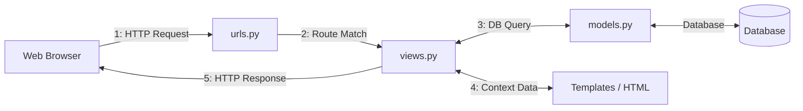
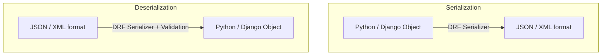
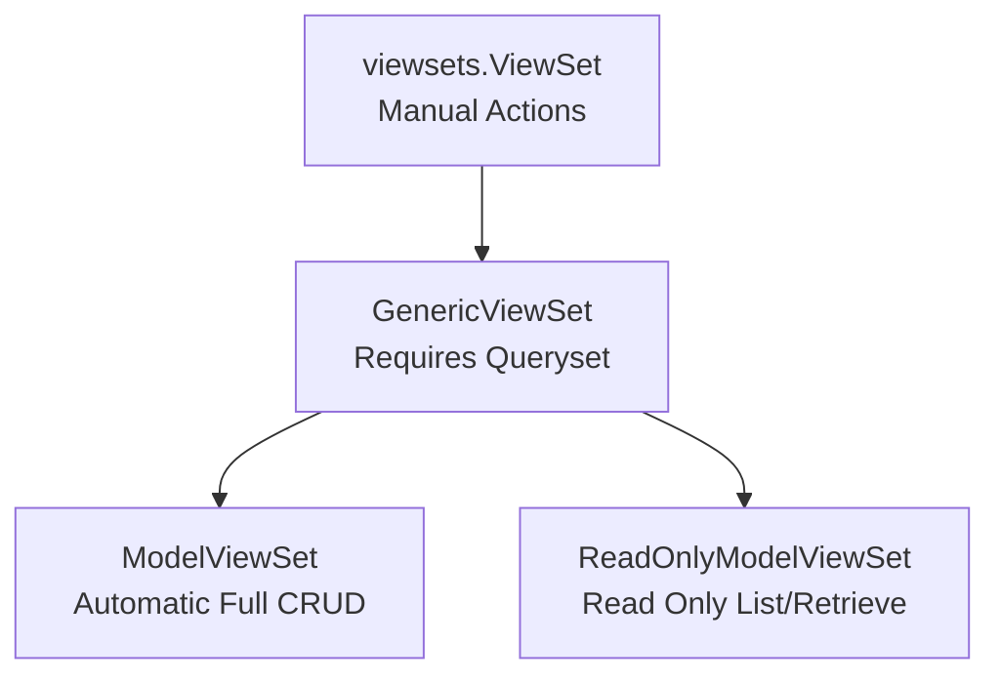

# Advanced Web & Microservices Exam Prep

---

## 1. CONCEPTUAL KNOWLEDGE PASS (The "What" & "Why")

This section covers all core principles, architecture, rules, and comparisons found in the slides. Focus on memorizing these definitions and relationships.

---

### A. Core Django Web & Request Lifecycle



#### The Lifecycle Steps:
1. **Request Reception**: The browser sends an HTTP request.
2. **Routing**: `urls.py` parses the path and selects the corresponding view.
3. **Logic Handling**: `views.py` processes the request, communicates with `models.py` (which queries the database) if needed.
4. **Rendering**: The view formats data and mixes it with HTML via the template engine or transforms it to JSON.
5. **Response Delivery**: An HTTP response is sent back to the client.

---

### B. REST API Architecture & Principles

#### What is an API?
An **Application Programming Interface** acts as a communication bridge allowing two different applications (e.g., a mobile client and a backend server) to exchange data and services.

#### 6 Core REST Constraints:
1. **Client-Server**: Complete separation of user interface concerns from data storage concerns.
2. **Stateless**: Each HTTP request must contain all context information needed to understand and process it.
3. **Cacheable**: Server responses must declare themselves cacheable or not to optimize network performance.
4. **Uniform Interface**: Access to resources must follow a standardized, predictable pattern.
5. **Layered System**: The client cannot tell if it is connected directly to the end server or an intermediary proxy/balancer.
6. **Code on Demand (Optional)**: Servers can send executable code (e.g., JavaScript) to run on the client.

#### HTTP Methods for Resource Management:
*   `GET`: Read / retrieve a resource.
*   `POST`: Create a new resource.
*   `PUT` / `PATCH`: Modify an existing resource (PUT = complete update, PATCH = partial update).
*   `DELETE`: Remove a resource.

---

### C. Django REST Framework (DRF) & Serialization

#### Why DRF?
DRF is a framework built on top of Django used to quickly build professional RESTful APIs. It provides:
*   Native mapping of Django models.
*   Automated interactive web documentation (Browsable API).
*   Integrated authentication and permission management.

#### Serialization vs. Deserialization



*   **Serialization**: Converts Python memory objects (from Django models) into readable output formats (usually JSON).
*   **Deserialization**: Receives raw output formats (JSON) from an HTTP request, validates the schema, and saves it back into Python/Django database objects.

#### DRF Serializer Options:
*   `Serializer`: Gives absolute manual control over every single field mapped.
*   `ModelSerializer`: Automatically creates serializers mapped directly onto a Django model class, dramatically reducing boilerplate code.

---

### D. ViewSets and Routers in DRF

#### What is a ViewSet?
A ViewSet groups the controller logic for all CRUD actions (`list`, `create`, `retrieve`, `update`, `partial_update`, `destroy`) of a resource into a single, cohesive class instead of writing separate views for each endpoint.

#### ViewSet Hierarchy



#### Comparison: ViewSet vs. ModelViewSet

| Feature | ViewSet (Base) | ModelViewSet |
| :--- | :--- | :--- |
| **Boilerplate** | High (must code each method manually) | Extremely Low (2-3 lines of code) |
| **CRUD Actions** | Manual implementation | Automatically generated |
| **Validation** | Manual handling inside methods | Integrated out-of-the-box |
| **404 / 400 Handling** | Manual `try/except` statements | Automatic |
| **Use Case** | Complex, specialized custom logic | 80% of standard CRUD use cases |

#### Routers
*   **The Problem**: Writing manual URL routes for individual ViewSet actions is repetitive and error-prone.
*   **The Solution**: A **Router** plugs directly into a ViewSet to automatically map HTTP verbs and URLs directly to the right view methods.
*   **SimpleRouter**: Generates standard CRUD routes. Does not generate a landing root view listing all active endpoints.
*   **DefaultRouter**: Generates standard CRUD routes, includes an interactive hyperlinked API root index page, and automatically handles output format suffixes.

---

### E. Template System & Layout Partitioning
*   **Separation of Concerns**: Prevents mixing Python application logic with UI markup.
*   **Block Inheritance**: Parent templates (like `base.html`) define empty placeholders using ``. Child files inherit the shared structure using `` and fill in specific blocks.
*   **Partial Views**: Small reusable templates (e.g., `nav.html`, `footer.html`) are pulled into parent pages using ``.

---

### F. Microservices Concepts

#### What is a Microservice?
An architectural style that splits a monolithic application into small, highly specialized, and completely autonomous programs.

#### Characteristics of a Microservice:
*   **Autonomous**: Independently deployable and maintained.
*   **Decoupled Database**: Each service can manage its own storage data engine to preserve isolation.
*   **Standard Communications**: Communication happens over generic lightweight pathways (like HTTP REST or gRPC).
*   **Advantages**: Scalability, absolute technology stack flexibility, and isolated blast-radii for errors.

---
---

## 2. PRACTICAL SYNTAX & EXECUTION GUIDE (The "How to Write It")

Use this section to practice writing boilerplate, configurations, and core patterns on paper.

---

### A. Django URL Path Converters & Regular Expressions

This section details how Django routes dynamic values from incoming URLs to variables inside your python view arguments.

```python
# Static path route
path('contact/', views.contact, name='contact')

# Integer type parameter route
path('article/<int:id>/', views.voir_article, name='article')

# Slug (alphanumeric string with dashes/underscores) parameter route
path('blog/<slug:titre>/', views.detail_blog, name='blog')

# Path converter (captures full relative paths containing slashes)
path('files/<path:chemin>/', views.download, name='download')

# Strict Regex pattern matching (4-digit year limit format)
re_path(r'^archive/(?P<annee>[0-9]{4})/$', views.archive, name='archive')
```

---

### B. Standard Django Views (FBV vs. CBV)

#### Function-Based View (FBV)
```python
from django.http import HttpResponse
from django.shortcuts import render

def ma_vue_simple(request):
    return HttpResponse("Reponse simple")

def ma_vue_template(request):
    context = {'nom': 'Utilisateur'}
    return render(request, 'mon_template.html', context)
```

#### Class-Based View (CBV) & The Dispatcher
```python
from django.views import View
from django.shortcuts import render

class DashboardView(View):
    # dispatch() automatically routes GET requests to get()
    def get(self, request):
        return render(request, 'dashboard.html')

    # dispatch() automatically routes POST requests to post()
    def post(self, request):
        return render(request, 'dashboard.html')
```

---

### C. Django HTML Templates

#### 1. Structuring Parent Templates (`base.html`)
```html
<!DOCTYPE html>
<html lang="fr">
<head>
    <meta charset="UTF-8">
    <title>Mon Site</title>
</head>
<body>
    
    

    <main>
        
        <p>Contenu par defaut</p>
        
    </main>

    
</body>
</html>
```

#### 2. Writing Inherited Templates (`home.html`)
```html


Accueil - Mon Site


<h1>Bienvenue sur notre site</h1>
<p>Ceci est la page d'accueil.</p>

<ul>
    
        <li>{{ item }}</li>
    
</ul>

```

#### 3. Conditional Structures inside Templates
```html
<ul>

    
        <li>{{ voiture.marque }} - {{ voiture.modele }}</li>
    
        <li>{{ voiture.marque }} - Non disponible</li>
    

</ul>
```

---

### D. Configuration of Django Static Files & Templates

Set these directories up in `settings.py`:

```python
import os
from pathlib import Path

BASE_DIR = Path(__file__).resolve().parent.parent

# 1. Template Engine Configuration
TEMPLATES = [
    {
        'BACKEND': 'django.template.backends.django.DjangoTemplates',
        'DIRS': [os.path.join(BASE_DIR, 'templates')], # Tells Django where HTML files live
        'APP_DIRS': True,
        'OPTIONS': {
            'context_processors': [
                'django.template.context_processors.debug',
                'django.template.context_processors.request',
                'django.contrib.auth.context_processors.auth',
                'django.contrib.messages.context_processors.messages',
            ],
        },
    },
]

# 2. Static Asset Files Configuration
STATIC_URL = '/static/'
STATICFILES_DIRS = [os.path.join(BASE_DIR, 'static')] # Dev paths
STATIC_ROOT = os.path.join(BASE_DIR, 'staticfiles') # Prod deployment path
```

#### Collecting static files & loading them in HTML:
```bash
# Terminal command to collect static files
python manage.py collectstatic
```
```html
<!-- Inclusion inside templates -->

<link rel="stylesheet" href="">
```

---

### E. Standard Forms & ModelForms

#### Traditional Django Form Class
```python
from django import forms

class ContactForm(forms.Form):
    nom = forms.CharField(max_length=100, label="Votre nom")
    email = forms.EmailField(label="Votre email")
    message = forms.CharField(widget=forms.Textarea, label="Votre message")
```

#### Integrated ModelForm Class
```python
from django import forms
from .models import Patient

class PatientForm(forms.ModelForm):
    class Meta:
        model = Patient
        fields = ['nom', 'email', 'date_naissance']
        labels = {
            'nom': 'Nom complet',
            'date_naissance': 'Date de naissance'
        }
```

#### Processing Forms inside a View Class
```python
from django.shortcuts import render, redirect
from .forms import PatientForm

def ajouter_patient(request):
    if request.method == 'POST':
        # Instantiates the form bound with user POST payload data
        form = PatientForm(request.POST)
        if form.is_valid():
            form.save() # Saves object directly to the DB database
            return redirect('liste_patients')
    else:
        # Instantiates an empty form unbound instance
        form = PatientForm()
        
    return render(request, 'patient_form.html', {'form': form})
```

#### Rendering Forms in Template Markup
```html



<h2>Ajouter un Patient</h2>
<form method="post">
     <!-- Mandatory Security Token -->
    
    <!-- Rendering Form Layout Styles: -->
    {{ form.as_p }}       <!-- Fields inside block Paragraphs -->
    <!-- Or: {{ form.as_table }} (Table format rows) -->
    <!-- Or: {{ form.as_ul }}    (List markup items) -->
    
    <button type="submit">Enregistrer</button>
</form>

```

---

### F. Defining Django REST ModelSerializers

Given a model configuration in `models.py`:
```python
from django.db import models

class Auteur(models.Model):
    nom = models.CharField(max_length=100)
    prenom = models.CharField(max_length=100)
    nationalite = models.CharField(max_length=50)
    date_naissance = models.DateField(null=True, blank=True)

    def __str__(self):
        return f"{self.prenom} {self.nom}"
```

Create its serializer in `serializers.py`:
```python
from rest_framework import serializers
from .models import Auteur

class AuteurSerializer(serializers.ModelSerializer):
    # Calculated read-only custom field
    nom_complet = serializers.SerializerMethodField()

    class Meta:
        model = Auteur
        fields = '__all__' # Imports all model fields
        # Alternative: fields = ['id', 'nom', 'prenom']
        # Alternative: exclude = ['date_naissance']

    # Must follow the get_<field_name> signature pattern
    def get_nom_complet(self, obj):
        return f"{obj.prenom} {obj.nom}"
```

#### Shell Usage: Serializing & Deserializing Objects
```python
# --- Serialization Flow (Model Instance -> JSON String) ---
from list.models import Auteur
from list.serializers import AuteurSerializer
import json

auteur_obj = Auteur.objects.first()
serializer = AuteurSerializer(auteur_obj)
print(serializer.data) # Generates Python Dictionary: {'id': 1, 'nom': 'Hugo', ...}

json_data = json.dumps(serializer.data) # Encodes dictionary to JSON string

# --- Deserialization Flow (JSON Dict -> DB Record Save) ---
data_received = {
    'nom': 'Camus',
    'prenom': 'Albert',
    'nationalite': 'Francaise',
    'date_naissance': '1913-11-07'
}
deserializer = AuteurSerializer(data=data_received)
if deserializer.is_valid():
    new_auteur = deserializer.save() # Saves record to DB database
else:
    print(deserializer.errors)
```

---

### G. Writing a Manual ViewSet (Full Control)

This code demonstrates writing every standard ViewSet CRUD controller method manually.

```python
from rest_framework import viewsets, status
from rest_framework.response import Response
from .models import Auteur
from .serializers import AuteurSerializer

class AuteurViewSet(viewsets.ViewSet):
    # GET /auteurs/
    def list(self, request):
        queryset = Auteur.objects.all()
        serializer = AuteurSerializer(queryset, many=True)
        return Response(serializer.data)

    # POST /auteurs/
    def create(self, request):
        serializer = AuteurSerializer(data=request.data)
        if serializer.is_valid():
            serializer.save()
            return Response(serializer.data, status=status.HTTP_201_CREATED)
        return Response(serializer.errors, status=status.HTTP_400_BAD_REQUEST)

    # GET /auteurs/{id}/
    def retrieve(self, request, pk=None):
        try:
            auteur = Auteur.objects.get(pk=pk)
            serializer = AuteurSerializer(auteur)
            return Response(serializer.data)
        except Auteur.DoesNotExist:
            return Response({'error': 'Auteur non trouve'}, status=status.HTTP_404_NOT_FOUND)

    # PUT /auteurs/{id}/
    def update(self, request, pk=None):
        try:
            auteur = Auteur.objects.get(pk=pk)
            serializer = AuteurSerializer(auteur, data=request.data)
            if serializer.is_valid():
                serializer.save()
                return Response(serializer.data)
            return Response(serializer.errors, status=status.HTTP_400_BAD_REQUEST)
        except Auteur.DoesNotExist:
            return Response({'error': 'Auteur non trouve'}, status=status.HTTP_404_NOT_FOUND)

    # PATCH /auteurs/{id}/
    def partial_update(self, request, pk=None):
        try:
            auteur = Auteur.objects.get(pk=pk)
            # partial=True is the key parameter here
            serializer = AuteurSerializer(auteur, data=request.data, partial=True)
            if serializer.is_valid():
                serializer.save()
                return Response(serializer.data)
            return Response(serializer.errors, status=status.HTTP_400_BAD_REQUEST)
        except Auteur.DoesNotExist:
            return Response({'error': 'Auteur non trouve'}, status=status.HTTP_404_NOT_FOUND)

    # DELETE /auteurs/{id}/
    def destroy(self, request, pk=None):
        try:
            auteur = Auteur.objects.get(pk=pk)
            auteur.delete()
            return Response(status=status.HTTP_204_NO_CONTENT)
        except Auteur.DoesNotExist:
            return Response({'error': 'Auteur non trouve'}, status=status.HTTP_404_NOT_FOUND)
```

---

### H. Writing and Overriding ModelViewSets

Writing a clean `ModelViewSet` requires only a few lines of code. Below is an example showing how to declare it and override standard methods to add custom business logic.

```python
from rest_framework import viewsets
from rest_framework.decorators import action
from rest_framework.response import Response
from .models import Auteur
from .serializers import AuteurSerializer, AuteurListSerializer, LivreSerializer

class AuteurViewSet(viewsets.ModelViewSet):
    queryset = Auteur.objects.all()
    serializer_class = AuteurSerializer

    # 1. Customizing data fetch scopes
    def get_queryset(self):
        # Restricts query scope only to active records
        return Auteur.objects.filter(actif=True)

    # 2. Selecting Serializers dynamically by requested action
    def get_serializer_class(self):
        if self.action == 'list':
            return AuteurListSerializer # Uses simplified dataset representations
        return AuteurSerializer

    # 3. Intercepting create logic to inject custom fields
    def perform_create(self, serializer):
        # Automatically registers current request user as record creator
        serializer.save(createur=self.request.user)

    # 4. Triggering actions during updates
    def perform_update(self, serializer):
        serializer.save()
        # Triggers non-blocking background logic
        send_update_email(serializer.instance)
```

---

### I. Creating Custom API Actions (`@action`)

Using `@action`, you can attach custom HTTP endpoints to standard collection arrays or single resource detail entities.

```python
    # 1. Detail-level custom action: GET /auteurs/{id}/livres/
    @action(detail=True, methods=['get'])
    def livres(self, request, pk=None):
        # self.get_object() returns the specific entity resolved by PK
        auteur = self.get_object()
        livres = auteur.livres.all()
        serializer = LivreSerializer(livres, many=True)
        return Response(serializer.data)

    # 2. Collection-level custom action (with pagination): GET /auteurs/francais/
    @action(detail=False, methods=['get'])
    def francais(self, request):
        auteurs = self.queryset.filter(nationalite='Francaise')
        
        # Applies active pagination settings to collection
        page = self.paginate_queryset(auteurs)
        if page is not None:
            serializer = self.get_serializer(page, many=True)
            return self.get_paginated_response(serializer.data)
            
        serializer = self.get_serializer(auteurs, many=True)
        return Response(serializer.data)

    # 3. Handling multiple HTTP methods: POST/DELETE /auteurs/{id}/activer/
    @action(detail=True, methods=['post', 'delete'])
    def activer(self, request, pk=None):
        auteur = self.get_object()
        if request.method == 'POST':
            auteur.actif = True
            auteur.save()
            return Response({'status': 'auteur active'})
        elif request.method == 'DELETE':
            auteur.actif = False
            auteur.save()
            return Response({'status': 'auteur desactive'})
```

---

### J. Registering Router Endpoints

#### Local application routing configuration (`gestion/urls.py`):
```python
from rest_framework.routers import DefaultRouter
from django.urls import path, include
from . import views

# Init router engine
router = DefaultRouter()

# Registering views to endpoints:
# Note: "basename" parameter is required if ViewSet does not expose a "queryset" attribute.
router.register(r'auteurs', views.AuteurViewSet, basename='auteur')
router.register(r'livres', views.LivreViewSet, basename='livre')
router.register(r'emprunts', views.EmpruntViewSet, basename='emprunt')

urlpatterns = [
    # Include all automatic URLs from the router:
    path('', include(router.urls)),
]
```

#### Parent project main routing configuration (`mon_projet/urls.py`):
```python
from django.contrib import admin
from django.urls import path, include

urlpatterns = [
    path('admin/', admin.site.urls),
    # Imports nested router endpoints, prefixes all routes with /api/
    path('api/', include('gestion.urls')), 
    
    # Optional: DRF Login interface paths for testing auth in browsing mode
    path('api-auth/', include('rest_framework.urls')),
]
```

---

### K. Microservices & HTTP Inter-service Calls

#### Writing a simple microservice endpoint with DRF:
```python
# service_api/views.py
from rest_framework.decorators import api_view
from rest_framework.response import Response

@api_view(['GET'])
def service_hello(request):
    return Response({"message": "Hello from microservice"})

@api_view(['POST'])
def service_process(request):
    # Access payload request parameters
    data_received = request.data
    return Response({"result": f"Processed: {data_received}"})
```

#### Calling remote microservices using Python:
```python
# client_app/caller.py
import requests

# 1. Sending an HTTP GET request to another microservice
get_response = requests.get("http://localhost:8001/api/hello/")
print(get_response.json()) # Prints output: {"message": "Hello from microservice"}

# 2. Sending an HTTP POST request with a JSON payload
payload = {"user_id": 123, "action": "login"}
post_response = requests.post("http://localhost:8002/api/process/", json=payload)
print(post_response.json()) # Prints processed output data
```