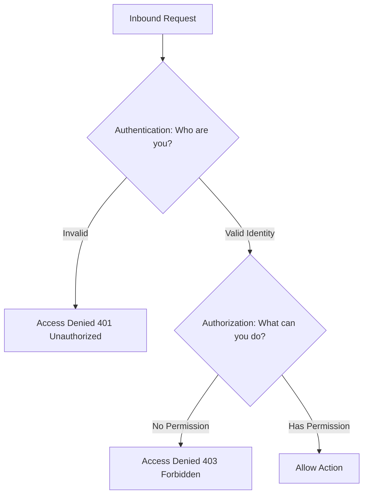
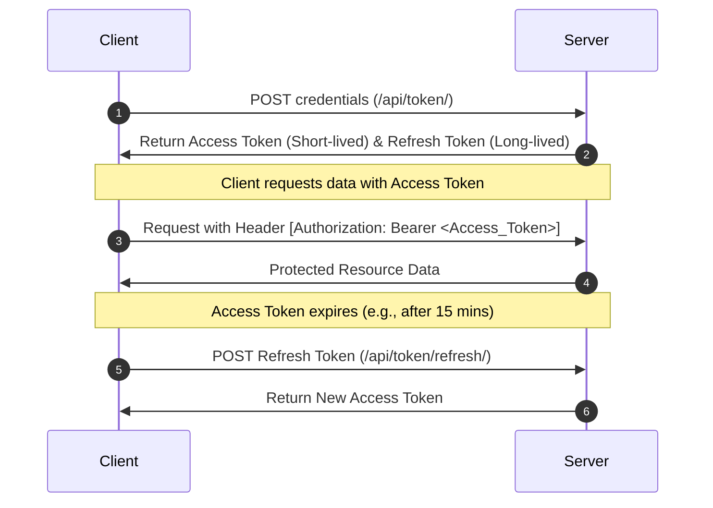

# Section 1: The Theory & Concept Vault (Knowledge Phase)

---

## 1. Core Authentication & Authorization

Authentication and authorization represent the entry gates of system security.

*   **Authentication (Identity Verification):** Confirms *who* the user is (e.g., verifying a username and password).
*   **Authorization (Access Control):** Determines *what* the authenticated user is allowed to do.



---

## 2. Django Default Authentication System

Django contains a built-in architecture (`django.contrib.auth`) for session-based user tracking.

*   **Built-in Models:** It includes default models for `User`, `Group`, and `Permission`.
*   **Default Permissions:** Every database model automatically generates 4 default permissions:
    *   `add_[modelname]`
    *   `change_[modelname]`
    *   `delete_[modelname]`
    *   `view_[modelname]`
*   **Database Schema Mapping:**
    ```mermaid
    erDiagram
        User ||--o{ User_Groups : belongs_to
        Group ||--o{ User_Groups : contains
        Group ||--o{ Group_Permissions : has
        Permission ||--o{ Group_Permissions : assigned_to
        User ||--o{ User_Permissions : direct_access
        Permission ||--o{ User_Permissions : assigned_to
    ```

---

## 3. Session-Based vs. Token-Based (JWT) Authentication

Authentication strategies differ significantly depending on whether they maintain state.

### Session-Based Authentication
*   **Stateful:** Session data is saved on the server (in memory, file, database, or cache).
*   **Session ID Cookie:** The server returns a Session ID stored inside a client cookie.
*   **Validation:** For every incoming request, the server queries its storage to match the Session ID with the logged-in user.

### JWT (Token-Based) Authentication
*   **Stateless:** No session data is stored on the server.
*   **Self-Contained:** The token itself contains the payload data (such as user ID, role, and expiration) signed cryptographically.
*   **Flow:** The client sends the token inside the HTTP headers of subsequent requests.
*   **Suitability:** Useful for Microservices, Single Page Applications (SPAs), and mobile apps.

---

## 4. Custom User Model Rationale

The standard Django `User` model uses `username` as the primary identifier. In production and microservice contexts, this is often insufficient because:

*   **Email Identification:** Modern systems typically require an `email` field as the primary login identifier.
*   **Custom Roles:** Custom fields (such as `role`) must be defined directly in the database model to manage custom permissions cleanly.
*   **Decoupled Fields:** Unused legacy fields from the default user model can be omitted.

---

## 5. Token Lifecycles (Access vs. Refresh Tokens)

To keep stateless API endpoints secure, JWT architectures utilize two tokens with distinct lifetimes:



---

# Section 2: The Implementation Blueprint (Execution Phase)

---

## Step 1: Custom User Model Setup (`models.py`)

To implement custom fields and use `email` as the primary login identifier, subclass both `AbstractBaseUser` and `PermissionsMixin`.

```python
# myapp/models.py
from django.contrib.auth.models import AbstractBaseUser, BaseUserManager, PermissionsMixin
from django.db import models

# 1. Custom User Manager (Required for AbstractBaseUser)
class CompteManager(BaseUserManager):
    def create_user(self, email, password=None, **extra_fields):
        """Creates and saves a standard user with normalized email."""
        if not email:
            raise ValueError("The email address is mandatory.")
        email = self.normalize_email(email)
        user = self.model(email=email, **extra_fields)
        user.set_password(password)  # Hashes password
        user.save(using=self._db)
        return user

    def create_superuser(self, email, password=None, **extra_fields):
        """Creates and saves a superuser with admin privileges."""
        extra_fields.setdefault('is_staff', True)
        extra_fields.setdefault('is_superuser', True)
        return self.create_user(email, password, **extra_fields)

# 2. Custom User Model
class Compte(AbstractBaseUser, PermissionsMixin):
    ROLE_CHOICES = [
        ('ADMIN', 'Administrateur'),
        ('EDITOR', 'Editeur'),
        ('VIEWER', 'Lecteur'),
    ]

    email = models.EmailField(unique=True)
    nom = models.CharField(max_length=100)
    prenom = models.CharField(max_length=100)
    role = models.CharField(max_length=20, choices=ROLE_CHOICES, default='VIEWER')
    date_creation = models.DateTimeField(auto_now_add=True)
    is_active = models.BooleanField(default=True)
    is_staff = models.BooleanField(default=False)

    # Link custom manager
    objects = CompteManager()

    # Configuration definitions
    USERNAME_FIELD = 'email'
    REQUIRED_FIELDS = ['nom', 'prenom', 'role']
```

---

## Step 2: Activating Custom User Model (`settings.py`)

Before executing your first database migration, you must point Django to your custom user model inside the configuration settings.

```python
# settings.py
AUTH_USER_MODEL = 'myapp.Compte'
```

### Execution Commands (Run in Terminal):
```bash
python manage.py makemigrations
python manage.py migrate
python manage.py createsuperuser
```

---

## Step 3: Automatic Group & Role Initialization (`apps.py`)

To avoid populating groups manually in the admin panel, populate roles automatically inside your application's startup hook.

```python
# myapp/apps.py
from django.apps import AppConfig

class AppiConfig(AppConfig):
    default_auto_field = 'django.db.models.BigAutoField'
    name = 'myapp'

    def ready(self):
        # Local imports inside ready() avoid circular import dependencies on startup
        from django.contrib.auth.models import Group
        from django.db.utils import OperationalError, ProgrammingError
        
        try:
            # Dynamically create Groups matching ROLE_CHOICES keys
            roles = ['ADMIN', 'EDITOR', 'VIEWER']
            for role_name in roles:
                Group.objects.get_or_create(name=role_name)
        except (OperationalError, ProgrammingError):
            # Prevents migrations from failing if the database is not yet initialized
            pass
```

---

## Step 4: Declaring Custom Model Permissions

Custom permissions can be defined inside a model's inner `Meta` class.

```python
# myapp/models.py
class Article(models.Model):
    title = models.CharField(max_length=200)
    content = models.TextField()

    class Meta:
        permissions = [
            ("can_publish", "Can publish articles"),
        ]
```

### Dynamic Assignment to Groups & Users:
```python
from django.contrib.auth.models import Group, Permission
from myapp.models import Compte

# Programmatically query the custom permission
permission = Permission.objects.get(codename="can_publish")

# Assign to a user
user = Compte.objects.get(email="editor@example.com")
user.user_permissions.add(permission)

# Assign to a group
group = Group.objects.get(name="EDITOR")
group.permissions.add(permission)
```

---

## Step 5: Session Configurations (`settings.py`)

If using session-based authentication rather than stateless JWTs, define the storage engines and cookie lifetimes in your configuration.

```python
# settings.py
# Use the database to store session keys
SESSION_ENGINE = 'django.contrib.sessions.backends.db'

# Session expiration time (in seconds - 1209600 is 2 weeks)
SESSION_COOKIE_AGE = 1209600
```

---

## Step 6: Checking Permissions at All Levels

Depending on the context (templates, function-based views, class-based views), permission checks are implemented differently.

### 1. Template-Level Checks
```html
<!-- templates/article_detail.html -->

    <button>Publish Article</button>

    <p>You do not have the rights to publish this content.</p>

```

### 2. Function-Based View Checking (FBV)
```python
# myapp/views.py
from django.contrib.auth.decorators import permission_required
from django.http import HttpResponse

@permission_required('myapp.can_publish', raise_exception=True)
def publish_article(request, pk):
    # This block executes only if the user has myapp.can_publish
    return HttpResponse("Article has been published.")
```

### 3. Class-Based View Checking (CBV)
```python
# myapp/views.py
from django.contrib.auth.mixins import PermissionRequiredMixin
from django.views import View
from django.http import HttpResponse

class ArticlePublishView(PermissionRequiredMixin, View):
    # Define required permission
    permission_required = 'myapp.can_publish'
    raise_exception = True

    def post(self, request, *args, **kwargs):
        return HttpResponse("Published via CBV.")
```

### 4. Advanced: Checking Permissions by HTTP Method in CBVs
```python
# myapp/views.py
from django.contrib.auth.mixins import PermissionRequiredMixin
from django.views import View
from django.http import HttpResponse, HttpResponseForbidden

class ArticlePermissionView(PermissionRequiredMixin, View):
    
    # 1. Map HTTP verbs to specific Django permissions
    def get_permission_required(self):
        if self.request.method == 'GET':
            return ['myapp.view_article']
        elif self.request.method == 'POST':
            return ['myapp.add_article']
        elif self.request.method in ['PUT', 'PATCH']:
            return ['myapp.change_article']
        elif self.request.method == 'DELETE':
            return ['myapp.delete_article']
        return []

    # 2. Intercept requests and evaluate permissions before dispatching
    def dispatch(self, request, *args, **kwargs):
        perms = self.get_permission_required()
        for perm in perms:
            if not request.user.has_perm(perm):
                return HttpResponseForbidden("Access Denied: Missing Permission")
        return super().dispatch(request, *args, **kwargs)

    def get(self, request, *args, **kwargs):
        return HttpResponse("Allowed View Action")
```

---

## Step 7: Django REST Framework & Custom JWT Setup

To decouple authentication from server-side sessions, configure Django REST Framework (DRF) with Simple JWT.

```bash
pip install djangorestframework djangorestframework-simplejwt
```

### 1. Configure DRF Settings
```python
# settings.py
from datetime import timedelta

INSTALLED_APPS = [
    # ...
    'rest_framework',
    'rest_framework_simplejwt',
    # ...
]

REST_FRAMEWORK = {
    'DEFAULT_AUTHENTICATION_CLASSES': (
        'rest_framework_simplejwt.authentication.JWTAuthentication',
    ),
}

# 2. Token Policy Tuning
SIMPLE_JWT = {
    'ACCESS_TOKEN_LIFETIME': timedelta(minutes=15),
    'REFRESH_TOKEN_LIFETIME': timedelta(days=7),
    'ROTATE_REFRESH_TOKENS': True,
    'BLACKLIST_AFTER_ROTATION': True,
}
```

### 2. Configure Token Endpoints
```python
# myproject/urls.py
from django.urls import path
from rest_framework_simplejwt.views import TokenObtainPairView, TokenRefreshView

urlpatterns = [
    path('api/token/', TokenObtainPairView.as_view(), name='token_obtain_pair'),
    path('api/token/refresh/', TokenRefreshView.as_view(), name='token_refresh'),
]
```

---

## Step 8: Custom Permissions in DRF ViewSets

Create a custom permission class to match individual HTTP verbs with model permissions. This secures your microservice endpoints against unauthenticated access.

```python
# myapp/permissions.py
from rest_framework import permissions

class IsPublisherOrReadOnly(permissions.BasePermission):
    def has_permission(self, request, view):
        # 1. Safe methods (GET, HEAD, OPTIONS) require view rights
        if request.method in permissions.SAFE_METHODS:
            return request.user.has_perm('myapp.view_article')
        
        # 2. Creation requests require add rights
        elif request.method == 'POST':
            return request.user.has_perm('myapp.add_article')
            
        # 3. Modification requests require change rights
        elif request.method in ['PUT', 'PATCH']:
            return request.user.has_perm('myapp.change_article')
            
        # 4. Deletions require delete rights
        elif request.method == 'DELETE':
            return request.user.has_perm('myapp.delete_article')
            
        return False
```

### Applying Custom Permissions to a ViewSet:
```python
# myapp/views.py
from rest_framework import viewsets
from rest_framework.permissions import IsAuthenticated
from myapp.models import Article
from myapp.serializers import ArticleSerializer
from myapp.permissions import IsPublisherOrReadOnly

class ArticleViewSet(viewsets.ModelViewSet):
    queryset = Article.objects.all()
    serializer_class = ArticleSerializer
    
    # Evaluate permissions sequentially
    permission_classes = [IsAuthenticated, IsPublisherOrReadOnly]
```

---

## Step 9: Client-side Token Consumption Flow

This shows how a client requests tokens from the backend, stores them in a session, and attaches the JWT to downstream requests.

### 1. Authenticate and Store JWT in Server Session
```python
# client_side_views.py
import requests
from django.shortcuts import redirect, render

def login_api(request):
    if request.method == "POST":
        u_name = request.POST["username"]
        p_word = request.POST["password"]
        
        # Send credentials to token pair endpoint
        response = requests.post(
            "http://127.0.0.1:8000/api/token/", 
            data={"username": u_name, "password": p_word}
        )
        
        if response.status_code == 200:
            tokens = response.json()
            # Store tokens securely in server-side session
            request.session['access_token'] = tokens['access']
            request.session['refresh_token'] = tokens['refresh']
            return redirect('dashboard')
            
    return render(request, "login.html", {"error": "Invalid login credentials"})
```

### 2. Make an Authorized Request using headers
```python
# client_side_views.py
def call_protected_api(request, endpoint_url):
    # Retrieve access token from session
    access_token = request.session.get('access_token')
    
    # Attach token to Request Headers
    headers = {"Authorization": f"Bearer {access_token}"}
    
    response = requests.get(
        f"http://127.0.0.1:8000/api/{endpoint_url}/", 
        headers=headers
    )
    return response.json()
```