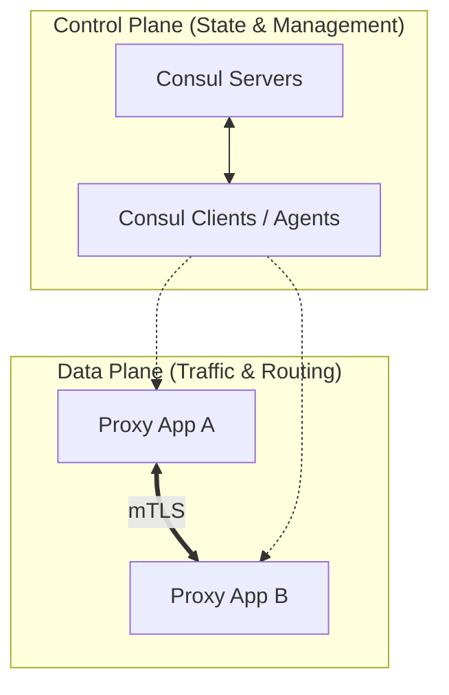
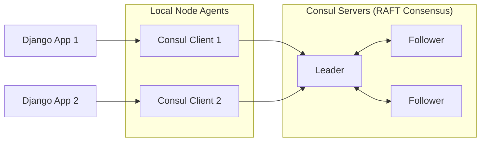
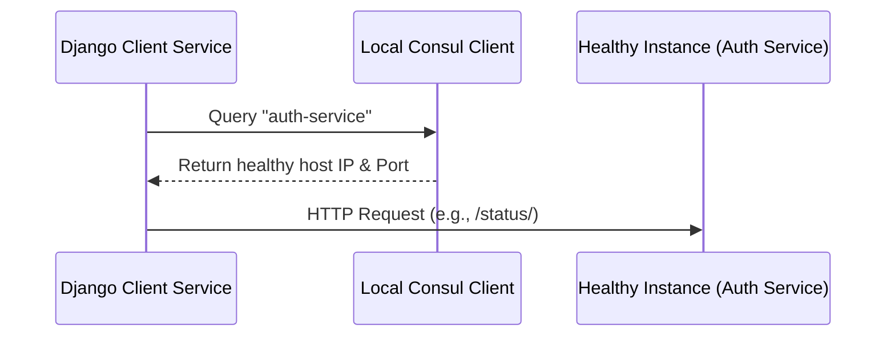

# Advanced Web & Microservices: Service Discovery with Consul

---

## PART 1: Core Theoretical Concepts

This section covers the essential theory of Service Discovery and Consul’s internal architecture.

### 1. Fundamentals of Service Discovery
* **The Problem:** Microservices need dynamic, peer-to-peer communication. They scale up and down, making static IP configuration impossible.
* **The Solution:** **Service Discovery** provides a dynamic central registry where instances register themselves and discover others.
* **Key Approaches:** 
  * **Client-side Discovery:** The client queries the service registry directly to select an available instance.
  * **Server-side Discovery:** The client sends requests through a load balancer/router that queries the registry and forwards traffic.

---

### 2. Consul Architecture Planes
Consul divides its responsibilities into two separate planes:



* **Control Plane:** Manages cluster state, service registrations, configuration, and health status.
* **Data Plane (Service Mesh):** Manages the physical network traffic and communication between applications via sidecar proxies (e.g., Envoy). 
  * *Note:* Standard Service Discovery (as studied in typical lab environments) does not require the Data Plane proxies; services communicate directly over standard HTTP.

---

### 3. Consul Cluster Node Roles
A Consul cluster contains two distinct node types:

#### Consul Servers (The Brain)
* **Role:** Maintain the authoritative global state of the system (Service Registry, Key-Value Store).
* **Consensus (Raft Protocol):** Uses a consensus algorithm to select one **Leader** node while others act as **Followers** to maintain data consistency.
* **Fault Tolerance:** Requires an odd number of servers (typically **3 or 5**) to maintain a quorum and survive failures.

#### Consul Clients (The Agents)
* **Role:** A lightweight daemon running on every host hosting microservices.
* **Control Path:** Acts as the local bridge between the microservices and the Consul Server cluster.
* **Tasks:** Runs local health checks, forwards service registration requests, and uses **Gossip** protocols to communicate membership updates.



---

### 4. Protocols & Port Assignments

#### Gossip (SERF Protocol)
* **Purpose:** Decentralized membership management, fast cluster-wide failure detection, and event broadcasting. Used by all nodes (servers and clients).
* **LAN Gossip (Within Datacenter):** Port **8301 TCP** (Communication) & **8301 UDP** (Gossip heartbeat).
* **WAN Gossip (Between Datacenters):** Port **8302 TCP** & **8302 UDP**.
* *Warning:* Blocking UDP ports causes `"UDP probes failed"` or `"unreachable network"` errors.

#### Consensus (RAFT Protocol)
* **Purpose:** Log replication, leader election, and single source-of-truth consensus. Used **only** by Consul Servers.
* **Port:** **8300 TCP** (RPC traffic).
* *Warning:* Port conflicts lead to `"Failed to start RPC layer"` or `"Only one usage of each socket address"` errors.

#### Application API Ports
* **8500 TCP:** HTTP API + Web UI.
* **8600 TCP/UDP:** DNS Service Discovery.
* **8502 TCP:** gRPC communication.
* **8503 TCP:** secure gRPC (TLS).

---

## PART 2: CLI Commands & Operations

This section contains the precise command lines needed to initialize, manage, and verify a Consul cluster.

### 1. Installation & Environment Verification
* To ensure the `consul` binary is executable from any CLI terminal:
  1. Extract the downloaded `Windows AMD64` zip archive to `C:\Consul\`.
  2. Add `C:\Consul\` to the system's environment `PATH` variable.
* Verify the system path configuration:
  ```bash
  consul --version
  ```

---

### 2. Starting Cluster Nodes

#### Starting the Leader Server
Starts the primary node of the cluster to act as the RAFT Leader:
```bash
consul agent -server -bootstrap-expect=1 -bind=192.168.1.75 -data-dir=C:\consul-leader -client=0.0.0.0
```
* `-server`: Runs the agent in server mode to join the consensus.
* `-bootstrap-expect=1`: Directs the server to self-elect as Leader (only used to bootstrap a single-node cluster).
* `-bind`: Specifies the network address used for server-to-server cluster communication.
* `-client=0.0.0.0`: Binds client APIs (HTTP/DNS) to all network interfaces.

#### Starting a Follower Server (On a Separate Machine)
```bash
consul agent -server -bind=192.168.1.76 -node=follower1 -data-dir=C:\consul-follower1 -retry-join=192.168.1.75:8301
```
* `-node=follower1`: Specifies a unique identifier inside the cluster registry.
* `-retry-join`: Tells this agent to register itself to the active Leader's Serf port (8301).

#### Starting a Follower Server (On the Same Machine - Port Overrides)
To run a secondary server on the same development host without network conflicts, override standard ports:
```bash
consul agent -server -bind=192.168.1.75 -node=follower1 -data-dir=C:\consul-follower1 -retry-join=192.168.1.75:8301 -server-port=8305 -serf-lan-port=8304 -serf-wan-port=8306 -http-port=8501 -dns-port=8601 -grpc-port=8502
```

#### Starting a Consul Client Agent
Clients act as local API gateways for application services and do not run consensus logic:
```bash
consul agent -client=192.168.1.75 -bind=192.168.1.75 -node=client1 -data-dir=C:\consul-client1 -retry-join=192.168.1.75:8301 -http-port=8502 -dns-port=8602
```
* *Notice:* The `-server` flag is omitted, preventing RAFT participation.

#### Starting in Local Development Mode
For quick local testing without complex configuration setups:
```bash
consul agent -dev
```
* Launches a single node in-memory agent. Web UI is exposed at `http://localhost:8500`.

---

### 3. Querying & Cluster Diagnostics

#### Listing Cluster Members
```bash
consul members
```
* **Expected Output Example:**
  ```text
  Node       Address             Status  Type    Build   Protocol
  leader1    192.168.1.75:8301   alive   server  1.15.0  2
  follower1  192.168.1.76:8301   alive   server  1.15.0  2
  client1    192.168.1.75:8301   alive   client  1.15.0  2
  ```

#### Listing RAFT Consensus Peers
```bash
consul operator raft list-peers
```
* **Expected Output Example:**
  ```text
  Node     ID                                    Address             State     Voter
  leader1  40236a94-df82-4bf1-b663-b8e734bc1ee8  192.168.1.75:8300   leader    true
  follower1 fca3b190-2bb1-4122-aaef-e38ff912a2aa 192.168.1.76:8300   follower  true
  ```

---

### 4. Direct HTTP API Interaction (via cURL)

#### Registering a Service Manual Endpoint
```bash
curl --request PUT http://localhost:8500/v1/agent/service/register \
--data '{
  "ID": "django-service-1",
  "Name": "django-service",
  "Address": "127.0.0.1",
  "Port": 8000,
  "Check": {
    "HTTP": "http://127.0.0.1:8000/health/",
    "Interval": "10s"
  }
}'
```

#### Listing Registered Catalog Services
```bash
curl http://localhost:8500/v1/catalog/services
```
* **Response payload format:**
  ```json
  {
    "consul": [],
    "django-service": []
  }
  ```

#### Obtaining Details of a Specific Service
```bash
curl http://localhost:8500/v1/catalog/service/django-service
```

#### Checking Health Status of a Specific Service
Retrieves nodes executing passing checks for the specified service:
```bash
curl http://localhost:8500/v1/health/service/django-service?passing
```

#### Deregistering a Service
```bash
curl --request PUT http://localhost:8500/v1/agent/service/deregister/django-service-1
```

---

## PART 3: Django Integration & Implementation

This section demonstrates how to handle service configuration, routing, registration, and discovery inside a Django codebase.

### 1. Django Health Check Configurations

#### `views.py`
Configure an endpoint for Consul to monitor instance availability:
```python
from django.http import JsonResponse

def health_check(request):
    # Returns 200 OK if the service instance is active
    return JsonResponse({"status": "ok"}, status=200)
```

#### `urls.py`
Expose the view route:
```python
from django.urls import path
from . import views

urlpatterns = [
    path('health/', views.health_check, name='health'),
]
```

---

### 2. Manual Programmatic Registration & Discovery (`requests` library)

#### Registering the Django Application Instance
```python
import requests

def register_service():
    service_data = {
        "ID": "django-service-1",
        "Name": "django-service",
        "Address": "127.0.0.1",
        "Port": 8000,
        "Check": {
            "HTTP": "http://127.0.0.1:8000/health/",
            "Interval": "10s"
        }
    }
    response = requests.put(
        "http://localhost:8500/v1/agent/service/register", 
        json=service_data
    )
    return response.status_code
```

#### Discovering an External Service Instance
```python
import requests

def discover_service(name):
    url = f"http://localhost:8500/v1/catalog/service/{name}"
    response = requests.get(url).json()
    
    # Retrieve the metadata of the first available service node
    svc = response[0]
    return f"http://{svc['ServiceAddress']}:{svc['ServicePort']}"
```

---

### 3. Programmatic Control (`python-consul` library)

Using `python-consul` simplifies registry interactions by wrapping HTTP requests.

#### Service Self-Registration
```python
import consul

def register_django(service_id: str, service_name: str, address: str, port: int, health_path: str = "/health/", interval: str = "10s"):
    # Connects to Consul Agent local instance
    c = consul.Consul()
    
    check_url = f"http://{address}:{port}{health_path}"
    
    service_definition = {
        "ID": service_id,
        "Name": service_name,
        "Address": address,
        "Port": port,
        "Check": {
            "HTTP": check_url, 
            "Interval": interval
        }
    }
    
    c.agent.service.register(**service_definition)
    print(f"[Consul] Service registered: {service_name} ({address}:{port})")
```

#### Dynamic Service Discovery & Communication Flow
The dynamic query retrieves a verified, healthy instance:



```python
import consul
import requests

def discover(name):
    c = consul.Consul()
    
    # catalog.service returns a tuple: (index, [list_of_services])
    _, services = c.catalog.service(name)
    
    # Select the first available registered healthy instance
    svc = services[0]
    return f"http://{svc['ServiceAddress']}:{svc['ServicePort']}"

# Usage Example: Dynamic Inter-Service Call
try:
    auth_url = discover("auth-service")
    response = requests.get(f"{auth_url}/status/")
    print(response.json())
except IndexError:
    print("No healthy instances of the service found.")
```