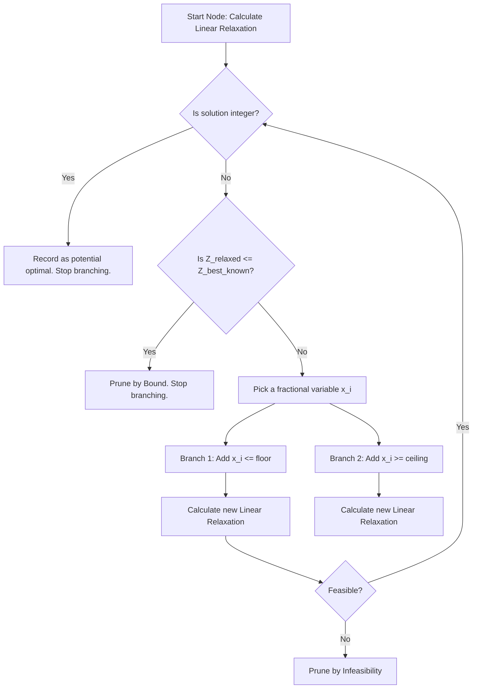
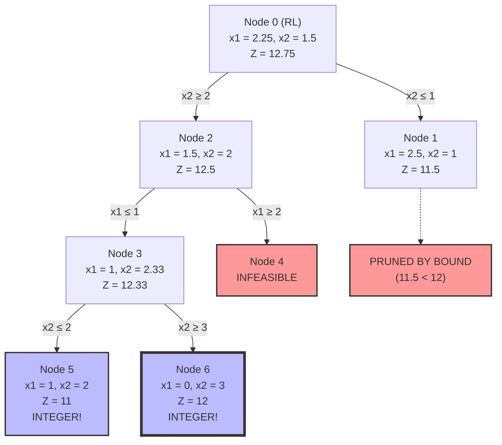

# Chapter 5: Integer Linear Programming and Branch and Bound

## 1. Introduction to Integer Linear Programming.md

> [!info] Essential Background
> Before diving into the Branch and Bound algorithm, we must understand the environment we are working in: **Integer Linear Programming (ILP)** (known in French as *Programmation Linéaire en Nombres Entiers - PLNE*). This note covers the critical fundamentals that are often assumed as prior knowledge.

### What is Integer Linear Programming?
In standard Linear Programming (LP), decision variables are allowed to take continuous (fractional) values. For example, producing $2.5$ liters of a chemical is perfectly acceptable. 

However, in many real-world operational research problems, variables represent discrete, indivisible items. You cannot produce $2.5$ cars, assign $1.3$ workers to a task, or build $0.8$ factories. 

An **Integer Linear Program (ILP)** is a linear programming problem where some or all of the decision variables are constrained to take only integer values (whole numbers). 

### The Standard Form of an ILP
A standard ILP looking to maximize an objective function is written as:

**Maximize:** 
$$Z = c_1x_1 + c_2x_2 + ... + c_nx_n$$

**Subject to:**
$$a_{11}x_1 + a_{12}x_2 + ... + a_{1n}x_n \le b_1$$
$$a_{21}x_1 + a_{22}x_2 + ... + a_{2n}x_n \le b_2$$
$$...$$
$$x_1, x_2, ..., x_n \ge 0$$
**And the crucial integrality constraint:**
$$x_1, x_2, ..., x_n \in \mathbb{Z} \text{ (or } \mathbb{N} \text{)}$$

### The Trap: Why Can't We Just Round the LP Solution?
A very common trap for students is thinking: *"Why not just solve the problem using the standard Simplex method (allowing fractions) and then round the resulting numbers to the nearest integer?"*

**Rounding is dangerous and mathematically incorrect for two reasons:**
1. **Infeasibility:** Rounding a variable up or down might push the solution outside the feasible region (violating one of the constraints).
2. **Sub-optimality:** Even if the rounded solution happens to be feasible, there is absolutely no guarantee that it is the *optimal* integer solution. The true optimal integer solution could be located far away from the continuous optimal solution.

Because rounding fails, we must use sophisticated, exhaustive search algorithms. The most famous and widely used of these is the **Branch and Bound** algorithm.

---

## 2. The Linear Relaxation Concept.md

> [!tip] Conceptual Anchor
> You cannot understand Branch and Bound without first mastering **Linear Relaxation**. It is the engine that drives the entire algorithm. 

### Defining Linear Relaxation
The **Linear Relaxation** (RL) of an Integer Linear Program is created by taking the original problem and completely ignoring (relaxing) the integrality constraints. 

If the original constraint is:
$$x_1, x_2 \in \mathbb{N}$$

The relaxed constraint becomes:
$$x_1, x_2 \ge 0 \text{ (and } x_1, x_2 \in \mathbb{R} \text{)}$$

By doing this, we transform a very difficult discrete problem into a standard, easy-to-solve continuous linear programming problem. We can now solve it using the Simplex method or graphical resolution.

### Why do we calculate the Linear Relaxation?
The solution to the Linear Relaxation serves a vital purpose: **It establishes a bound.**

*   **In a Maximization Problem:** The optimal value of the Linear Relaxation will *always* be greater than or equal to the optimal value of the original integer problem. It acts as an **Upper Bound**.
*   **Why?** Because by relaxing the constraint, we have made the feasible region *larger*. We have added all the fractional points back into the pool of valid answers. With more options available, the objective function can reach higher (or equal) values, but never lower.

> [!warning] Exam Trick
> If you solve the Linear Relaxation and, by pure luck, the optimal solution naturally consists of integers, **you are done!** That solution is guaranteed to be the optimal solution for the Integer problem as well. You do not need to proceed to Branch and Bound.

### Graphical Resolution Reminder
The video assumes you remember how to solve continuous LPs graphically. Here is the steped-out process to never forget:
1.  **Plot the constraints:** Treat each inequality as an equation (a line). Find the $x_1$ and $x_2$ intercepts to draw the line. 
2.  **Determine the feasible region:** Use a test point (usually $(0,0)$) to determine which side of the line satisfies the inequality. The overlapping area of all constraints is your feasible polygon.
3.  **Draw the Objective Function (Isoline):** Choose an arbitrary value for $Z$ (e.g., $Z = 12$) and plot the line $c_1x_1 + c_2x_2 = 12$. 
4.  **Find the Optimal Vertex:** Shift the objective line parallel to itself in the direction of improvement (up/right for maximization) until it touches the very last vertex of the feasible region before leaving it entirely.

---

## 3. The Branch and Bound Algorithm Mechanics.md

> [!info] Algorithm Architecture
> The Branch and Bound (B&B) algorithm is a "Divide and Conquer" strategy. It systematically breaks a large, difficult problem into smaller, mutually exclusive subproblems (Branching) while using upper and lower limits to avoid calculating useless paths (Bounding).

### The Three Pillars of the Algorithm

#### 1. Branching (Separation)
When the Linear Relaxation yields a fractional solution (e.g., $x_1 = 2.5$), we know this cannot be our final answer. We must force $x_1$ to become an integer. 
Since $x_1$ cannot be between $2$ and $3$, we split the problem into two parallel universes (sub-problems):
*   **Branch Left:** Add the constraint $x_1 \le 2$
*   **Branch Right:** Add the constraint $x_1 \ge 3$

This entirely removes the fractional space $(2 < x_1 < 3)$ from our feasible region.

#### 2. Bounding (Evaluation)
At every new sub-problem (Node), we must immediately calculate its Linear Relaxation.
*   **Local Upper Bound:** The result of the RL at a specific node represents the absolute best-case scenario for that specific branch. 
*   **Global Lower Bound ($Z_{best}$):** The highest valid integer solution we have found *so far* in the entire tree. Initially, this is $-\infty$.

#### 3. Pruning / Fathoming (Élagage)
This is the "Bound" part of Branch and Bound. It prevents the tree from growing infinitely. We close (prune) a node and stop exploring its sub-branches if **any** of the following three conditions are met:

1.  **Pruning by Infeasibility:** The added constraints contradict each other, resulting in an empty feasible region. There are no solutions down this path.
2.  **Pruning by Optimality (Integer Solution):** The Linear Relaxation at this node yields a perfect integer solution. We record this value. If it is better than our current Global Lower Bound, we update the Global Lower Bound. We do not branch further from this node.
3.  **Pruning by Bound:** The Linear Relaxation value (Local Upper Bound) of the node is *worse* (lower) than our Global Lower Bound ($Z_{best}$). 
    * *Reasoning:* If the absolute *best* this branch can theoretically achieve is $11.5$, but we have already safely banked an integer solution of $12$ elsewhere in the tree, exploring this branch is a waste of time.

### Visualizing the Logic Flow

---

## 4. Step-by-Step Exercise Resolution.md

> [!info] The Leo Liberti Problem
> The video uses a specific exercise. The speaker skips several algebraic steps when calculating the values of the nodes. This note provides the absolute, exhaustive mathematical breakdown of every single calculation.

### The Problem Definition
**Objective:** Maximize $Z = 3x_1 + 4x_2$
**Constraints:**
1.  $(C1): 2x_1 + x_2 \le 6$
2.  $(C2): 2x_1 + 3x_2 \le 9$
3.  $x_1, x_2 \in \mathbb{N}$ (Positive Integers)

### Node 0: The Initial Linear Relaxation
We relax $x_1, x_2 \in \mathbb{N}$ to $x_1, x_2 \ge 0$.
Looking at the graph, the optimal vertex occurs at the intersection of lines $C1$ and $C2$. We must solve the system of equations:

1. $2x_1 + x_2 = 6$
2. $2x_1 + 3x_2 = 9$

*Step-by-step algebra:*
Subtract Equation 1 from Equation 2:
$(2x_1 - 2x_1) + (3x_2 - x_2) = 9 - 6$
$2x_2 = 3 \Rightarrow x_2 = \frac{3}{2} = 1.5$

Substitute $x_2$ back into Equation 1:
$2x_1 + 1.5 = 6 \Rightarrow 2x_1 = 4.5 \Rightarrow x_1 = \frac{9}{4} = 2.25$

Calculate Objective $Z$:
$Z = 3(2.25) + 4(1.5) = 6.75 + 6 = 12.75$

*   **Result Node 0:** $x_1 = 2.25, x_2 = 1.5, Z = 12.75$
*   **Current Bounds:** Global Lower Bound = $-\infty$. Global Upper Bound = $12.75$.

> [!tip] The "Integer Coefficient" Trick
> Notice that the objective function is $3x_1 + 4x_2$, and we demand $x_1, x_2$ to be integers. 
> An integer times 3, plus an integer times 4, will **always** result in a whole integer. 
> Therefore, if the theoretical maximum is $12.75$, the true integer maximum *cannot possibly* be higher than $12$. We can immediately tighten our Global Upper Bound to $12$!

### Branching 1
$x_2$ is fractional ($1.5$). We branch on $x_2$:
*   **Left Branch (Node 1):** Add constraint $x_2 \le 1$
*   **Right Branch (Node 2):** Add constraint $x_2 \ge 2$

---

### Node 1 (Exploring Left: $x_2 \le 1$)
We add $x_2 \le 1$ to our graph. The new optimal vertex is pushed down to where $x_2 = 1$ intersects with constraint $C1$ ($2x_1 + x_2 = 6$).

*Algebra:*
$x_2 = 1$
$2x_1 + 1 = 6 \Rightarrow 2x_1 = 5 \Rightarrow x_1 = 2.5$

Calculate Objective $Z$:
$Z = 3(2.5) + 4(1) = 7.5 + 4 = 11.5$

*   **Result Node 1:** $x_1 = 2.5, x_2 = 1, Z = 11.5$
*   *Status:* Fractional. We leave this node open.

---

### Node 2 (Exploring Right: $x_2 \ge 2$)
We add $x_2 \ge 2$ to our graph. The optimal vertex occurs where $x_2 = 2$ intersects constraint $C2$ ($2x_1 + 3x_2 = 9$).

*Algebra:*
$x_2 = 2$
$2x_1 + 3(2) = 9 \Rightarrow 2x_1 + 6 = 9 \Rightarrow 2x_1 = 3 \Rightarrow x_1 = 1.5$

Calculate Objective $Z$:
$Z = 3(1.5) + 4(2) = 4.5 + 8 = 12.5$

*   **Result Node 2:** $x_1 = 1.5, x_2 = 2, Z = 12.5$
*   *Status:* Fractional. We leave this node open.

We choose to explore Node 2 further because it has a higher potential $Z$ ($12.5 > 11.5$). We branch on $x_1$ ($1.5$):
*   **Left Branch (Node 3):** Add constraint $x_1 \le 1$
*   **Right Branch (Node 4):** Add constraint $x_1 \ge 2$

---

### Node 4 (Exploring $x_2 \ge 2$ AND $x_1 \ge 2$)
Let's check the constraints. If $x_1 \ge 2$ and $x_2 \ge 2$, let's plug these absolute minimums into $C2$:
$2(2) + 3(2) = 4 + 6 = 10$.
However, constraint $C2$ dictates $2x_1 + 3x_2 \le 9$.
$10 \le 9$ is a mathematical impossibility.

*   **Result Node 4:** No solution.
*   *Status:* **PRUNED BY INFEASIBILITY.**

---

### Node 3 (Exploring $x_2 \ge 2$ AND $x_1 \le 1$)
The active constraints at the vertex are $x_1 = 1$ and $C2$ ($2x_1 + 3x_2 = 9$).

*Algebra:*
$x_1 = 1$
$2(1) + 3x_2 = 9 \Rightarrow 3x_2 = 7 \Rightarrow x_2 = \frac{7}{3} \approx 2.33$

Calculate Objective $Z$:
$Z = 3(1) + 4(\frac{7}{3}) = 3 + \frac{28}{3} = \frac{37}{3} \approx 12.33$

*   **Result Node 3:** $x_1 = 1, x_2 = 2.33, Z = 12.33$
*   *Status:* Fractional. We branch on $x_2$ ($2.33$):
    *   **Left Branch (Node 5):** Add $x_2 \le 2$
    *   **Right Branch (Node 6):** Add $x_2 \ge 3$

---

### Node 5 (Exploring $x_2 \ge 2$, $x_1 \le 1$, AND $x_2 \le 2$)
Because we have $x_2 \ge 2$ (from Node 2) and $x_2 \le 2$ (from Node 5), $x_2$ is strictly equal to $2$.
If $x_2 = 2$, we plug it into the tightest constraint bounding $x_1$, which is $C2$:
$2x_1 + 3(2) \le 9 \Rightarrow 2x_1 \le 3 \Rightarrow x_1 \le 1.5$.
Since we also have the inherited constraint $x_1 \le 1$, the highest integer value $x_1$ can take is $1$.

*Algebra:*
$x_1 = 1, x_2 = 2$
$Z = 3(1) + 4(2) = 11$

*   **Result Node 5:** $x_1 = 1, x_2 = 2, Z = 11$
*   *Status:* Integer! **PRUNED BY OPTIMALITY.** 
*   **UPDATE:** Global Lower Bound ($Z_{best}$) becomes $11$.

---

### Node 6 (Exploring $x_2 \ge 2$, $x_1 \le 1$, AND $x_2 \ge 3$)
Here, $x_2 \ge 3$. Let's test the boundary where $x_2 = 3$ against $C2$:
$2x_1 + 3(3) \le 9 \Rightarrow 2x_1 + 9 \le 9 \Rightarrow 2x_1 \le 0 \Rightarrow x_1 \le 0$.
Since $x_1 \ge 0$, $x_1$ must equal $0$.

*Algebra:*
$x_1 = 0, x_2 = 3$
$Z = 3(0) + 4(3) = 12$

*   **Result Node 6:** $x_1 = 0, x_2 = 3, Z = 12$
*   *Status:* Integer! **PRUNED BY OPTIMALITY.**
*   **UPDATE:** $12$ is better than $11$. Global Lower Bound ($Z_{best}$) becomes $12$.

---

### Final Evaluation and Pruning Node 1
We still have an open node: **Node 1** ($x_1 = 2.5, x_2 = 1, Z = 11.5$).
Look at our Global Lower Bound. We have already found a valid integer solution that guarantees us a score of $12$ (Node 6). 
The absolute *best-case* mathematical ceiling for Node 1 is $11.5$. Even if we find an integer solution down that branch, it will never beat $12$.

*   *Status:* **PRUNED BY BOUND.** (Élagué par évaluation).

### The Complete Branch and Bound Tree Diagram

**Conclusion:** The optimal integer solution is $x_1 = 0$, $x_2 = 3$, yielding $Z = 12$.

---

## 5. Ideal Formulations and Polytope Integrity.md

> [!info] Advanced Concept
> The end of the video introduces the concept of **Ideal Formulations** ($P1$ vs $P2$). This section explains why two mathematical models that seem to describe the exact same problem can result in vastly different computational times.

### Polytopes and Convex Hulls
*   **Polytope:** The geometric shape created by the intersection of our continuous constraints. It is the "feasible region" of the Linear Relaxation.
*   **Integer Points:** The grid of whole numbers that happen to fall inside that Polytope.
*   **Integer Hull (Convex Hull of Integer Points):** Imagine placing a peg at every valid integer coordinate inside the Polytope, and wrapping a tight rubber band around the outermost pegs. The shape created by that rubber band is the Integer Hull.

### The Problem with Standard Formulations (P1)
In our exercise, the initial formulation ($P1$) created a Polytope whose corners (vertices) were floating in fractional space (e.g., $(2.25, 1.5)$). 
Because the Simplex method *always* hunts for corners, it landed on this fractional corner, forcing us to use the Branch and Bound algorithm to "chop away" the fractional space until we hit an integer corner.

### The Ideal Formulation (P2)
An **Ideal Formulation** is a set of mathematical constraints that perfectly outline the Integer Hull. 
In the video, the instructor suggests replacing the original constraints with a new one: 
$$x_1 + x_2 \le 3$$

If you plot this line, you will notice that it perfectly connects the outermost integer solutions of the region. It forms a Polytope where **every single vertex is an integer**.

### Why is this crucial for computational efficiency?
If you feed Formulation $P2$ into a computer solver, the Linear Relaxation evaluates the corners of the shape. Because the constraints were designed so that all corners are integers, the Linear Relaxation will immediately land on $(0,3)$, yielding $Z=12$. 

**The Branch and Bound algorithm will solve the problem in exactly 1 node (Node 0).**

> [!tip] The Rule of Formulations
> Formulations that tightly hug the integer points are called **"Tight Formulations."** 
> The tighter the formulation, the better the Linear Relaxation Upper Bound will be, and the fewer nodes the Branch and Bound algorithm will have to explore. Designing efficient formulations is often more important than the speed of the algorithm itself.