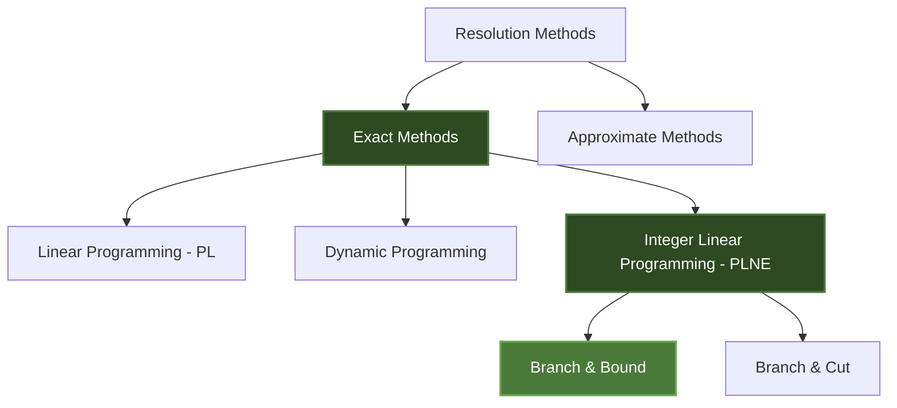
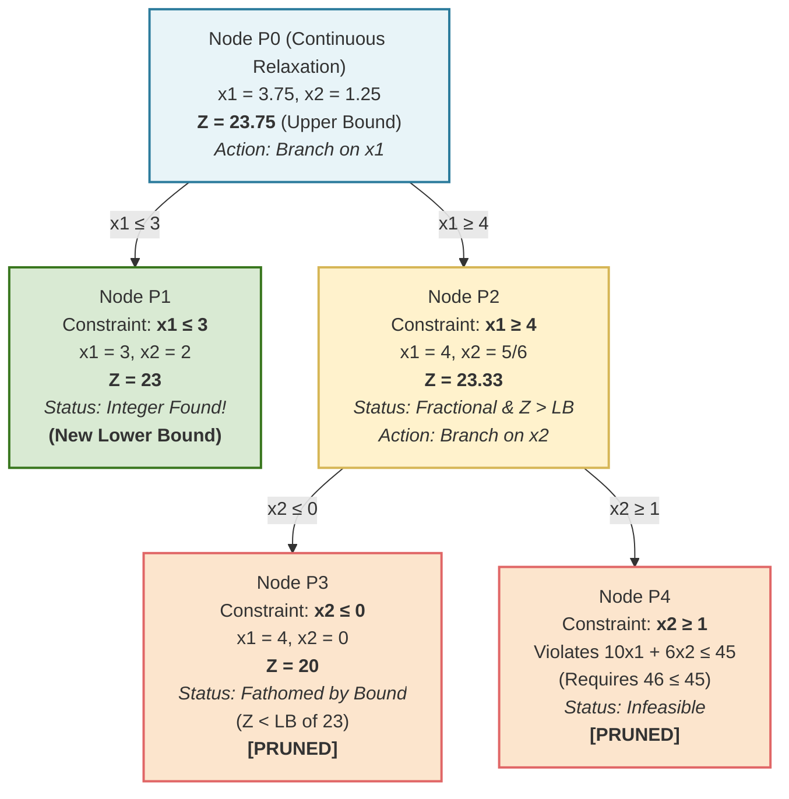

# Chapter 5: Integer Linear Programming and Branch and Bound

## 1. Introduction to Integer Linear Programming

> [!info] Definition
> **Integer Linear Programming (ILP)** — known in French as *Programmation Linéaire en Nombres Entiers (PLNE)* — is a variation of classical Linear Programming where some or all of the decision variables are restricted to take only **integer values** (whole numbers). 

### The Need for Integer Variables
Standard Linear Programming (solved via the Simplex method) assumes that variables are continuous and can take any fractional value (e.g., $x_1 = 3.75$). However, in many real-world physical and economic problems, fractional solutions make no logical sense.

**Examples of strict integer contexts:**
*   Manufacturing discrete items (you cannot produce 3.75 cars or 1.25 airplanes).
*   Assigning personnel (you cannot assign half a worker to a shift).
*   Binary decisions (0 = No, 1 = Yes).

### Classification in Operations Research
As outlined in the course taxonomy, Operations Research divides resolution methods into exact and approximate categories.

> [!warning] A Common Misconception
> A common mistake students make is solving the problem using the standard Simplex method and simply **rounding off** the fractional results to the nearest whole number (e.g., rounding $x_1 = 3.75$ to $4$). 
> 
> **Rounding is mathematically dangerous in PLNE because:**
> 1. The rounded solution might violate a constraint (become infeasible).
> 2. Even if feasible, the rounded solution is very rarely the true mathematical optimum of the integer problem. 

To find the true exact integer solution, we must use dedicated algorithms, the most prominent being **Branch and Bound (Séparation et Évaluation)**.

***

## 2. Continuous Relaxation and Bounding Principles

To understand Branch and Bound, you must deeply understand the concepts of **Relaxation** and **Bounds (Bornes)**. These form the fundamental logic of the algorithm.

### Continuous Relaxation (La Relaxation Continue)
When faced with an ILP problem, the very first step is to completely ignore the rule that says "variables must be integers." 

*   **Original Problem ($P$):** Maximize $Z$, subject to constraints, where $x_1, x_2 \in \mathbb{Z}^+$ (positive integers).
*   **Relaxed Problem ($P_0$):** Maximize $Z$, subject to the exact same constraints, where $x_1, x_2 \in \mathbb{R}^+$ (positive real/continuous numbers).

By relaxing the integer constraint, we convert the hard PLNE problem into a standard PL problem, which can easily be solved graphically or using the Simplex algorithm.

> [!quote] From the Course Notes
> *"Fitness : ici c'est la fct obj en relâchant la contrainte de var entière, cette solution est généralement pas réalisable."*
> (The fitness/objective value here is found by relaxing the integer constraint; this solution is generally not feasible for the final integer problem).

### Understanding Bounds (Évaluation)
The algorithm relies on comparing Upper Bounds (Borne Supérieure) and Lower Bounds (Borne Inférieure) to eliminate bad pathways.

#### 1. The Upper Bound (Borne Supérieure)
For a maximization problem, the maximum value ($Z$) found in a **relaxed, continuous problem** always serves as the **Upper Bound** for that branch. 
*   *Why?* Because adding a restriction (like forcing a number to be an integer) can only make the final result *worse or equal*, never better. You will never find an integer solution that produces a higher profit than the continuous optimum.

#### 2. The Lower Bound (Borne Inférieure)
The **Lower Bound** is the best value of $Z$ belonging to a **valid, fully integer solution** that we have found *so far* in our search.
*   *Why?* Because if we have already mathematically proven that we can achieve a profit of $Z = 20$ using strictly integers, we absolutely do not care about any branch of calculations whose maximum theoretical potential (Upper Bound) is less than $Z = 20$.

> [!quote] From the Course Notes
> *"La borne inférieure est par contre une solution réalisable déjà trouvée."*
> (The lower bound, on the other hand, is an already discovered feasible [integer] solution).

***

## 3. The Branch and Bound Algorithm

**Branch and Bound (Séparation et Évaluation)** is a "divide and conquer" algorithm. It systematically explores all possible integer solutions using a tree structure, but intelligently "prunes" (cuts off) branches that are mathematically guaranteed to be useless.

### Step-by-Step Algorithm Walkthrough

**Step 1: Initialization (Root Node)**
Solve the continuous relaxation of the initial problem ($P_0$).
*   If the solution naturally results in integer values, stop! You have found the absolute optimal solution.
*   If one or more variables are fractional (e.g., $x_1 = 3.75$), proceed to Step 2.

**Step 2: Branching (Séparation)**
Choose one fractional variable to branch on. Let's say $x_1 = 3.75$. 
Since $x_1$ must be an integer in the final solution, it absolutely cannot exist between 3 and 4. It must either be $\le 3$ or $\ge 4$.
We create two new sub-problems (Nodes):
*   **Branch 1:** Original constraints + $x_1 \le \lfloor 3.75 \rfloor$ (meaning $x_1 \le 3$).
*   **Branch 2:** Original constraints + $x_1 \ge \lceil 3.75 \rceil$ (meaning $x_1 \ge 4$).

**Step 3: Bounding and Solving (Évaluation)**
Solve the continuous relaxation for these two new sub-problems. Analyze the results:

1.  **Fathomed by Infeasibility:** The new constraint makes the problem impossible to solve (no mathematical intersection). The branch is dead. Prune it.
2.  **Fathomed by Integrality:** The new solution is entirely integers! 
    *   Calculate $Z$. 
    *   If this $Z$ is better than our current Lower Bound, this $Z$ becomes our *new* Lower Bound. The branch stops here (no need to divide further).
3.  **Fathomed by Bound:** The solution is still fractional, BUT its $Z$ value (Upper Bound) is *lower* than our current known Lower Bound. Even if we kept branching, it would never beat our current best integer solution. Prune it.
4.  **Explore Further:** The solution is fractional, but its $Z$ is *higher* than our Lower Bound. It holds potential. We must branch again on one of its fractional variables.

**Step 4: Termination**
The algorithm ends when all branches have been fathomed (pruned or resolved into integers). The optimal integer solution is the one associated with the highest Lower Bound found during the process.

***

## 4. Exercise Resolution - Maximization Problem

This note provides a rigorous, step-by-step resolution of the specific exercise introduced in the `Cours (07)` source material. The provided notes stopped at the initial continuous calculation; here, we complete the entire Branch and Bound tree.

### 4.1. The Problem Statement

**Objective Function:**
$$ \text{Maximize } Z = 5x_1 + 4x_2 $$

**Subject to technical constraints:**
1.  $$ x_1 + x_2 \le 5 $$
2.  $$ 10x_1 + 6x_2 \le 45 $$
3.  $$ x_1, x_2 \in \mathbb{Z}^+ \text{ (Positive Integers)} $$

---

### 4.2. Initial Continuous Relaxation (Node $P_0$)

We ignore the integer constraint and solve for the intersection of the two constraint lines to find the maximum possible continuous profit.

**System of Equations:**
1) $x_1 + x_2 = 5 \implies x_2 = 5 - x_1$
2) $10x_1 + 6x_2 = 45$

**Substitution:**
$$ 10x_1 + 6(5 - x_1) = 45 $$
$$ 10x_1 + 30 - 6x_1 = 45 $$
$$ 4x_1 = 15 $$
$$ x_1 = \frac{15}{4} = 3.75 $$

**Finding $x_2$:**
$$ x_2 = 5 - 3.75 = 1.25 $$

**Calculating Maximum $Z$:**
$$ Z = 5(3.75) + 4(1.25) = 18.75 + 5 = 23.75 $$

> [!success] Verification
> This exactly matches the data point in the provided notebook graph: **$Z = 23.75 \text{ at } (3.75 ; 1.25)$**.
> Because variables are fractional, this is our **Upper Bound ($Z=23.75$)**, and we must begin branching.

---

### 4.3. Developing the Branch and Bound Tree

We branch on $x_1 = 3.75$. The two nearest integers are 3 and 4.
We create two sub-problems: **$P_1 \ (x_1 \le 3)$** and **$P_2 \ (x_1 \ge 4)$**.

#### Resolving Node $P_1$ (Constraint: $x_1 \le 3$)
Let's test the boundary where $x_1 = 3$.
Substitute $x_1 = 3$ into Constraint 1 ($x_1 + x_2 \le 5$):
$$ 3 + x_2 = 5 \implies x_2 = 2 $$
Verify against Constraint 2 ($10x_1 + 6x_2 \le 45$):
$$ 10(3) + 6(2) = 30 + 12 = 42 \le 45 $$ *(Valid!)*

*   **Solution for $P_1$:** $x_1 = 3$, $x_2 = 2$.
*   **Calculate $Z$:** $Z = 5(3) + 4(2) = 15 + 8 = \mathbf{23}$

> [!info] Crucial Update
> The solution at $P_1$ is purely composed of integers! 
> This becomes our first valid **Lower Bound (LB = 23)**. We do not need to branch $P_1$ any further.

#### Resolving Node $P_2$ (Constraint: $x_1 \ge 4$)
Let's test the boundary where $x_1 = 4$.
Substitute $x_1 = 4$ into Constraint 2 ($10x_1 + 6x_2 \le 45$):
$$ 10(4) + 6x_2 = 45 $$
$$ 40 + 6x_2 = 45 $$
$$ 6x_2 = 5 \implies x_2 = \frac{5}{6} \approx 0.833 $$
Verify against Constraint 1 ($x_1 + x_2 \le 5$):
$$ 4 + 0.833 = 4.833 \le 5 $$ *(Valid!)*

*   **Solution for $P_2$:** $x_1 = 4$, $x_2 = \frac{5}{6}$.
*   **Calculate $Z$:** $Z = 5(4) + 4(\frac{5}{6}) = 20 + 3.33 = \mathbf{23.33}$

> [!warning] Branch Evaluation
> The solution is fractional ($x_2 = 0.833$). 
> *Should we prune it?* No! Its maximum potential ($Z = 23.33$) is **higher** than our current Lower Bound ($Z = 23$). There might be a better integer solution hiding down this branch. We must branch again on $x_2$.

#### Branching Node $P_2$ into $P_3$ and $P_4$
Since $x_2 \approx 0.833$, we branch into:
*   **$P_3$:** $x_2 \le 0$
*   **$P_4$:** $x_2 \ge 1$

**Resolving Node $P_3$ ($x_1 \ge 4$ AND $x_2 \le 0$)**
Since $x_2$ must be positive, $x_2$ is strictly $0$.
If $x_2 = 0$, constraint 2 becomes $10x_1 \le 45 \implies x_1 \le 4.5$.
Since we are constrained by $x_1 \ge 4$ (from $P_2$) and $x_1 \le 4.5$, the maximum integer value for $x_1$ is $4$.
*   **Solution for $P_3$:** $x_1 = 4, x_2 = 0$.
*   **Calculate $Z$:** $Z = 5(4) + 4(0) = \mathbf{20}$.
*   *Evaluation:* The solution is integer, but $Z=20$ is worse than our current Lower Bound ($Z=23$). **Prune this branch.**

**Resolving Node $P_4$ ($x_1 \ge 4$ AND $x_2 \ge 1$)**
Combine these constraints: If $x_1$ is at least 4, and $x_2$ is at least 1, then $x_1 + x_2$ is at least $5$.
However, our Original Constraint 1 strictly states: $x_1 + x_2 \le 5$.
The only mathematical possibility is exactly $x_1 = 4$ and $x_2 = 1$.
Let's test this point against Constraint 2 ($10x_1 + 6x_2 \le 45$):
$$ 10(4) + 6(1) = 40 + 6 = 46 $$
**$46$ is NOT $\le 45$. This violates the physical constraints of the problem.**
*   *Evaluation:* Problem is **Infeasible**. **Prune this branch.**

---

### 4.4. Final Branch and Bound Tree Diagram

All branches have now been fathomed. We summarize the logic using the following Mermaid tree.

### Final Conclusion
Because all pathways originating from Node 0 have been completely evaluated and pruned, the algorithm terminates. 

The optimal integer solution is the one associated with our highest discovered Lower Bound:
**$x_1 = 3$**
**$x_2 = 2$**
**Maximum Objective Value: $Z = 23$**