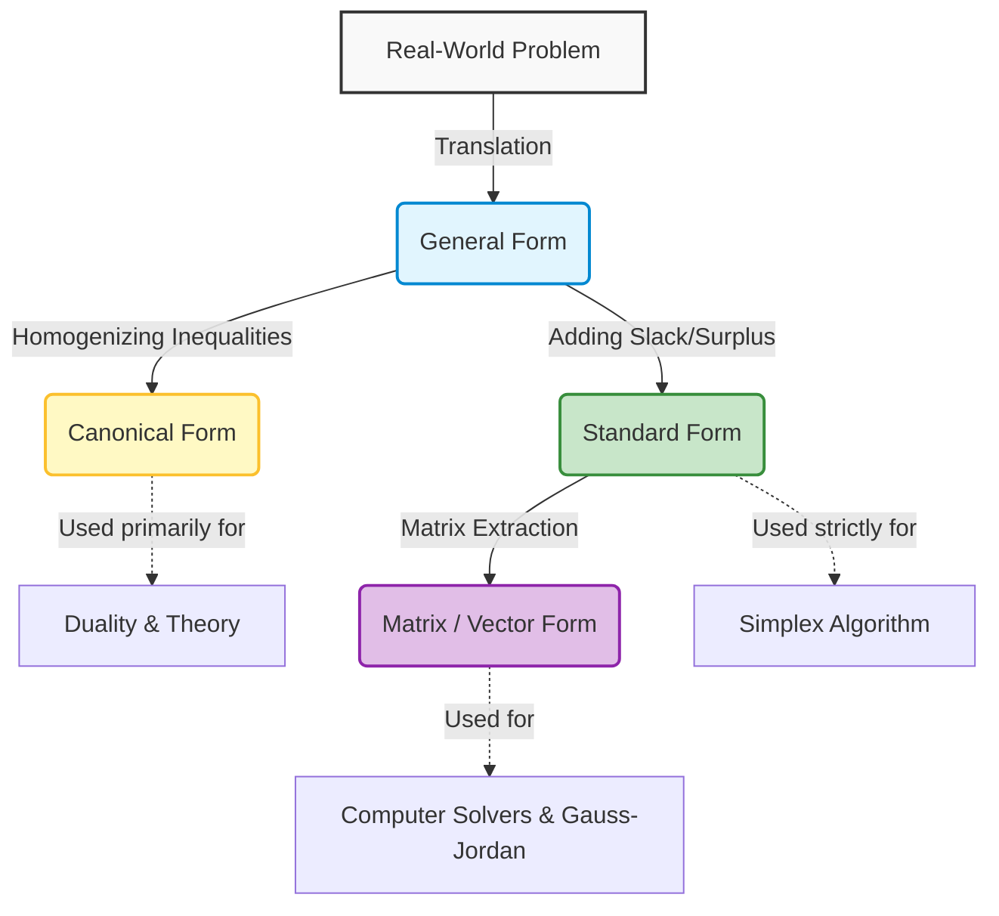
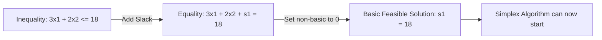

> [!info] Theory Application
> The Simplex algorithm heavily relies on the problem being in standard form (Maximization, all equalities, all positive variables). Sometimes, models do not start this way. The notes (Images 19 & 21) provide three key transformation techniques you must apply.

### 1. Minimization to Maximization Transformation

The Simplex algorithm is designed to maximize. If you are given a minimization problem, you must convert it.
**Rule:** $Min(Z) = -Max(-Z)$

**Exercise Example:**
Given: $Min(Z) = 3x_1 - x_2$
Convert this to a maximization problem.

- **Step 1:** Multiply the objective function by -1 to create a new function, let's call it $W$.
- $W = -Z = -3x_1 + x_2$
- **Step 2:** Solve for $Max(W)$ using standard Simplex.
- **Step 3:** Once you find the maximum value of $W$, remember that $Z = -W$.

### 2. Constraint Direction Inversion

If a constraint is $\ge$ (greater than or equal to), but your algorithm requires $\le$ (less than or equal to), you can flip the sign by multiplying both sides by -1.

**Exercise Example:**
Given constraint: $2x_1 + x_2 \ge 15$

- **Action:** Multiply the entire inequality by -1.
- **Result:** $-2x_1 - x_2 \le -15$
  _(Note: This introduces a negative Right-Hand Side ($b_i$), which will require the Two-Phase Simplex or Dual Simplex method to resolve, but mechanically puts the constraint in the required orientation)._

### 3. Variables Without Sign Restrictions

Normally, LP requires $x_j \ge 0$. What if a variable $x_j$ can be positive, negative, or zero (e.g., temperature changes, financial debt)?
**Rule:** Replace $x_j$ with the difference of two new strictly positive variables: $x_j = x_j' - x_j''$ where $x_j', x_j'' \ge 0$.

**Exercise Example:**
Assume $x_1$ represents a value that can be negative, and the optimal solution is mathematically $x_1 = -3$. How does the model output this?

- We substituted $x_1 = x_1' - x_1''$.
- The Simplex solver will naturally force one of these to be zero to remain efficient.
- It will output: $x_1' = 0$ and $x_1'' = 3$.
- You calculate the final real-world value: $0 - 3 = -3$.
  This trick forces the Simplex algorithm to handle negative numbers while strictly operating in the positive quadrant!


Here is the comprehensive, exhaustive, and polished Obsidian note explaining the different "forms" of Linear Programming and why they are absolutely essential. 

Following your vault structure rules, here is how this fits into your overarching folder:

```text
Course {
    Chapter 1: Introduction to Linear Programming
        - 1. Series 1 Simplex Algorithm Complete Execution
        - 2. Series 2 LP Model Transformation Techniques
        - 3. Big M
        - 4. Linear Programming Forms Concept and Purpose
}
```

--- START OF FILE 4. Linear Programming Forms Concept and Purpose.md ---

# 4. Linear Programming Forms Concept and Purpose

> [!info] Essential Background Knowledge
> When translating a real-world business, logistics, or engineering problem into mathematics, we get a messy system of inequalities and equations. However, mathematical algorithms (like the Simplex Method) are rigid machines. They cannot accept "messy" inputs. To bridge the gap between human problem-solving and algorithmic computation, mathematicians categorized Linear Programming (LP) problems into specific **Forms**. 
> Understanding these forms is not just a theoretical exercise; it is the absolute prerequisite to solving any optimization problem algebraically.

---

### 1. The Pipeline of Linear Programming

Before diving into the definitions, it is crucial to understand the lifecycle of an LP problem. 



---

### 2. The Four Distinct Forms of Linear Programming

There are four primary forms you will encounter in optimization theory. Students often confuse them, so we will define each one exhaustively.

#### 2. 1. The General Form (The Raw Formulation)
The General Form is the immediate mathematical translation of a real-world problem. It has no strict structural rules other than being linear. 

*   **Objective Function:** Can be either Maximization ($Max$) or Minimization ($Min$).
*   **Constraints:** Can be a chaotic mix of $\le$, $\ge$, and $=$.
*   **Variables:** Can be strictly positive ($x_i \ge 0$), strictly negative ($x_i \le 0$), or unrestricted in sign (URS).

**Example of General Form:**
$$Max \ Z = 5x_1 - 3x_2 + 2x_3$$
Subject to:
$$2x_1 + x_2 \le 10$$
$$x_1 - x_3 \ge 4$$
$$3x_1 + x_2 + x_3 = 15$$
$$x_1 \ge 0, \ x_2 \text{ is URS}, \ x_3 \le 0$$

> [!warning] Pitfall
> You **cannot** feed the General Form directly into the Simplex algorithm. Simplex does not know how to handle mixed inequalities, negative variables, or unrestricted variables simultaneously without standardizing them first.

#### 2. 2. The Canonical Form (The Symmetrical Form)
The Canonical Form forces the problem into a state of "pure inequalities." It is highly structured and heavily used to define **Dual Problems** (which you will study later).

**Rules for Canonical Form:**
1.  **For a Maximization Problem:** ALL constraints must be $\le$ (less than or equal to).
2.  **For a Minimization Problem:** ALL constraints must be $\ge$ (greater than or equal to).
3.  **Variables:** ALL decision variables must be strictly non-negative ($x_i \ge 0$).

**Why do we use it?**
It provides perfect mathematical symmetry. If you are maximizing profit, you are inherently limited by a ceiling of resources (hence, $\le$). If you are minimizing cost, you must meet a floor of minimum requirements (hence, $\ge$). 

**Example of Canonical Form (Maximization):**
$$Max \ Z = 4x_1 + 6x_2$$
Subject to:
$$x_1 + x_2 \le 10$$
$$2x_1 - 3x_2 \le 5$$
$$x_1, x_2 \ge 0$$

#### 2. 3. The Standard Form (The Algorithmic Form)
This is the most important form for computation. The Simplex Algorithm, the Big M method, and the Two-Phase method **strictly require** the Standard Form.

**Rules for Standard Form:**
1.  **Objective Function:** Usually configured as Maximization (Minimization is converted to Maximization by multiplying by -1).
2.  **Constraints:** ALL constraints must be strict equations ($=$).
    *   $\le$ constraints are converted by adding a $+s_i$ (Slack Variable).
    *   $\ge$ constraints are converted by adding a $-s_i$ (Surplus Variable) and an artificial variable if needed.
3.  **Right-Hand Side (RHS):** The constant value $b_i$ on the right side of the equals sign **must be non-negative** ($b_i \ge 0$).
4.  **Variables:** ALL variables (decision, slack, surplus, artificial) must be strictly non-negative ($x_i \ge 0$).

**Example of Standard Form:**
$$Max \ Z = 4x_1 + 6x_2 + 0s_1 + 0s_2$$
Subject to:
$$x_1 + x_2 + 1s_1 = 10$$
$$2x_1 - 3x_2 + 1s_2 = 5$$
$$x_1, x_2, s_1, s_2 \ge 0$$

#### 2. 4. The Matrix Form (The Computational Form)
Once the problem is in Standard Form, we can strip away the variable letters ($x_1, s_1$, etc.) and represent the entire system as matrices and vectors. This is how software solvers (like CPLEX or Gurobi) view the problem.

*   Let $\mathbf{c}$ be the vector of objective coefficients.
*   Let $\mathbf{x}$ be the vector of all variables.
*   Let $\mathbf{A}$ be the matrix of constraint coefficients.
*   Let $\mathbf{b}$ be the vector of Right-Hand Side limits.

**Matrix Form:**
$$Max \ Z = \mathbf{c}^T \mathbf{x}$$
Subject to:
$$\mathbf{A}\mathbf{x} = \mathbf{b}$$
$$\mathbf{x} \ge \mathbf{0}$$

---

### 3. Why Do We Need These Forms?

Students often ask: *"Why can't we just solve the General Form directly? Why do we have to add all these slack variables and artificial variables?"*

Here is the absolute, rigorous reasoning behind why forms are mandatory.

#### 3. 1. The Algebraic Limitation of Inequalities
Linear optimization relies on navigating the geometry of feasible regions. In algebra, solving systems of **equations** is straightforward—we use Gauss-Jordan elimination to isolate variables. 
However, you **cannot** easily perform Gauss-Jordan elimination on a system of **inequalities**.
*   If $A + B \le 10$ and $A - B \le 5$, adding or subtracting these rows algorithmically becomes chaotic because the "slack" (the unused capacity) is invisible. 
*   By converting inequalities to equalities (Standard Form), we map the problem into standard linear algebra. The invisible unused capacity is given a name ($s_1, s_2$), allowing algorithms to track it exactly.

#### 3. 2. The Requirement for an Initial Basic Feasible Solution (IBFS)
The Simplex Algorithm requires a starting point—specifically, the origin $(0,0,0...)$. 
*   If you have a constraint $3x_1 + 2x_2 \le 18$, and you start at $x_1 = 0, x_2 = 0$, what takes up the remaining 18 units?
*   In the General Form, the algorithm doesn't know. 
*   In the Standard Form ($3x_1 + 2x_2 + s_1 = 18$), if $x_1=0$ and $x_2=0$, the math dictates that $s_1 = 18$. 
*   This instantly creates an Identity Matrix inside the Matrix Form, providing the Simplex algorithm with its crucial first "Basic Feasible Solution."



#### 3. 3. Handling Variable Bounds
Simplex algorithms assume every variable operates in the positive quadrant ($x \ge 0$). If a real-world variable can be negative (e.g., a bank account balance, temperature, altitude), the algorithm will fail because it is programmed to stop at $0$.
By standardizing variables ($x = x' - x''$ where both are $\ge 0$), we "trick" the algorithm into exploring negative space while it mathematically believes it is only moving in positive space.

#### 3. 4. Duality and Sensitivity Analysis
The Canonical Form is required to create a "Dual" problem. Every Maximization problem has a mirror Minimization problem. 
*   If the original problem is a chaotic mix of $\le$ and $\ge$, creating the dual becomes immensely complicated.
*   By forcing all constraints into a uniform direction (Canonical Form), the Dual problem can be generated effortlessly by simply transposing the matrix $\mathbf{A}$.

---

### 4. Comprehensive Transformation Rules

To move from the messy General Form to the required Standard or Canonical forms, you must memorize and rigorously apply the following rules.

#### Rule 1. Converting Minimization to Maximization
*   **Why:** Simplex is built to climb a hill (maximize). If you need to find the bottom of a valley (minimize), you flip the valley upside down.
*   **How:** Multiply the entire objective function by $-1$.
*   **Math:** $Min(Z) = c_1x_1 + c_2x_2 \implies Max(-Z) = -c_1x_1 - c_2x_2$. 
*   *Tip:* At the very end of the Simplex tableau, remember to multiply your final optimal Z value by $-1$ to get the true minimum.

#### Rule 2. Flipping Inequality Directions
*   **Why:** To achieve Canonical form (e.g., getting all $\le$ for a Max problem), or to fix a negative Right-Hand Side.
*   **How:** Multiply both sides of the inequality by $-1$. **Crucially, this flips the inequality sign.**
*   **Math:** $2x_1 - 5x_2 \ge -10 \implies -2x_1 + 5x_2 \le 10$.

#### Rule 3. Converting Inequalities to Equalities (For Standard Form)
*   **Why:** To allow Gauss-Jordan row operations.
*   **How for $\le$:** Add a Slack Variable ($+s_i$). Represents unused resources.
    *   $x_1 + x_2 \le 100 \implies x_1 + x_2 + s_1 = 100$
*   **How for $\ge$:** Subtract a Surplus Variable ($-s_i$). Represents over-fulfillment of a minimum requirement.
    *   $x_1 + x_2 \ge 50 \implies x_1 + x_2 - s_2 = 50$

#### Rule 4. Fixing a Negative Right-Hand Side (RHS)
*   **Why:** Simplex tableaus will instantly fail if the $b_i$ column is negative, because it implies a negative basic variable, violating the $x \ge 0$ rule.
*   **How:** If you have an equation or inequality with a negative RHS, multiply the entire row by $-1$ before doing anything else.
*   **Math:** $4x_1 - x_2 \le -20 \implies -4x_1 + x_2 \ge 20$. *(Note: This introduces a $\ge$ sign, which will subsequently require a surplus variable and Big M artificial variable!)*

#### Rule 5. Handling Unrestricted in Sign (URS) Variables
*   **Why:** Variables must be $\ge 0$.
*   **How:** Replace every instance of the URS variable $x_i$ with $(x_i' - x_i'')$, where both $x_i', x_i'' \ge 0$.
*   **Math:** If $x_1$ is URS, $2x_1 + 3x_2 \le 10$ becomes $2(x_1' - x_1'') + 3x_2 \le 10$, which simplifies to $2x_1' - 2x_1'' + 3x_2 \le 10$.

---

### 5. Summary Cheat Sheet

| Goal | Starting Condition | Action Required | Resulting Form |
| :--- | :--- | :--- | :--- |
| Use Simplex Method | Any General Form | Add slacks, subtract surplus, add artificials. | **Standard Form** (All $=$) |
| Find the Dual | Any General Form | Make all signs $\le$ for Max, or $\ge$ for Min. | **Canonical Form** (Uniform inequalities) |
| Fix Negative RHS | $Ax \le -b$ | Multiply row by $-1$, flip sign to $\ge$. | Standardized RHS |
| Handle URS | Variable $x$ can be negative | Substitute $x = x' - x''$ | All variables $\ge 0$ |
| Use Matrix Math | Standard Form | Extract coefficients into $A, x, b, c$ | **Matrix Form** |

> [!success] The Golden Rule of Forms
> Always ask yourself: **What algorithm am I about to run?** 
> If you are building a Simplex Tableau, you **must** be in Standard Form with $b_i \ge 0$. If you are answering a theoretical question about Duality, you **must** be in Canonical Form. Forms are not just notation; they are the required keys to unlock specific mathematical tools.

