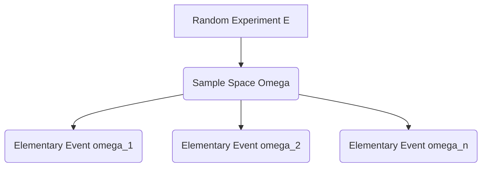

# 1.1. Introduction to Probability and Random Experiments

### 1. Fundamental Definitions
Probability theory provides a mathematical framework for analyzing phenomena ruled by chance. In deterministic systems, a given set of initial conditions always yields the same unique outcome. In contrast, a **random experiment** (denoted by $\mathcal{E}$) is an action or process where:
1. All possible outcomes are known in advance.
2. The exact outcome of any single trial cannot be predicted with certainty prior to execution.
3. The experiment can, at least conceptually, be repeated under identical conditions.

### 2. The Sample Space ($\Omega$) and Elementary Events ($\omega$)
* **Sample Space ($\Omega$):** The set containing all possible outcomes of a random experiment. It acts as the universal set for the system under analysis.
* **Elementary Event ($\omega$):** A single outcome of the random experiment, such as an individual element belonging to the sample space ($\omega \in \Omega$).

### 3. Concrete Examples
* **Example A: Flipping a Single Coin**
  * Let $\mathcal{E}$ be the single toss of a fair coin.
  * The outcomes are either heads ($P$ for *pile*) or tails ($F$ for *face*).
  * The sample space is:
    $$\Omega = \{P, F\}$$
  * There are exactly two elementary events: $\omega_1 = P$ and $\omega_2 = F$.

* **Example B: Rolling a Single Six-Sided Die**
  * Let $\mathcal{E}$ be the roll of a standard fair die.
  * The outcome is the number displayed on the top face.
  * The sample space is:
    $$\Omega = \{1, 2, 3, 4, 5, 6\}$$
  * There are six elementary events: $\omega_i = i$ for $i \in \{1, 2, 3, 4, 5, 6\}$.

### 4. Random Events
A **random event** (often referred to simply as an **event**) is a subset of the sample space $\Omega$. It represents a collection of elementary outcomes. An event $A$ (where $A \subseteq \Omega$) is said to **occur** or **realize** if the actual outcome $\omega$ of the experiment is an element of $A$ (i.e., $\omega \in A$).

* **Die Roll Example:**
  * Let $A$ be the event "rolling an even number":
    $$A = \{2, 4, 6\}$$
  * Let $B$ be the event "rolling a number in $\{1, 2, 5, 6\}$":
    $$B = \{1, 2, 5, 6\}$$
  * Let $C$ be the event "rolling a prime number":
    $$C = \{2, 3, 5\}$$
  Since $A, B, C \subseteq \Omega$, they are valid events. They are non-elementary because they contain more than one single outcome.

* **Coin Toss Example and the Role of the Sample Space:**
  * Let $\mathcal{E}$ be a single coin toss, so $\Omega = \{P, F\}$.
  * Suppose we define $A = \{\text{obtaining face twice in a row}\}$.
  * Under a single coin toss, $A$ **cannot** be considered an event because it is not a subset of the current sample space $\Omega = \{P, F\}$. 
  * For $A$ to be a valid event, the experiment must be modified to repeat the toss at least twice, which changes the sample space to:
    $$\Omega' = \{(P,P), (P,F), (F,P), (F,F)\}$$
    In this expanded space, $A = \{(F,F)\} \subseteq \Omega'$, which makes it a mathematically valid event.

---
