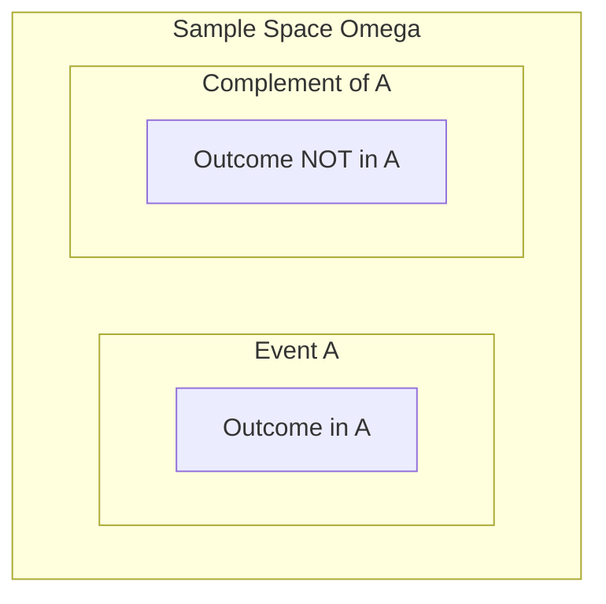

# 1.2. Set Theory and Probability Correspondence

To perform mathematical calculations on events, we translate probabilistic statements into set-theoretic operations.

### 1. Dictionary of Correspondence
The table below maps the terminology used in probability theory to its equivalent in set theory:

| Probabilistic Language | Set-Theoretic Representation | Mathematical Notation |
| :--- | :--- | :--- |
| **Sample Space** | Universal Set | $\Omega$ |
| **Elementary Event** | Element of a Set | $\omega \in \Omega$ |
| **Event** | Subset | $A \subseteq \Omega$ |
| **Certain Event** | Complete Set | $\Omega$ |
| **Impossible Event** | Empty Set | $\emptyset$ (or $\Theta$) |
| **Event "$A$ and $B$" (Simultaneous)** | Intersection | $A \cap B$ (or $A \cdot B$) |
| **Event "$A$ or $B$" (At least one)** | Union | $A \cup B$ |
| **Opposite / Complementary Event** | Absolute Complement | $\bar{A} = \Omega \setminus A$ |
| **Incompatible Events** | Disjoint Sets | $A \cap B = \emptyset$ |
| **Event $A$ implies Event $B$** | Subset Inclusion | $A \subseteq B$ |

### 2. Detailed Mathematical Explanations

#### The certain event ($\Omega$)
This event always occurs because any experimental outcome $\omega$ must belong to $\Omega$ by definition. Hence, $P(\Omega) = 1$.

#### The impossible event ($\emptyset$)
This event contains no outcomes. It can never occur, meaning $P(\emptyset) = 0$. For example, rolling a 7 on a standard six-sided die corresponds to the empty set.

#### Complements ($\bar{A}$)
The event "not $A$". It is realized if and only if $A$ is not realized.
$$\bar{A} = \{\omega \in \Omega \mid \omega \notin A\}$$
The union of an event and its complement spans the entire sample space:
$$A \cup \bar{A} = \Omega \quad \text{and} \quad A \cap \bar{A} = \emptyset$$

#### Implication and Inclusion ($A \subseteq B$)
The provided course material states: *"Si A est inclus dans B alors on dit que B implique A..."* This is a common typo. Let's clarify the correct mathematical relationship:
* If $A \subseteq B$, then every outcome in $A$ is also in $B$.
* Therefore, if event $A$ occurs, event $B$ is guaranteed to occur as well.
* This means **$A$ implies $B$** ($A \implies B$). 
* For example, let $A = \{2, 4\}$ and $B = \{2, 4, 6\}$. If the die outcome is $2$, then $A$ occurs, which guarantees that $B$ (even number) also occurs. Thus, $A \subseteq B \implies A \implies B$.

#### Incompatible (Mutually Exclusive) Events
Two events $A$ and $B$ are incompatible if they cannot occur at the same time.
$$A \cap B = \emptyset$$
For example, the event $A = \{\text{rolling an odd number}\} = \{1, 3, 5\}$ and $B = \{\text{rolling an even number}\} = \{2, 4, 6\}$ are incompatible because no single roll can be both odd and even.

---
