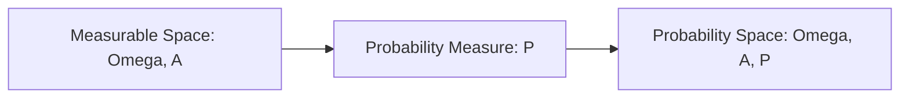
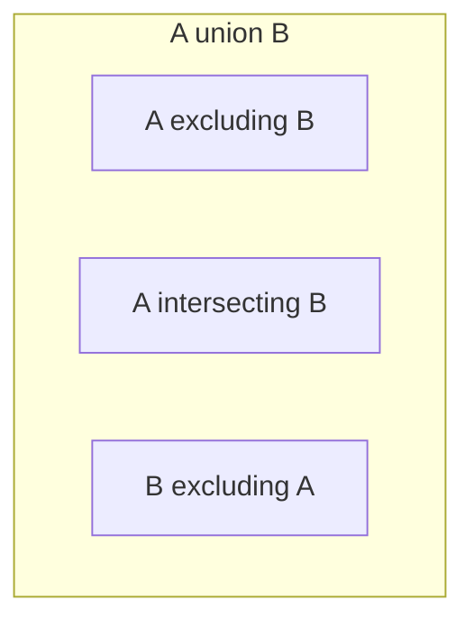

# 1.4. Probability Spaces and Fundamental Axioms

### 1. Mathematical Definition of Probability
A **probability measure** $P$ on a measurable space $(\Omega, \mathcal{A})$ is a function that maps each event in the $\sigma$-algebra to a real number in the interval $[0, 1]$:
$$P: \mathcal{A} \to [0, 1]$$
This function must satisfy Kolmogorov's Axioms:

* **Axiom 1 (Unit Measure):** The probability of the certain event is exactly $1$:
  $$P(\Omega) = 1$$
* **Axiom 2 ($\sigma$-Additivity):** For any countable sequence of pairwise incompatible (disjoint) events $(A_i)_{i \ge 1}$ (where $A_i \cap A_j = \emptyset$ for all $i \neq j$):
  $$P\left( \bigcup_{i=1}^{\infty} A_i \right) = \sum_{i=1}^{\infty} P(A_i)$$

The triplet **$(\Omega, \mathcal{A}, P)$** is called a **probability space** (or *espace probabilisé*).

### 2. Properties Derived from the Axioms
Using Kolmogorov's axioms, we can prove several fundamental properties of probability:

#### Property 1: Probability of the Empty Set
$$P(\emptyset) = 0$$
* **Proof:** Consider the sequence of events where $A_1 = \Omega$ and $A_i = \emptyset$ for all $i \ge 2$. These events are pairwise disjoint because $\Omega \cap \emptyset = \emptyset$ and $\emptyset \cap \emptyset = \emptyset$.
  Applying the $\sigma$-additivity axiom:
  $$P\left( \bigcup_{i=1}^{\infty} A_i \right) = P(\Omega) + \sum_{i=2}^{\infty} P(\emptyset)$$
  Since $\bigcup_{i=1}^{\infty} A_i = \Omega \cup \emptyset \cup \emptyset \cup \dots = \Omega$, this simplifies to:
  $$P(\Omega) = P(\Omega) + \sum_{i=2}^{\infty} P(\emptyset)$$
  Subtracting $P(\Omega)$ (which is finite and equal to $1$) from both sides gives:
  $$0 = \sum_{i=2}^{\infty} P(\emptyset)$$
  Since probabilities are non-negative ($P(\emptyset) \ge 0$), this infinite sum can only equal $0$ if each individual term is $0$. Thus, $P(\emptyset) = 0$.

#### Property 2: Probability of the Complement
$$P(\bar{A}) = 1 - P(A)$$
* **Proof:** By definition, $A \cap \bar{A} = \emptyset$ and $A \cup \bar{A} = \Omega$. 
  Using finite additivity (which follows from $\sigma$-additivity by setting all remaining terms to $\emptyset$):
  $$P(A \cup \bar{A}) = P(A) + P(\bar{A})$$
  Since $P(A \cup \bar{A}) = P(\Omega) = 1$, we can substitute this into the equation:
  $$1 = P(A) + P(\bar{A}) \implies P(\bar{A}) = 1 - P(A)$$

#### Property 3: Monotonicity
$$\text{If } A \subseteq B, \quad \text{then } P(A) \le P(B)$$
* **Proof:** We can decompose the set $B$ into two disjoint parts:
  $$B = A \cup (B \setminus A)$$
  Since $A$ and $B \setminus A$ are disjoint, we can apply the additivity property:
  $$P(B) = P(A) + P(B \setminus A)$$
  Because the range of $P$ is restricted to $[0, 1]$, we know that $P(B \setminus A) \ge 0$. Substituting this back into our equation yields:
  $$P(B) \ge P(A)$$

#### Property 4: General Addition Rule (Inclusion-Exclusion)
For any two events $A, B \in \mathcal{A}$ (not necessarily disjoint):
$$P(A \cup B) = P(A) + P(B) - P(A \cap B)$$
* **Proof:** We can write the union $A \cup B$ as the union of three disjoint sets:
  $$A \cup B = (A \setminus (A \cap B)) \cup (B \setminus (A \cap B)) \cup (A \cap B)$$

  We can also express $A$ and $B$ as unions of disjoint sets:
  $$A = (A \setminus (A \cap B)) \cup (A \cap B) \implies P(A) = P(A \setminus (A \cap B)) + P(A \cap B)$$
  $$B = (B \setminus (A \cap B)) \cup (A \cap B) \implies P(B) = P(B \setminus (A \cap B)) + P(A \cap B)$$
  Solving for the set difference probabilities gives:
  $$P(A \setminus (A \cap B)) = P(A) - P(A \cap B)$$
  $$P(B \setminus (A \cap B)) = P(B) - P(A \cap B)$$
  Since $A \cup B$ is composed of three disjoint sets, its probability is the sum of their individual probabilities:
  $$P(A \cup B) = P(A \setminus (A \cap B)) + P(B \setminus (A \cap B)) + P(A \cap B)$$
  Substituting our previous expressions into this equation:
  $$P(A \cup B) = [P(A) - P(A \cap B)] + [P(B) - P(A \cap B)] + P(A \cap B)$$
  $$P(A \cup B) = P(A) + P(B) - P(A \cap B)$$

---
