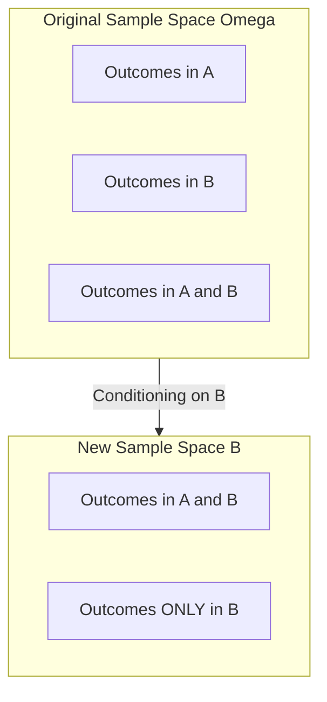

# 1.5. Conditional Probability and Independence

### 1. Conditional Probability
Conditional probability measures the likelihood of an event $A$ occurring, given the knowledge that another event $B$ has already occurred. This is written as $P(A \mid B)$.

* **Geometric Intuition:** When we assume event $B$ has occurred, we restrict our sample space from the original space $\Omega$ to the subset $B$. The only outcomes in $A$ that can still occur are those that also lie within $B$ (the intersection $A \cap B$).

* **Definition:** Let $(\Omega, \mathcal{A}, P)$ be a probability space, and let $B \in \mathcal{A}$ be an event with $P(B) > 0$. The conditional probability of $A$ given $B$ is defined as:
  $$P(A \mid B) = \frac{P(A \cap B)}{P(B)}$$
  If $A \cap B = \emptyset$ (meaning they are incompatible), then $P(A \mid B) = 0$.

* **Axiomatic Consistency:** The conditional probability function $P(\cdot \mid B): \mathcal{A} \to [0, 1]$ satisfies all of Kolmogorov’s axioms on its own, making it a valid probability measure:
  1. **Non-negativity:** $P(A \mid B) = \frac{P(A \cap B)}{P(B)} \ge 0$ since both $P(A \cap B) \ge 0$ and $P(B) > 0$.
  2. **Normalization:** $P(\Omega \mid B) = \frac{P(\Omega \cap B)}{P(B)} = \frac{P(B)}{P(B)} = 1$.
  3. **Countable Additivity:** If $(A_i)_{i \ge 1}$ are pairwise disjoint:
     $$P\left( \bigcup_{i} A_i \;\middle|\; B \right) = \frac{P\left( \left(\bigcup_{i} A_i\right) \cap B \right)}{P(B)} = \frac{P\left( \bigcup_{i} (A_i \cap B) \right)}{P(B)}$$
     Since the events $A_i$ are pairwise disjoint, the events $A_i \cap B$ are also pairwise disjoint. Thus:
     $$\frac{\sum_{i} P(A_i \cap B)}{P(B)} = \sum_{i} P(A_i \mid B)$$

### 2. The Multiplication Rule (Chain Rule)
By rearranging the definition of conditional probability, we can calculate the probability of the intersection of two events:
$$P(A \cap B) = P(A \mid B)P(B) = P(B \mid A)P(A)$$

We can extend this to any finite number of events $A_1, A_2, \dots, A_n$:
$$P(A_1 \cap A_2 \cap \dots \cap A_n) = P(A_1) \cdot P(A_2 \mid A_1) \cdot P(A_3 \mid A_1 \cap A_2) \cdots P(A_n \mid A_1 \cap \dots \cap A_{n-1})$$

---

### 3. Independence of Events
Two events $A$ and $B$ are **independent** if the occurrence of one does not affect the probability of the other.

* **Formal Definition:** $A$ and $B$ are independent if and only if:
  $$P(A \cap B) = P(A)P(B)$$
* **Equivalent Conditional Form:** If $P(B) > 0$ and $P(A) > 0$, independence is equivalent to:
  $$P(A \mid B) = P(A) \quad \text{and} \quad P(B \mid A) = P(B)$$

#### Proposition 1.4: Independence of Complements
If $A$ and $B$ are independent, then:
1. $A$ and $\bar{B}$ are independent.
2. $\bar{A}$ and $\bar{B}$ are independent.

* **Proof for $A$ and $\bar{B}$:**
  We can write the event $A$ as the union of two disjoint sets:
  $$A = (A \cap B) \cup (A \cap \bar{B})$$
  Applying the additivity property:
  $$P(A) = P(A \cap B) + P(A \cap \bar{B})$$
  Using the assumption that $A$ and $B$ are independent, we substitute $P(A \cap B) = P(A)P(B)$ into the equation:
  $$P(A) = P(A)P(B) + P(A \cap \bar{B})$$
  Now, we isolate the term $P(A \cap \bar{B})$:
  $$P(A \cap \bar{B}) = P(A) - P(A)P(B) = P(A)(1 - P(B))$$
  Since $1 - P(B) = P(\bar{B})$, we obtain:
  $$P(A \cap \bar{B}) = P(A)P(\bar{B})$$
  This proves that $A$ and $\bar{B}$ are independent.

* **Proof for $\bar{A}$ and $\bar{B}$:**
  Since $A$ and $B$ are independent, we know from the previous proof that $A$ and $\bar{B}$ are also independent. Applying the same logic to the events $\bar{B}$ and $A$, we conclude that $\bar{B}$ and $\bar{A}$ are independent. Thus:
  $$P(\bar{A} \cap \bar{B}) = P(\bar{A})P(\bar{B})$$

---
