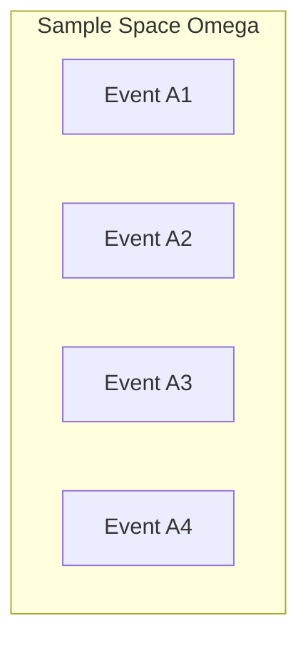

# 1.6. Law of Total Probability and Bayes Theorem

### 1. Complete System of Events (Partition)
A family of events $(A_i)_{i \in I}$ (where $I$ is a finite or countably infinite index set) is called a **complete system of events** (or a **partition** of $\Omega$) if it satisfies two conditions:
1. **Pairwise Disjoint:** The events cannot occur simultaneously:
   $$A_i \cap A_j = \emptyset \quad \text{for all } i \neq j$$
2. **Exhaustive:** The union of all events covers the entire sample space:
   $$\bigcup_{i \in I} A_i = \Omega$$

### 2. The Law of Total Probability
Let $(A_i)_{i \in I}$ be a complete system of events with $P(A_i) > 0$ for all $i$. For any arbitrary event $B \subseteq \Omega$, its probability can be calculated as:
$$P(B) = \sum_{i \in I} P(B \mid A_i)P(A_i)$$

* **Proof:** We can write $B$ as the intersection of itself with the sample space:
  $$B = B \cap \Omega$$
  Since $\Omega = \bigcup_{i \in I} A_i$, we can substitute this into the equation:
  $$B = B \cap \left( \bigcup_{i \in I} A_i \right) = \bigcup_{i \in I} (B \cap A_i)$$
  Because the events $A_i$ are pairwise disjoint, the events $(B \cap A_i)$ are also pairwise disjoint. Applying the additivity axiom:
  $$P(B) = P\left( \bigcup_{i \in I} (B \cap A_i) \right) = \sum_{i \in I} P(B \cap A_i)$$
  Using the definition of conditional probability ($P(B \cap A_i) = P(B \mid A_i)P(A_i)$), we substitute this back into the sum:
  $$P(B) = \sum_{i \in I} P(B \mid A_i)P(A_i)$$

---

### 3. Bayes' Theorem (Probability of Causes)
Bayes' Theorem calculates the conditional probability of a specific "cause" $A_j$ occurring, given that the effect $B$ has already been observed.

Let $(A_i)_{i \in I}$ be a complete system of events, and let $B$ be an event such that $P(B) > 0$. For any specific index $j \in I$:
$$P(A_j \mid B) = \frac{P(B \mid A_j)P(A_j)}{\sum_{i \in I} P(B \mid A_i)P(A_i)}$$

* **Proof:** Using the definition of conditional probability:
  $$P(A_j \mid B) = \frac{P(A_j \cap B)}{P(B)}$$
  Applying the multiplication rule to the numerator:
  $$P(A_j \cap B) = P(B \mid A_j)P(A_j)$$
  Applying the Law of Total Probability to the denominator:
  $$P(B) = \sum_{i \in I} P(B \mid A_i)P(A_i)$$
  Combining these two expressions yields Bayes' Theorem:
  $$P(A_j \mid B) = \frac{P(B \mid A_j)P(A_j)}{\sum_{i \in I} P(B \mid A_i)P(A_i)}$$

---

# Chapter 2: Random Variables and Cumulative Distribution Functions
