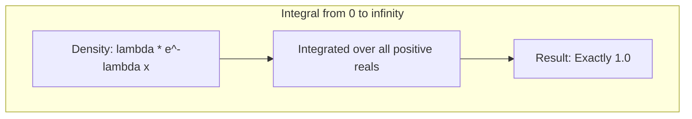

# 2.6. The Exponential Distribution

### 1. Definition and PDF
The exponential distribution is often used to model the time between independent events occurring at a constant average rate $\lambda$.

* **Support:** $X(\Omega) = [0, +\infty)$
* **Parameter:** $\lambda > 0$ (the rate parameter)
* **Probability Density Function (PDF):**
  $$f(x) = \begin{cases} 
  \lambda e^{-\lambda x} & \text{if } x \ge 0 \\ 
  0 & \text{if } x < 0 
  \end{cases}$$

#### Verifying that the total area equals 1
$$\int_{-\infty}^{+\infty} f(x) \, dx = \int_{0}^{+\infty} \lambda e^{-\lambda x} \, dx = \lim_{M \to +\infty} \left[ -e^{-\lambda x} \right]_{0}^{M} = \lim_{M \to +\infty} \left( -e^{-\lambda M} - (-e^{0}) \right) = 0 + 1 = 1$$

---

### 2. Derivation of the Cumulative Distribution Function (CDF)
For any $t \ge 0$, we find the CDF by integrating the PDF from $0$ to $t$:
$$F(t) = P(X \le t) = \int_{0}^{t} \lambda e^{-\lambda x} \, dx$$
Evaluating the antiderivative:
$$F(t) = \left[ -e^{-\lambda x} \right]_{0}^{t} = \left( -e^{-\lambda t} \right) - \left( -e^{0} \right) = 1 - e^{-\lambda t}$$

For $t < 0$, the PDF is 0, so the integral is also 0. Thus, the complete CDF is:
$$F(t) = \begin{cases} 
1 - e^{-\lambda t} & \text{if } t \ge 0 \\ 
0 & \text{if } t < 0 
\end{cases}$$

---

### 3. The Memoryless Property
A key feature of the exponential distribution is its **memoryless property**. This property means that the probability of an event occurring in the next interval of time is independent of how much time has already passed.

* **Mathematical Statement:**
  $$P(X > s + t \mid X > s) = P(X > t) \quad \text{for all } s, t \ge 0$$

* **Mathematical Proof:**
  First, we calculate the probability $P(X > x)$ using the CDF:
  $$P(X > x) = 1 - P(X \le x) = 1 - (1 - e^{-\lambda x}) = e^{-\lambda x}$$
  Now, we apply the definition of conditional probability:
  $$P(X > s + t \mid X > s) = \frac{P((X > s + t) \cap (X > s))}{P(X > s)}$$
  Since $t \ge 0$, the event $X > s + t$ is a subset of $X > s$. Therefore, their intersection is simply $X > s + t$:
  $$P(X > s + t \mid X > s) = \frac{P(X > s + t)}{P(X > s)}$$
  Substituting our previous expression $P(X > x) = e^{-\lambda x}$ into the fraction:
  $$P(X > s + t \mid X > s) = \frac{e^{-\lambda(s + t)}}{e^{-\lambda s}} = \frac{e^{-\lambda s} \cdot e^{-\lambda t}}{e^{-\lambda s}} = e^{-\lambda t}$$
  Since $e^{-\lambda t} = P(X > t)$, this completes the proof:
  $$P(X > s + t \mid X > s) = P(X > t)$$

---

# Chapter 3: Markov Chains
