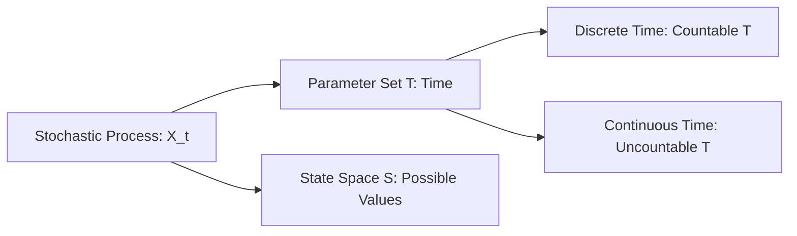

# 3.1. Introduction to Stochastic Processes

### 1. Concept and Definition
A **stochastic process** is a collection of random variables indexed by a parameter, which typically represents time:
$$\{X(t) \text{ or } X_t \mid t \in T\}$$
where $T$ is the **index set** (or parameter set), and all the random variables $X_t$ are defined on the same underlying probability space $(\Omega, \mathcal{A}, P)$.

The set of all possible values that the random variables $X_t$ can take is called the **state space** (denoted by $S$).

### 2. Parameter Sets and Time Domains
* **Discrete-Time Processes:** The index set $T$ is countable, such as the natural numbers:
  $$T = \{0, 1, 2, 3, \dots\} \quad \text{or} \quad T = \mathbb{Z}$$
  In this case, the process is written as a sequence: $\{X_n \mid n \in \mathbb{N}\}$.
* **Continuous-Time Processes:** The index set $T$ is uncountable, such as the non-negative real numbers:
  $$T = [0, +\infty) \quad \text{or} \quad T = \mathbb{R}$$
  This is written as $\{X(t) \mid t \ge 0\}$.

### 3. Trajectories and Sections

#### Trajectory (Sample Path)
If we fix an outcome $\omega \in \Omega$, the mapping $t \mapsto X(t, \omega)$ is a deterministic function of time called a **trajectory** or **sample path** of the process. It represents one specific realization of the process over time.

#### Section
If we fix a specific point in time $t \in T$, the mapping $\omega \mapsto X(t, \omega)$ is a standard random variable $X_t$. It represents the state of the system at that specific moment.

---
