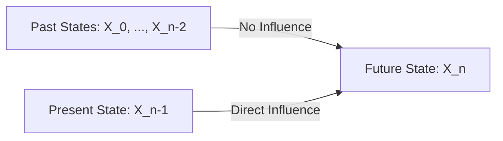

# 3.2. Discrete-Time Markov Chains and the Markov Property

### 1. Definition of a DTMC
A discrete-time stochastic process $\{X_n \mid n \in \mathbb{N}\}$ taking values in a finite or countable state space $S = \{a_1, a_2, \dots, a_m\}$ is a **Discrete-Time Markov Chain (DTMC)** if it satisfies the **Markov Property**.

### 2. The Markov Property (Memorylessness)
The Markov Property states that the future state of the system depends only on its current state, and is independent of its past history.

* **Mathematical Statement:**
  For any sequence of steps $n$, and for any states $x_0, x_1, \dots, x_n \in S$:
  $$P(X_n = x_n \mid X_{n-1} = x_{n-1}, X_{n-2} = x_{n-2}, \dots, X_0 = x_0) = P(X_n = x_n \mid X_{n-1} = x_{n-1})$$

---
