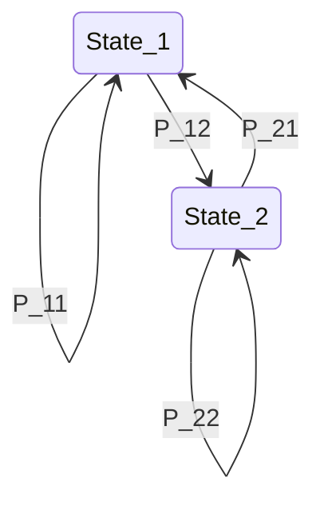

# 3.3. Transition Matrices and Diagram Representations

### 1. One-Step Transition Probabilities
The probability of transitioning from state $a_i$ to state $a_j$ in a single step is called the **one-step transition probability** (denoted by $P_{ij}$):
$$P_{ij} = P(X_{n+1} = a_j \mid X_n = a_i)$$

A Markov chain is **homogeneous** if these transition probabilities do not change over time, meaning $P_{ij}$ is the same for all $n$.

### 2. The Transition Matrix ($P$)
We can organize these transition probabilities into a square matrix $P$, where the rows represent the current state and the columns represent the next state:

$$P = \begin{pmatrix}
P_{11} & P_{12} & \dots & P_{1m} \\
P_{21} & P_{22} & \dots & P_{2m} \\
\vdots & \vdots & \ddots & \vdots \\
P_{m1} & P_{m2} & \dots & P_{mm}
\end{pmatrix}$$

#### Key Properties of the Transition Matrix
1. **Non-negativity:** All probabilities are non-negative:
   $$P_{ij} \ge 0 \quad \text{for all } i, j$$
2. **Row Sums of 1:** Since the system must transition to some state in $S$, the sum of probabilities in each row must equal 1:
   $$\sum_{j=1}^{m} P_{ij} = 1 \quad \text{for all } i$$
   Any matrix satisfying these two properties is called a **stochastic matrix**.

---

### 3. Transition Diagrams
We can represent a Markov chain as a directed graph where:
* The **nodes** represent the states in $S$.
* The **directed edges** represent possible transitions, labeled with their transition probabilities $P_{ij} > 0$.

---
