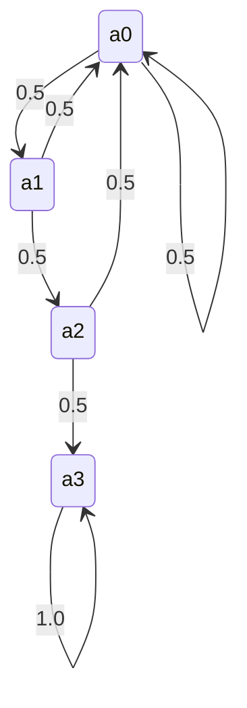

# 3.6. Absorbing States in Markov Chains

### 1. Definition of an Absorbing State
A state $a_i$ is an **absorbing state** if once the system enters this state, it can never leave.

* **Mathematical Condition:**
  $$P_{ii} = 1 \quad \text{and} \quad P_{ij} = 0 \quad \text{for all } j \neq i$$
  In the transition matrix, the row corresponding to an absorbing state has a $1$ on the main diagonal and $0$ in all other positions.

---

### 2. Concrete Example
Consider the following transition matrix for a system with four states $\{a_0, a_1, a_2, a_3\}$:

$$P = \begin{pmatrix}
1/2 & 1/2 & 0 & 0 \\
1/2 & 0 & 1/2 & 0 \\
1/2 & 0 & 0 & 1/2 \\
0 & 0 & 0 & 1
\end{pmatrix}$$

* **Analyzing the fourth row (state $a_3$):**
  $$P_{30} = 0, \quad P_{31} = 0, \quad P_{32} = 0, \quad P_{33} = 1$$
  Since $P_{33} = 1$, once the system enters state $a_3$, it is guaranteed to remain in state $a_3$ on the next step. Therefore, **$a_3$ is an absorbing state**.

* **Transition Diagram:**
  The diagram below shows how the other states can transition to one another or eventually become trapped in the absorbing state $a_3$:

---
