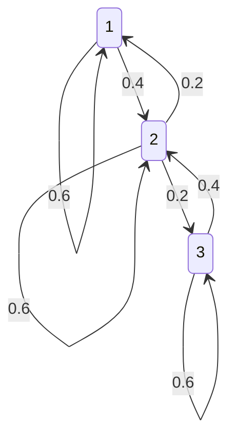
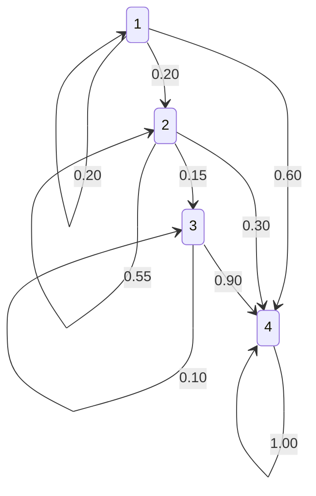

# 4.3. Elementary Markov Chains Matrix Algebra and Diagonalization

### 1. Invariant Measures of 3-State Homogeneous Systems
* **Problem Statement:** A 3-state Markov chain has the following transition matrix:
  $$M = \begin{pmatrix} 3/5 & 2/5 & 0 \\ 1/5 & 3/5 & 1/5 \\ 0 & 2/5 & 3/5 \end{pmatrix}$$
  1. Draw the transition diagram.
  2. Prove that the chain is irreducible.
  3. Compute the invariant probability vector $\pi$.
  4. Prove that $1/5$, $3/5$, and $1$ are eigenvalues of $M$.
  5. Given the diagonalization matrices $S$ and $S^{-1}$, write $M^n$ in terms of $n$, find the limit as $n \to \infty$, and compare the result to part (3).

#### Drawing the Transition Diagram
The transition diagram consists of three states $\{1, 2, 3\}$ connected by directed, weighted edges:

#### Proving Irreducibility
A Markov chain is irreducible if it is possible to transition from any state to any other state in a finite number of steps.
* State 1 can reach State 2 directly ($P_{12} = 2/5 > 0$), and State 2 can reach State 3 directly ($P_{23} = 1/5 > 0$). Thus, State 1 can reach State 3 ($1 \to 2 \to 3$).
* State 3 can reach State 2 directly ($P_{32} = 2/5 > 0$), and State 2 can reach State 1 directly ($P_{21} = 1/5 > 0$). Thus, State 3 can reach State 1 ($3 \to 2 \to 1$).
Since all states communicate, the Markov chain is irreducible.

#### Computing the Invariant Probability Vector $\pi$
We solve the system of equations $\pi M = \pi$, where $\pi = (x, y, z)$ and $x + y + z = 1$:
$$(x, \quad y, \quad z) \begin{pmatrix} 3/5 & 2/5 & 0 \\ 1/5 & 3/5 & 1/5 \\ 0 & 2/5 & 3/5 \end{pmatrix} = (x, \quad y, \quad z)$$

This yields the following equations:
1. $\frac{3}{5}x + \frac{1}{5}y = x \implies \frac{1}{5}y = \frac{2}{5}x \implies y = 2x$
2. $\frac{2}{5}x + \frac{3}{5}y + \frac{2}{5}z = y \implies 2x + 2z = 2y \implies x + z = y$
3. $\frac{1}{5}y + \frac{3}{5}z = z \implies \frac{1}{5}y = \frac{2}{5}z \implies y = 2z$

From equations 1 and 3, we see that $x = z$. Substituting this into the normalization equation $x + y + z = 1$:
$$x + (2x) + x = 1 \implies 4x = 1 \implies x = \frac{1}{4}$$

We find the remaining values:
$$z = \frac{1}{4} \quad \text{and} \quad y = 2\left(\frac{1}{4}\right) = \frac{1}{2}$$

This gives the invariant probability vector:
$$\pi = \left(\frac{1}{4}, \quad \frac{1}{2}, \quad \frac{1}{4}\right) = (0.25, \quad 0.50, \quad 0.25)$$

#### Finding the Eigenvalues of $M$
We find the eigenvalues of $M$ by solving the characteristic equation $\det(M - \lambda I) = 0$:
$$\det \begin{pmatrix} 3/5 - \lambda & 2/5 & 0 \\ 1/5 & 3/5 - \lambda & 1/5 \\ 0 & 2/5 & 3/5 - \lambda \end{pmatrix} = 0$$

Let $u = \frac{3}{5} - \lambda$:
$$\det \begin{pmatrix} u & 2/5 & 0 \\ 1/5 & u & 1/5 \\ 0 & 2/5 & u \end{pmatrix} = 0$$

Expanding along the first row:
$$u \left( u^2 - \frac{2}{25} \right) - \frac{2}{5} \left( \frac{1}{5}u - 0 \right) = 0 \implies u^3 - \frac{2}{25}u - \frac{2}{25}u = 0 \implies u \left( u^2 - \frac{4}{25} \right) = 0$$

This yields three solutions for $u$:
* $u_1 = 0 \implies \frac{3}{5} - \lambda = 0 \implies \lambda_1 = \frac{3}{5}$
* $u_2 = \frac{2}{5} \implies \frac{3}{5} - \lambda = \frac{2}{5} \implies \lambda_2 = \frac{1}{5}$
* $u_3 = -\frac{2}{5} \implies \frac{3}{5} - \lambda = -\frac{2}{5} \implies \lambda_3 = 1$

The eigenvalues are indeed $1/5, 3/5, 1$.

#### Computing the Matrix Limit of $M^n$
We can diagonalize $M$ using $M = S D S^{-1}$, where:
$$D = \begin{pmatrix} 1/5 & 0 & 0 \\ 0 & 3/5 & 0 \\ 0 & 0 & 1 \end{pmatrix}, \quad S = \begin{pmatrix} 1 & 1 & 1 \\ -1 & 0 & 1 \\ 1 & -1 & 1 \end{pmatrix}, \quad S^{-1} = \begin{pmatrix} 1/4 & -1/2 & 1/4 \\ 1/2 & 0 & -1/2 \\ 1/4 & 1/2 & 1/4 \end{pmatrix}$$

The $n$-th power of $M$ is:
$$M^n = S D^n S^{-1} = S \begin{pmatrix} (1/5)^n & 0 & 0 \\ 0 & (3/5)^n & 0 \\ 0 & 0 & 1 \end{pmatrix} S^{-1}$$

Taking the limit as $n \to \infty$:
$$\lim_{n \to \infty} D^n = \begin{pmatrix} 0 & 0 & 0 \\ 0 & 0 & 0 \\ 0 & 0 & 1 \end{pmatrix}$$

We compute the limit of $M^n$ as:
$$\lim_{n \to \infty} M^n = S \left( \lim_{n \to \infty} D^n \right) S^{-1} = \begin{pmatrix} 1 & 1 & 1 \\ -1 & 0 & 1 \\ 1 & -1 & 1 \end{pmatrix} \begin{pmatrix} 0 & 0 & 0 \\ 0 & 0 & 0 \\ 0 & 0 & 1 \end{pmatrix} S^{-1} = \begin{pmatrix} 0 & 0 & 1 \\ 0 & 0 & 1 \\ 0 & 0 & 1 \end{pmatrix} S^{-1}$$

$$\lim_{n \to \infty} M^n = \begin{pmatrix} 0 & 0 & 1 \\ 0 & 0 & 1 \\ 0 & 0 & 1 \end{pmatrix} \begin{pmatrix} 1/4 & -1/2 & 1/4 \\ 1/2 & 0 & -1/2 \\ 1/4 & 1/2 & 1/4 \end{pmatrix} = \begin{pmatrix} 1/4 & 1/2 & 1/4 \\ 1/4 & 1/2 & 1/4 \\ 1/4 & 1/2 & 1/4 \end{pmatrix}$$

* **Comment:** Every row of the limiting matrix is identical to the invariant probability vector $\pi = (0.25, 0.5, 0.25)$ computed in part (3). This is consistent with the stationary behavior of regular Markov chains.

---

### 2. Transient Analysis and Geometric Solvers
* **Problem Statement:** A 4-state Markov chain has the following transition matrix:
  $$P = \begin{pmatrix} 0.2 & 0.2 & 0 & 0.6 \\ 0 & 0.55 & 0.15 & 0.3 \\ 0 & 0 & 0.1 & 0.9 \\ 0 & 0 & 0 & 1 \end{pmatrix}$$
  1. Draw the transition diagram and identify the classes of the chain.
  2. Let $N_i$ represent the number of steps required to reach the absorbing state starting from transient state $i$. Derive the probability mass functions for $N_3$ and $N_2$ for $k = 1, 2, 3$.
  3. Determine the probability of absorption into state 4 starting from state 2.

#### Drawing the Transition Diagram and Identifying Classes
The transition diagram is defined below:

* **Classes:**
  * $\{1\}$, $\{2\}$, and $\{3\}$ are open, transient classes containing one state each.
  * $\{4\}$ is a closed, absorbing class.

#### Deriving the Distribution of Absorption Times
Let $N_i$ represent the number of transitions until the chain enters the absorbing state 4, given that it started in state $i$.

* **For State 3:**
  The system can only remain in state 3 or transition to state 4:
  * For $k = 1$: $P(N_3 = 1) = P_{34} = 0.90$
  * For $k = 2$: $P(N_3 = 2) = P_{33} P_{34} = 0.10 \times 0.90 = 0.09$
  * For $k = 3$: $P(N_3 = 3) = P_{33}^2 P_{34} = (0.10)^2 \times 0.90 = 0.009$

  This matches a geometric distribution with parameter $p = 0.9$:
  $$P(N_3 = k) = (0.1)^{k-1} (0.9) \quad \text{for } k \ge 1$$

* **For State 2:**
  Starting from state 2, the system can transition to state 2, state 3, or state 4:
  * **$k = 1$:**
    The system transitions directly to state 4:
    $$P(N_2 = 1) = P_{24} = 0.30$$
  * **$k = 2$:**
    The possible paths are $2 \to 2 \to 4$ and $2 \to 3 \to 4$:
    $$P(N_2 = 2) = P_{22} P_{24} + P_{23} P_{34} = (0.55)(0.30) + (0.15)(0.90) = 0.165 + 0.135 = 0.300$$
  * **$k = 3$:**
    The possible paths are $2 \to 2 \to 2 \to 4$, $2 \to 2 \to 3 \to 4$, and $2 \to 3 \to 3 \to 4$:
    $$P(N_2 = 3) = P_{22}^2 P_{24} + P_{22} P_{23} P_{34} + P_{23} P_{33} P_{34} = (0.55)^2 (0.30) + (0.55)(0.15)(0.90) + (0.15)(0.10)(0.90) = 0.09075 + 0.07425 + 0.0135 = 0.1785$$

#### Finding the Probability of Absorption
Since state 4 is the only absorbing state in a finite state Markov chain, the probability of eventually being absorbed into state 4 from any starting state is 1:
$$\lim_{n \to \infty} P(X_n = 4 \mid X_0 = 2) = 1.00$$

---
