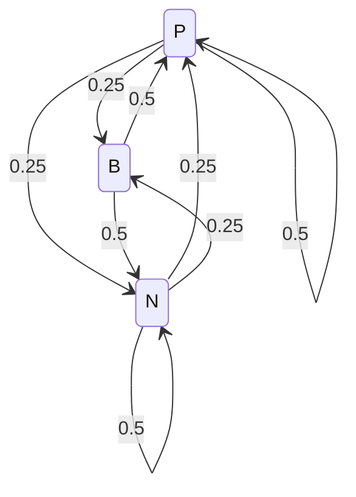

# 4.4. Advanced Meteorological and Disease Modeling Chains

### 1. Meteorological Modeling Chain
* **Problem Statement:** The weather in a specific region is classified as Rainy ($P$), Fair ($B$), or Snowy ($N$). The system is modeled as a Markov chain with transition matrix:
  $$P = \begin{pmatrix} 1/2 & 1/4 & 1/4 \\ 1/2 & 0 & 1/2 \\ 1/4 & 1/4 & 1/2 \end{pmatrix}$$
  1. Draw the transition diagram.
  2. Prove that the chain is irreducible and regular.
  3. Assuming that the weather on Day 0 is Snowy, compute the probability distribution for the weather on Day 1 and Day 2.
  4. Compute the long-term probability of each type of weather.
  5. Compute the mean return time to Fair weather.
  6. Compute the mean number of days to transition from Rainy to Fair weather for the first time.

#### Drawing the Transition Diagram
The transition diagram consists of three states connected by directed edges:

#### Proving Irreducibility and Regularity
* **Irreducibility:** Every state can reach every other state directly or indirectly. For example, $B \to P$ directly and $P \to B$ directly. Similarly, $B \to N$ and $N \to B$ directly. Thus, all states communicate, and the chain is irreducible.
* **Regularity:** The diagonal elements $P_{PP} = 1/2$ and $P_{NN} = 1/2$ are strictly positive. Since the chain is irreducible and has positive self-transition loops, it is aperiodic. An irreducible, finite, and aperiodic Markov chain is regular.

#### Computing Weather Distributions for Day 1 and Day 2
The initial state is Snowy, so the initial probability vector is:
$$p^{(0)} = (0, \quad 0, \quad 1)$$

On Day 1:
$$p^{(1)} = p^{(0)} P = (0.25, \quad 0.25, \quad 0.50)$$

On Day 2:
$$p^{(2)} = p^{(1)} P = \begin{pmatrix} 1/4 & 1/4 & 1/2 \end{pmatrix} \begin{pmatrix} 1/2 & 1/4 & 1/4 \\ 1/2 & 0 & 1/2 \\ 1/4 & 1/4 & 1/2 \end{pmatrix}$$

Evaluating each component:
* $p^{(2)}_P = \frac{1}{4} \cdot \frac{1}{2} + \frac{1}{4} \cdot \frac{1}{2} + \frac{1}{2} \cdot \frac{1}{4} = \frac{1}{8} + \frac{1}{8} + \frac{1}{8} = \frac{3}{8} = 0.3750$
* $p^{(2)}_B = \frac{1}{4} \cdot \frac{1}{4} + \frac{1}{4} \cdot 0 + \frac{1}{2} \cdot \frac{1}{4} = \frac{1}{16} + 0 + \frac{1}{8} = \frac{3}{16} = 0.1875$
* $p^{(2)}_N = \frac{1}{4} \cdot \frac{1}{4} + \frac{1}{4} \cdot \frac{1}{2} + \frac{1}{2} \cdot \frac{1}{2} = \frac{1}{16} + \frac{1}{8} + \frac{1}{4} = \frac{7}{16} = 0.4375$

This yields the probability vector:
$$p^{(2)} = (0.375, \quad 0.1875, \quad 0.4375)$$

The probability of Fair weather on Day 2 is:
$$P_{NB}^{(2)} = \frac{3}{16} = 0.1875$$

#### Computing the Long-Term Weather Distribution
We solve the system of equations $\pi P = \pi$, where $\pi = (x, y, z)$ and $x + y + z = 1$:
$$(x, \quad y, \quad z) \begin{pmatrix} 1/2 & 1/4 & 1/4 \\ 1/2 & 0 & 1/2 \\ 1/4 & 1/4 & 1/2 \end{pmatrix} = (x, \quad y, \quad z)$$

This yields the following equations:
1. $\frac{1}{2}x + \frac{1}{2}y + \frac{1}{4}z = x \implies 2y + z = 2x$
2. $\frac{1}{4}x + \frac{1}{4}z = y \implies x + z = 4y$
3. $\frac{1}{4}x + \frac{1}{2}y + \frac{1}{2}z = z \implies x + 2y = 2z$

Subtracting equation 3 from equation 1:
$$(2y + z) - (x + 2y) = 2x - 2z \implies z - x = 2x - 2z \implies 3x = 3z \implies x = z$$

Substituting $x = z$ into equation 2:
$$x + x = 4y \implies 2x = 4y \implies x = 2y$$

Using the normalization equation $x + y + z = 1$:
$$(2y) + y + (2y) = 1 \implies 5y = 1 \implies y = 0.20$$

We find the remaining values:
$$x = 2(0.2) = 0.40 \quad \text{and} \quad z = 0.40$$

This gives the stationary distribution:
$$\pi = (0.40, \quad 0.20, \quad 0.40)$$

#### Computing the Mean Return Time to Fair Weather
The mean return time $\mu_{jj}$ to a state $j$ is the reciprocal of its stationary probability:
$$\mu_{BB} = \frac{1}{\pi_B} = \frac{1}{0.20} = 5 \text{ days}$$

#### Computing the First Passage Time from Rainy to Fair
We calculate the mean first passage time $m_{ij}$ from state $i$ to state $j$ using the formula:
$$m_{ij} = 1 + \sum_{k \neq j} P_{ik} m_{kj}$$

For $j = B$ (Fair weather), we wish to calculate $m_{PB}$ (Rainy to Fair) and $m_{NB}$ (Snowy to Fair). The system of equations is:
$$m_{PB} = 1 + P_{PP} m_{PB} + P_{PN} m_{NB} \implies m_{PB} = 1 + \frac{1}{2} m_{PB} + \frac{1}{4} m_{NB}$$
$$m_{NB} = 1 + P_{NP} m_{PB} + P_{NN} m_{NB} \implies m_{NB} = 1 + \frac{1}{4} m_{PB} + \frac{1}{2} m_{NB}$$

Rearranging the terms:
1. $\frac{1}{2} m_{PB} - \frac{1}{4} m_{NB} = 1 \implies 2 m_{PB} - m_{NB} = 4$
2. $-\frac{1}{4} m_{PB} + \frac{1}{2} m_{NB} = 1 \implies -m_{PB} + 2 m_{NB} = 4$

We solve this system of equations:
* From equation 1: $m_{NB} = 2 m_{PB} - 4$
* Substituting this into equation 2:
  $$-m_{PB} + 2(2 m_{PB} - 4) = 4 \implies -m_{PB} + 4 m_{PB} - 8 = 4 \implies 3 m_{PB} = 12 \implies m_{PB} = 4$$
* Now we find $m_{NB}$:
  $$m_{NB} = 2(4) - 4 = 4$$

Thus, the mean number of days to transition from Rainy to Fair weather for the first time is:
$$m_{PB} = 4 \text{ days}$$

---

### 2. Disease Progression Model
* **Problem Statement:** An individual can transition between three health states: Immunized ($I$), Sick ($M$), or Susceptible ($S$). The monthly transition rules are:
  * An immunized individual remains immunized with probability $0.9$, or becomes susceptible with probability $0.1$.
  * A sick individual remains sick with probability $0.2$, or becomes immunized with probability $0.8$.
  * A susceptible individual remains susceptible with probability $0.5$, or becomes sick with probability $0.5$.
  1. Determine the transition matrix $P$ (ordered as $I, M, S$).
  2. Given the matrix power $P^3$, compute $P^6$ and find the health state probabilities after 6 months if the individual is initially: (a) Immunized, or (b) Susceptible.
  3. Compute the long-term probabilities for each health state.
  4. If 1000 susceptible people enter this environment, estimate how many will be sick after 4 months.

#### Constructing the Transition Matrix $P$
Using the monthly transition rules, we write the matrix $P$:
$$P = \begin{pmatrix} 
P_{II} & P_{IM} & P_{IS} \\ 
P_{MI} & P_{MM} & P_{MS} \\ 
P_{SI} & P_{SM} & P_{SS} 
\end{pmatrix} = \begin{pmatrix} 0.9 & 0 & 0.1 \\ 0.8 & 0.2 & 0 \\ 0 & 0.5 & 0.5 \end{pmatrix}$$

#### Calculating $P^6$ and State Probabilities
We are given the 3-step transition matrix:
$$P^3 = \begin{pmatrix} 0.769 & 0.080 & 0.151 \\ 0.824 & 0.048 & 0.128 \\ 0.640 & 0.195 & 0.165 \end{pmatrix}$$

We calculate $P^6 = P^3 \cdot P^3$:
$$P^6 = \begin{pmatrix} 0.769 & 0.080 & 0.151 \\ 0.824 & 0.048 & 0.128 \\ 0.640 & 0.195 & 0.165 \end{pmatrix} \begin{pmatrix} 0.769 & 0.080 & 0.151 \\ 0.824 & 0.048 & 0.128 \\ 0.640 & 0.195 & 0.165 \end{pmatrix}$$

Evaluating the matrix product:
* **Row 1:**
  * $P^6_{11} = 0.769(0.769) + 0.08(0.824) + 0.151(0.64) = 0.59136 + 0.06592 + 0.09664 = 0.75392$
  * $P^6_{12} = 0.769(0.08) + 0.08(0.048) + 0.151(0.195) = 0.06152 + 0.00384 + 0.02945 = 0.09481$
  * $P^6_{13} = 0.769(0.151) + 0.08(0.128) + 0.151(0.165) = 0.11612 + 0.01024 + 0.02492 = 0.15127$
* **Row 3:**
  * $P^6_{31} = 0.64(0.769) + 0.195(0.824) + 0.165(0.64) = 0.49216 + 0.16068 + 0.1056 = 0.75844$
  * $P^6_{32} = 0.64(0.08) + 0.195(0.048) + 0.165(0.195) = 0.0512 + 0.00936 + 0.03218 = 0.09274$
  * $P^6_{33} = 0.64(0.151) + 0.195(0.128) + 0.165(0.165) = 0.09664 + 0.02496 + 0.02723 = 0.14883$

This yields the matrix:
$$P^6 \approx \begin{pmatrix} 0.753921 & 0.094805 & 0.151274 \\ 0.755128 & 0.093184 & 0.151688 \\ 0.758440 & 0.092735 & 0.148825 \end{pmatrix}$$

Using this matrix, we find the state probabilities after 6 months:
* **Case (a): Initially Immunized ($p^{(0)} = (1, 0, 0)$)**
  $$p^{(6)} = p^{(0)} P^6 = (0.753921, \quad 0.094805, \quad 0.151274)$$
* **Case (b): Initially Susceptible ($p^{(0)} = (0, 0, 1)$)**
  $$p^{(6)} = p^{(0)} P^6 = (0.758440, \quad 0.092735, \quad 0.148825)$$

#### Computing the Long-Term Weather Distribution
We solve the system of equations $\pi P = \pi$, where $\pi = (x, y, 1-x-y)$:
$$(x, \quad y, \quad 1-x-y) \begin{pmatrix} 0.9 & 0 & 0.1 \\ 0.8 & 0.2 & 0 \\ 0 & 0.5 & 0.5 \end{pmatrix} = (x, \quad y, \quad 1-x-y)$$

This yields the following equations:
1. $0.9x + 0.8y = x \implies 0.8y = 0.1x \implies x = 8y$
2. $0.2y + 0.5(1-x-y) = y \implies 0.5(1-x-y) = 0.8y \implies 5(1-x-y) = 8y \implies 5 - 5x - 5y = 8y \implies 5x + 13y = 5$

Substituting $x = 8y$ into equation 2:
$$5(8y) + 13y = 5 \implies 40y + 13y = 5 \implies 53y = 5 \implies y = \frac{5}{53} \approx 0.09434$$

We find the remaining values:
$$x = 8\left(\frac{5}{53}\right) = \frac{40}{53} \approx 0.75472$$
$$z = 1 - x - y = 1 - \frac{40}{53} - \frac{5}{53} = \frac{8}{53} \approx 0.15094$$

This gives the stationary distribution:
$$\pi = \left(\frac{40}{53}, \quad \frac{5}{53}, \quad \frac{8}{53}\right) \approx (0.7547, \quad 0.0943, \quad 0.1509)$$

#### Estimating the Number of Sick Individuals after 4 Months
We calculate the 4-step transition matrix $P^4 = P^3 \cdot P$:
$$P^4 = \begin{pmatrix} 0.769 & 0.080 & 0.151 \\ 0.824 & 0.048 & 0.128 \\ 0.640 & 0.195 & 0.165 \end{pmatrix} \begin{pmatrix} 0.9 & 0 & 0.1 \\ 0.8 & 0.2 & 0 \\ 0 & 0.5 & 0.5 \end{pmatrix}$$

For an initially susceptible population ($p^{(0)} = (0, 0, 1)$), the state distribution after 4 months is the third row of $P^4$:
$$p^{(4)} = (0.640, \quad 0.195, \quad 0.165) \begin{pmatrix} 0.9 & 0 & 0.1 \\ 0.8 & 0.2 & 0 \\ 0 & 0.5 & 0.5 \end{pmatrix}$$

Evaluating the second component (Sick state $M$):
$$p^{(4)}_M = 0.640 \times 0 + 0.195 \times 0.2 + 0.165 \times 0.5 = 0 + 0.039 + 0.0825 = 0.1215$$

For a population of 1000 susceptible people, the expected number of sick individuals after 4 months is:
$$\text{Expected Sick} = 1000 \times 0.1215 = 121.5 \approx 121 \text{ or } 122 \text{ people}$$

---
